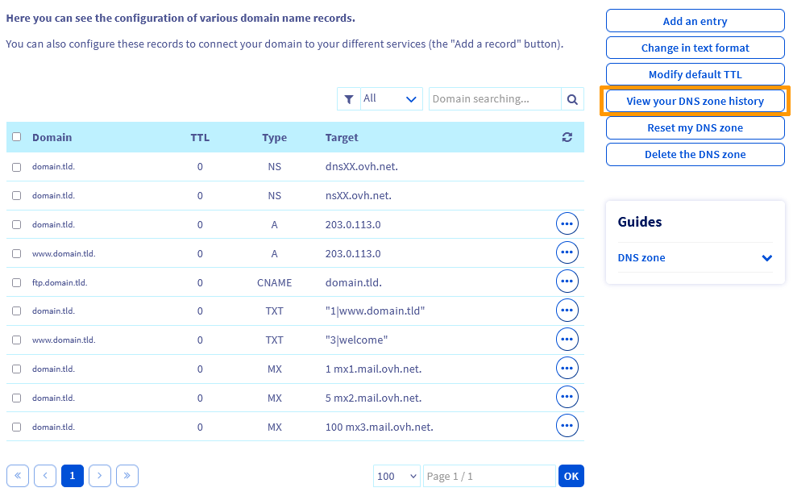
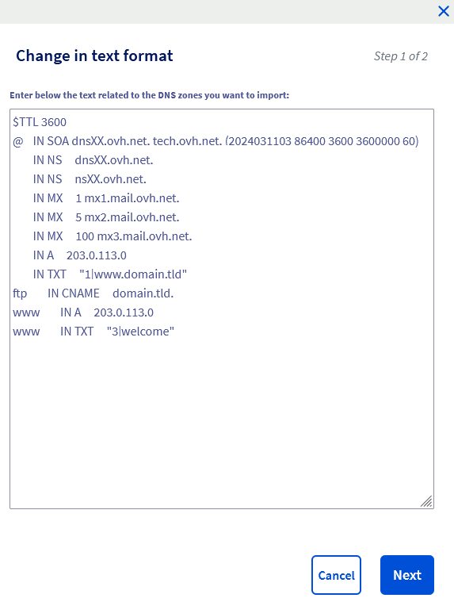

## Ziel

Die **D**omain **N**ame **S**ystem (**DNS**) einer Domain ist die Konfigurationsdatei der Domain. Sie besteht aus technischen Informationen, die als *DNS Einträge* bezeichnet werden. Die DNS-Zone ist wie ein Datacenter.

Sie können beispielsweise Folgendes angeben:

- Die IP-Adresse (DNS-Einträge vom Typ *A* und *AAAA*) Ihres Webhostings, um Ihre Website mit Ihrem Domainnamen anzuzeigen.
- Die E-Mail-Server (DNS-Einträge vom Typ *MX*), auf die Ihre Domain die von ihr empfangenen E-Mails weiterleiten soll. So können Sie diese über Ihre personalisierte(n) E-Mail-Adresse(n) mit Ihrem Domainnamen einsehen.
- Informationen zur Sicherheit / Authentifizierung Ihrer Dienste (Webhosting, Webserver, E-Mail-Server etc.), die mit Ihrem Domainnamen verbunden sind (DNS-Einträge vom Typ *SPF*, *DKIM*, *DMARC* etc.).

Weitere Informationen hierzu finden Sie in unserer Dokumentation zu [DNS-Einträgen und Bearbeiten einer DNS-Zone](/pages/web_cloud/domains/dns_zone_edit) in Ihrem [OVHcloud Kundencenter](https://www.ovh.com/auth/?action=gotomanager&from=https://www.ovh.de/&ovhSubsidiary=de).
Es kann aus verschiedenen Gründen erforderlich sein, eine alte DNS-Konfiguration auf Ihre Domain anzuwenden.

Ab sofort wird die Verwaltung der DNS dank der History Ihrer DNS Zonen vereinfacht.

**Diese Anleitung erklärt, wie Sie Ihre Backups der DNS-Zone einsehen, vergleichen, herunterladen und wiederherstellen können**

## Voraussetzungen

- Sie haben eine DNS-Zone für Ihre Domain in Ihrem [OVHcloud Kundencenter](https://www.ovh.com/auth/?action=gotomanager&from=https://www.ovh.de/&ovhSubsidiary=de)
- Sie sind im [OVHcloud Kundencenter](https://www.ovh.com/auth/?action=gotomanager&from=https://www.ovh.de/&ovhSubsidiary=de) eingeloggt
- Sie haben Zugriff auf die Verwaltung der betreffenden Domain

## In der praktischen Anwendung

Um auf diese Funktion zuzugreifen, loggen Sie sich in Ihrem [OVHcloud Kundencenter](https://www.ovh.com/auth/?action=gotomanager&from=https://www.ovh.de/&ovhSubsidiary=de) ein und gehen Sie in den Bereich `Web Cloud`{.action} oben im Interface. Gehen Sie in der linken Spalte auf den Tab `Domainnamen`{.action} und wählen Sie den Domainnamen aus, der mit der DNS-Zone verbunden ist, die Sie bearbeiten möchten.

Wenn Sie auf der angezeigten Seite noch nicht auf diesen Tab weitergeleitet wurden, klicken Sie auf den Tab `DNS-Zone`{.action}.

Die angezeigte Tabelle stellt die DNS-Zone Ihrer Domain dar. Dort finden Sie die Liste der darin enthaltenen DNS-Einträge. Rechts in der Tabelle finden Sie mehrere Schaltflächen, mit denen Sie Aktionen in Ihrer DNS-Zone durchführen können. 

{.thumbnail}

Klicken Sie auf `Den Verlauf meiner DNS-Zone einsehen`{.action}. 

Auf der neu geöffneten Seite wird eine Tabelle mit dem Backup-Verlauf Ihrer DNS-Zone angezeigt. Diese wird nach dem letzten und dem letzten Datum sortiert. Am Anfang dieser Tabelle steht die aktuelle Version Ihrer DNS-Zone. Auf dieser Seite können Sie folgende Aktionen ausführen:

- [DNS Zone anzeigen](#view)
- [DNS Zone herunterladen](#download)
- [DNS-Zone wiederherstellen](#restore)
- [Zwei DNS Zonen vergleichen](#compare)

### Eine DNS-Zone anzeigen 

Um die gewünschte DNS-Zone anzuzeigen, geben Sie die Zeile in der Tabelle an und klicken Sie auf das Symbol in der Spalte `Anzeigen`{.action}.

{.thumbnail}

Die Daten der betreffenden DNS-Zone werden angezeigt.

{.thumbnail}

Klicken Sie auf `Schließen`{.action}, um zur Hauptseite „History der DNS-Zone“ zurückzukehren.

### DNS Zone herunterladen 

Um die gewünschte DNS-Zone herunterzuladen identifizieren Sie die entsprechende Zeile in der Tabelle und klicken Sie dann auf das Symbol in der Spalte `Herunterladen`{.action}.

{.thumbnail}

Die DNS Zone wird im .txt Format heruntergeladen.

### DNS Zone wiederherstellen 

Wenn Sie Ihre aktuelle DNS-Zone durch eine andere ersetzen möchten, stellen Sie einfach eine ältere DNS-Zone wieder her. Suchen Sie in der Tabelle mit dem Verlauf Ihrer DNS-Zonen die Zeile für die DNS-Zone, die Sie wiederherstellen möchten (überprüfen Sie bitte das Datum links in der Zeile), und klicken Sie dann auf das Symbol in der Spalte `Wiederherstellen`{.action}.

{.thumbnail}

Das folgende Fenster wird angezeigt.

{.thumbnail}

Stellen Sie sicher, dass das Datum in der Nachricht mit der DNS-Zone übereinstimmt, die Sie wiederherstellen möchten. Wie das gelbe Banner zeigt, wird die aktuelle DNS-Zone (die in der Liste der DNS-Zonenversionen ganz oben angezeigt wird) gelöscht und durch die DNS-Zone ersetzt, die Sie wiederherstellen möchten.

Klicken Sie auf `Wiederherstellen`{.action}, um die Wiederherstellung zu bestätigen, oder auf `Abbrechen`{.action}.

> [!primary]
>
> Das Ändern oder Wiederherstellen einer DNS-Zone führt zu einer Propagationsverzögerung von **4** bis **24** Stunden, damit sie im DNS-Netzwerk vollständig berücksichtigt wird.
>

### Zwei DNS-Zonen vergleichen 

Sie können den Inhalt zweier DNS-Zonen vergleichen. Suchen Sie in der Tabelle mit der History Ihrer DNS-Zone die beiden Zeilen, die den beiden DNS-Zonen entsprechen, die Sie vergleichen möchten (überprüfen Sie bitte das Datum links neben jeder Zeile), und wählen Sie diese aus. Um diese beiden Versionen der DNS-Zone zu vergleichen, klicken Sie oben links auf `Versionen vergleichen`{.action}.

{.thumbnail}

Es wird eine neue Seite mit dem Inhalt der beiden DNS-Zonen angezeigt. Über jeder Version wird das zugehörige Datum angezeigt. Standardmäßig befindet sich die neueste Version der DNS-Zone links und die älteste rechts. Eine Farbcodierung hilft Ihnen dabei, Unterschiede im Inhalt zu erkennen. 
Auf der linken Seite wurde der rot markierte Inhalt in der neueren Version geändert oder entfernt. 
Auf der rechten Seite wurde der grün hervorgehobene Inhalt im Vergleich zur älteren Version geändert oder hinzugefügt. 

Sie können auch die Datumsangaben der Versionen, die Sie vergleichen möchten, mithilfe der beiden Dropdownlisten aktualisieren.

{.thumbnail}

Mit dieser Anleitung können Sie nun zwei DNS-Zonen vergleichen sowie eine DNS-Zone anzeigen, herunterladen, wiederherstellen und löschen.

## Weiterführende Informationen

[In das OVHcloud Kundencenter einloggen](/pages/account_and_service_management/account_information/ovhcloud-account-login)

[DNS-Zone bei OVHcloud erstellen](/pages/web_cloud/domains/dns_zone_create)

Kontaktieren Sie für spezialisierte Dienstleistungen (SEO, Web-Entwicklung etc.) die [OVHcloud Partner](https://partner.ovhcloud.com/de/directory/).

Wenn Sie Hilfe bei der Nutzung und Konfiguration Ihrer OVHcloud Lösungen benötigen, beachten Sie unsere [Support-Angebote](https://www.ovhcloud.com/de/support-levels/).

Für den Austausch mit unserer User Community gehen Sie auf <https://community.ovh.com/en/>.