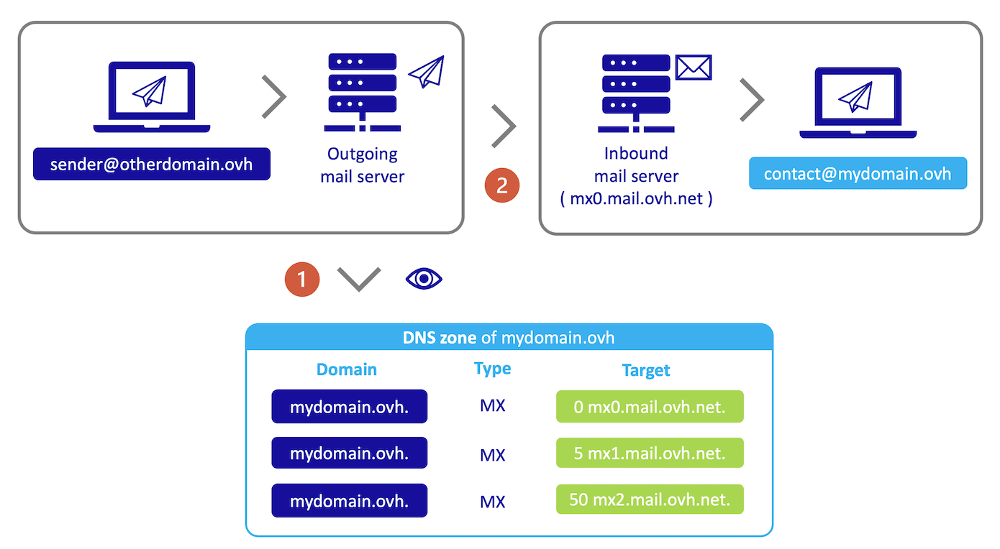
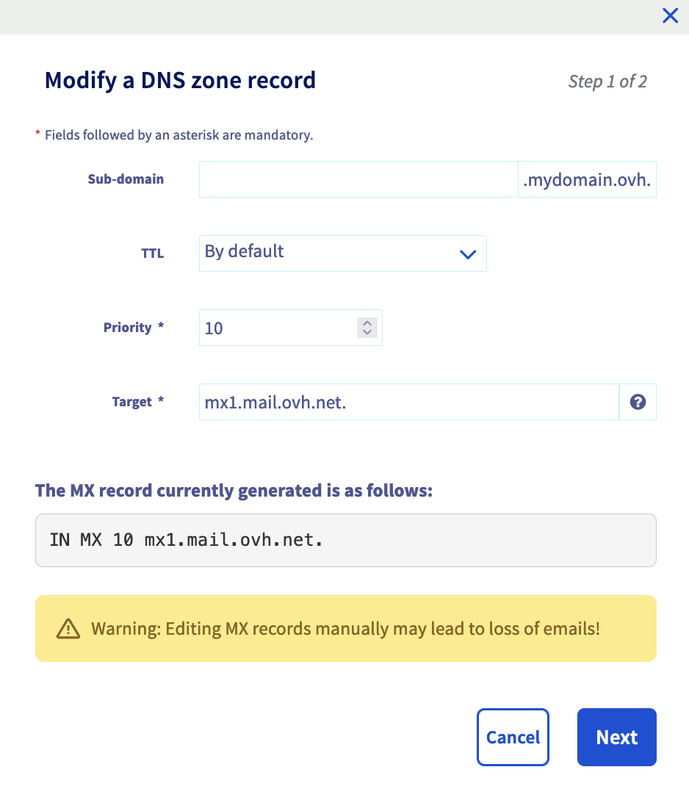

## Ziel

Der MX-Eintrag erlaubt die Verbindung eines Domainnamens mit dem Server seiner E-Mail-Plattform. Es ist notwendig, damit der E-Mail-Dienst des Absenders den des Empfängers erreichen kann.

**Hier erfahren Sie, wie Sie einen MX-Eintrag für Ihre Domain bei OVHcloud konfigurieren.**

## Voraussetzungen

- Sie haben über das [OVHcloud Kundencenter](https://www.ovh.com/auth/?action=gotomanager&from=https://www.ovh.de/&ovhSubsidiary=de) Zugriff auf die DNS-Zone der betreffenden Domain.
- Sie sind in Ihrem [OVHcloud Kundencenter](https://www.ovh.com/auth/?action=gotomanager&from=https://www.ovh.de/&ovhSubsidiary=de) angemeldet.
- Die betreffende Domain verwendet die OVHcloud Konfiguration (d. h. die OVHcloud DNS-Server).
- Sie verfügen über ein MX Plan Angebot (im [Webhosting Angebot](https://www.ovhcloud.com/de/web-hosting/), dem [kostenlosen 100M Hosting](https://www.ovhcloud.com/de/domains/free-web-hosting/) oder dem separat bestellten MX Plan Angebot enthalten), eines unserer [OVHcloud E-Mail Angebote](https://www.ovhcloud.com/de/emails/) oder einen externen E-Mail-Dienst.

> [!primary]
>
> - Wenn Ihre Domain nicht die DNS-Server von OVHcloud verwendet, muss die Änderung der MX-Einträge über das Interface des Anbieters vorgenommen werden, bei dem die Konfiguration Ihrer Domain verwaltet wird.
>
> - Wenn Ihre Domain bei OVHcloud registriert ist, können Sie überprüfen, ob diese unsere OVHcloud Konfiguration verwendet. Gehen Sie hierzu in Ihrem [Kundencenter](https://www.ovh.com/auth/?action=gotomanager&from=https://www.ovh.de/&ovhSubsidiary=de) in den Bereich `DNS-Server`{.action} und anschließend in den Tab `Allgemeine Informationen`{.action}. Wenn unter „**DNS-Server**“ der Eintrag Aktiv angezeigt wird, verwenden Sie die OVHcloud DNS-Server.
>
> {.thumbnail}

## In der praktischen Anwendung

### Grundlegendes zur Rolle von MX-Einträgen 

MX-Einträge (**M**ail **eX**change) werden verwendet, um Ihre Domain mit den empfangenden E-Mail-Servern zu verbinden, die mit Ihrem E-Mail-Dienst verbunden sind. Wir werden uns auf ein Beispiel stützen.

Wenn die Adresse **sender@otherdomain.ovh** eine E-Mail an **contact@mydomain.ovh** sendet, wird der Server, der die E-Mail sendet (**Outgoing mail server**):
- **(1)** Abfrage der DNS Zone der Domain **mydomain.ovh** und Lesen der **MX** Einträge.
- **(2)** E-Mail an die URL des gelesenen **MX**-Eintrags weiterleiten.

{.thumbnail}

Die E-Mail wird an das Ziel **mx0.mail.ovh.net** gesendet, dem der Wert **0** vorangestellt ist. Dieser Wert wird als Priorität bezeichnet. Der niedrigste Wert wird zuerst abgefragt, der höchste zuletzt. Dies bedeutet, dass das Vorhandensein mehrerer Datensätze eine fehlende Antwort des MX-Datensatzes mit der niedrigsten Priorität ausgleicht.

Sie können mehrere MX-Einträge für denselben Domainnamen einrichten. In diesem Fall ist es notwendig, eine Prioritätsnummer für jede dieser Nummern zu definieren. MX-Einträge werden in aufsteigender Reihenfolge von der niedrigsten zur höchsten Nummer abgefragt, bis eine Antwort vom empfangenden Server eingeht.

> [!warning]
>
> Im Allgemeinen ist die **Änderung der MX-Einträge in der DNS-Zone Ihrer Domain eine heikle Handlung**: Bei einer fehlerhaften Änderung können E-Mails an Ihre Adressen nicht mehr empfangen werden. Achten Sie bitte darauf, diese Einstellungen vorzunehmen.
> Im Zweifelsfall empfehlen wir Ihnen, einen [spezialisierten Dienstleister](https://partner.ovhcloud.com/fr/directory/) zu kontaktieren.

### Werte der OVHcloud MX-Konfiguration 

Nachfolgend finden Sie die OVHcloud MX-Konfiguration für unsere MX Plan Lösungen (einzeln oder in einem [OVHcloud Webhosting](https://www.ovhcloud.com/de/web-hosting/) enthalten), [E-Mail Pro](https://www.ovhcloud.com/de/emails/email-pro/) und [Exchange](https://www.ovhcloud.com/de/emails/). Unsere E-Mail-Server verfügen über integrierte Antispam- und Antivirensoftware.

|Domain|TTL|Eintrag|Priorität|Ziel|
|---|---|---|---|---|
|*leer lassen*|3600|MX|1|mx0.mail.ovh.net.|
|*leer lassen*|3600|MX|5|mx1.mail.ovh.net.|
|*leer lassen*|3600|MX|50|mx2.mail.ovh.net.|
|*leer lassen*|3600|MX|100|mx3.mail.ovh.net.|
|*leer lassen*|3600|MX|200|mx4.mail.ovh.net.|

Diese MX-Einträge müssen in der DNS-Zone Ihrer Domain konfiguriert werden.

### MX-Eintrag in einer OVHcloud DNS-Zone konfigurieren

Um MX-Einträge in der OVHcloud Konfiguration Ihrer Domain zu erstellen oder zu bearbeiten, loggen Sie sich in Ihrem [OVHcloud Kundencenter](https://www.ovh.com/auth/?action=gotomanager&from=https://www.ovh.de/&ovhSubsidiary=de) ein. Gehen Sie in den Bereich `Domainnamen`{.action}, klicken Sie auf die betreffende Domain und anschließend in den Tab DNS `Zone`{.action}.

Die Tabelle zeigt die OVHcloud Konfiguration Ihrer Domain an. Jede Zeile entspricht einem DNS-Eintrag.

Überprüfen Sie zunächst anhand der Filterliste über der Tabelle Ihrer DNS-Zone, ob bereits MX-Einträge in der OVHcloud DNS-Konfiguration Ihrer Domain vorhanden sind. 
Wählen Sie den **MX**-Typ aus und bestätigen Sie, damit nur die MX DNS-Einträge Ihrer DNS-Zone angezeigt werden. Verwenden Sie den Screenshot unten.

{.thumbnail}

- Wenn bereits MX-Einträge vorhanden sind und Sie diese bearbeiten möchten, klicken Sie rechts neben jeder Zeile der betreffenden Tabelle auf den Button `...`{.action}. und dann auf Eintrag `bearbeiten`{.action}.
- Wenn kein MX-Eintrag vorhanden ist, klicken Sie rechts neben der Tabelle auf `Eintrag bearbeiten`{.action} und wählen Sie `MX`{.action} aus. Geben Sie die angeforderten Informationen für die ausgewählte E-Mail-Lösung ein:

**Wenn Sie über eine E-Mail-Lösung von OVHcloud** verfügen, lesen Sie die Informationen unter „[OVHcloud MX-Konfiguration ](#mxovhcloud)“.

{.thumbnail}

Wenn Sie alle Informationen eingegeben haben, schließen Sie die Schritte ab und klicken Sie dann auf `Weiter`{.action}.

**Wenn Sie über eine andere E-Mail**-Lösung verfügen, lesen Sie die Informationen Ihres E-Mail-Dienstanbieters.

> [!primary]
>
> Die Änderung erfordert eine Propagationszeit zwischen 4 und 24 Stunden, bis sie voll wirksam ist.
>

## Weiterführende Informationen

[Webhosting − Allgemeine Informationen zu den DNS Servern](/pages/web_cloud/domains/dns_server_general_information)

[Bearbeiten einer OVHcloud DNS-Zone](/pages/web_cloud/domains/dns_zone_edit)

[Einen SPF-Eintrag für seine Domain konfigurieren](/pages/web_cloud/domains/dns_zone_spf)

[DKIM-Eintrag konfigurieren](/pages/web_cloud/domains/dns_zone_dkim)

Für spezialisierte Dienstleistungen (Referenzierung, Entwicklung etc.) kontaktieren Sie bitte die [OVHcloud Partner](https://partner.ovhcloud.com/de/).

Wenn Sie Hilfe bei der Verwendung und Konfiguration Ihrer OVHcloud Lösungen benötigen, empfehlen wir Ihnen unsere verschiedenen [Support-Angebote](https://www.ovhcloud.com/de/support-levels/).

Für den Austausch mit unserer User Community gehen Sie auf <https://community.ovh.com/en/>.
