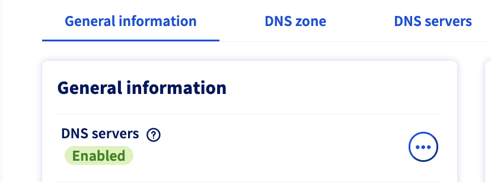
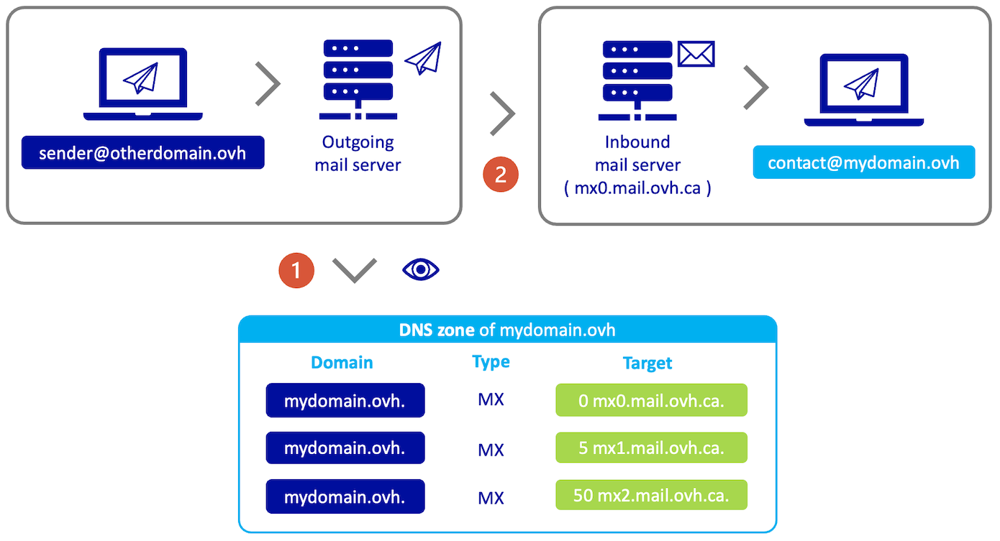
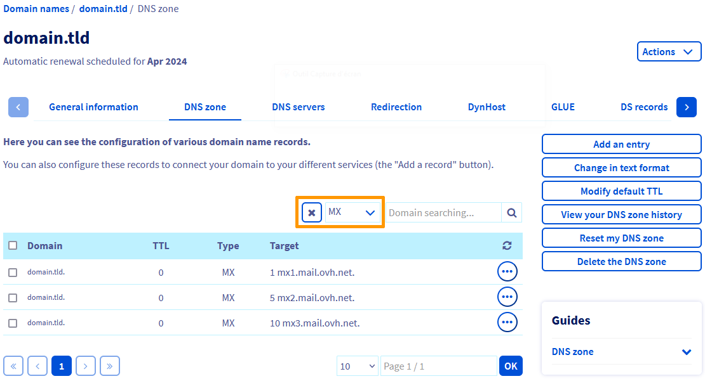

## Objective

With an MX record, you can link a domain name to the server on your email platform. It is essential for the sender’s email service to reach the recipient’s email service.

**Find out how to configure an MX record for your domain name at OVHcloud.**

## Requirements

- You have access to the [OVHcloud Control Panel](https://ca.ovh.com/auth/?action=gotomanager&from=https://www.ovh.com/sg/&ovhSubsidiary=sg).
- You have the rights to manage the DNS zone for the domain name concerned via the [OVHcloud Control Panel](https://ca.ovh.com/auth/?action=gotomanager&from=https://www.ovh.com/sg/&ovhSubsidiary=sg).
- The domain name concerned uses the OVHcloud configuration (i.e. OVHcloud DNS servers).
- You have an MX Plan solution (included in the [web hosting plan](https://www.ovhcloud.com/en-sg/web-hosting/)), or an external email service.

> [!primary]
>
> - If your domain name does not use OVHcloud DNS servers, you will need to modify the MX records using the interface of the service provider that manages your domain name configuration.
>
> - If your domain name is with OVHcloud, you can check if it uses our OVHcloud configuration in the [OVHcloud Control Panel](https://ca.ovh.com/auth/?action=gotomanager&from=https://www.ovh.com/sg/&ovhSubsidiary=sg), in the `DNS Servers`{.action} section. Next, select the domain name concerned, and go to the `General information`{.action} tab. If `Active` is displayed under **DNS servers**, the domain name uses OVHcloud DNS servers.
>
> {.thumbnail}

## Instructions

### Understanding the role of MX records 

MX (**M**ail e**X**change) records are used to link your domain name to the receiving email servers attached to your email service. We will use an example.

When the address **sender@otherdomain.ovh** sends an email to **contact@mydomain.ovh**, the **Outgoing mail server** will:
- **(1)** Query the DNS zone of the domain name **mydomain.ovh** and read the **MX** records.
- **(2)** Forward the email to the URL of the **MX** record it has found.

{.thumbnail}

The email will be sent to the target **mx0.mail.ovh.ca**, which is preceded by a value of **0**. This value is called *priority*. The lowest value is queried first and the highest value is queried last. This means that the presence of several records makes it possible to compensate for an absence of response from the MX record having the lowest priority.

You can set up multiple MX records for the same domain name. It is then necessary to define a *priority* number for each of them. MX records are queried in ascending order from lowest number to highest number until a response is received from the receiving server.

> [!warning]
>
> Generally speaking, **modifying MX records in a domain name’s DNS zone warrants caution**. If you make any mistakes configuring the records, it may make it impossible for emails to reach your email address. Please take care when you carry out this procedure.
> If you have any doubts, we advise contacting a [specialist provider](https://partner.ovhcloud.com/en-sg/directory/).

### OVHcloud MX configuration values 

Below, you will find the OVHcloud MX configuration to use for our MX Plan solutions ( included in an [OVHcloud web hosting](https://www.ovhcloud.com/en-sg/web-hosting/) plan). Our email servers have antispam and antivirus integrated.

|Domain|TTL|Record type|Priority|Target|
|---|---|---|---|---|
|*leave blank*|3600|MX|1|mx0.mail.ovh.ca.|
|*leave blank*|3600|MX|5|mx1.mail.ovh.ca.|
|*leave blank*|3600|MX|50|mx2.mail.ovh.ca.|
|*leave blank*|3600|MX|100|mx3.mail.ovh.ca.|
|*leave blank*|3600|MX|200|mx4.mail.ovh.ca.|

These MX records must be configured in your domain name’s DNS zone.

### Configuring an MX record in an OVHcloud DNS zone

To create or modify the MX records in your domain name’s OVHcloud configuration, log in to the [OVHcloud Control Panel](https://ca.ovh.com/auth/?action=gotomanager&from=https://www.ovh.com/sg/&ovhSubsidiary=sg). Go to the `Domain names`{.action} section, click on the domain concerned, then go to the `DNS Zone`{.action} tab.

The table shows your domain name’s OVHcloud configuration. Each row corresponds to a DNS record.

As a first step, please check whether any MX records already exist in your domain name’s OVHcloud DNS configuration. You can do this using the filtering list located above the table for your DNS zone. 
Select the **MX** type, then confirm to display only the MX DNS records for your DNS zone. Use the screenshot below.

{.thumbnail}

- If MX records already exist and you want to edit them, click the `...`{.action} button to the right of each table row, and then click `Edit Entry`{.action}.
- If no MX record is present, click the `Add record`{.action} button to the right of the table, then choose `MX`{.action}. Enter the information requested, depending on the email solution you have chosen:

**If you have an OVHcloud email solution**, please refer to the information provided in the [OVHcloud MX configuration](#mxovhcloud) step.

{.thumbnail}

Fill in the values, complete the steps, then click `Confirm`{.action}.

**If you have another email solution**, please refer to the information provided by your email service provider.

> [!primary]
>
> The change can take between 4 and 24 hours to propagate fully.
>

## Go further

[General information about DNS servers](/pages/web_cloud/domains/dns_server_general_information)

[Editing an OVHcloud DNS zone](/pages/web_cloud/domains/dns_zone_edit)

[Configuring an SPF record on your domain name](/pages/web_cloud/domains/dns_zone_spf)

[Configuring a DKIM record](/pages/web_cloud/domains/dns_zone_dkim)

For specialised services (SEO, development, etc.), contact [OVHcloud partners](https://partner.ovhcloud.com/en-sg/directory/).

If you would like assistance using and configuring your OVHcloud solutions, please refer to our [support offers](https://www.ovhcloud.com/en-sg/support-levels/).

Join our community of users on <https://community.ovh.com/en/>.