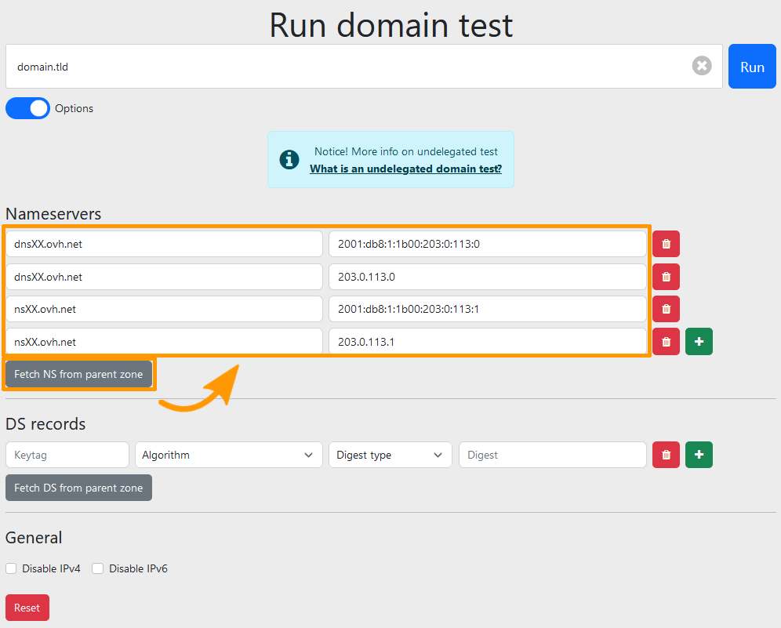

> [!primary]
> Tłumaczenie zostało wygenerowane automatycznie przez system naszego partnera SYSTRAN. W niektórych przypadkach mogą wystąpić nieprecyzyjne sformułowania, na przykład w tłumaczeniu nazw przycisków lub szczegółów technicznych. W przypadku jakichkolwiek wątpliwości zalecamy zapoznanie się z angielską/francuską wersją przewodnika. Jeśli chcesz przyczynić się do ulepszenia tłumaczenia, kliknij przycisk "Zgłoś propozycję modyfikacji" na tej stronie.
>

> [!warning]
>
> OVHcloud udostępnia różnorodne usługi, jednak to Ty odpowiadasz za ich konfigurację i zarządzanie nimi. Ponosisz więc odpowiedzialność za ich prawidłowe funkcjonowanie.
> 
> Oddajemy w Twoje ręce niniejszy przewodnik, którego celem jest pomoc w wykonywaniu bieżących zadań. W przypadku trudności zalecamy skorzystanie z pomocy [specjalisty](https://partner.ovhcloud.com/pl/). Niestety firma OVHcloud nie będzie mogła udzielić wsparcia w tym zakresie. Więcej informacji znajduje się w sekcji ["Sprawdź również"](#go-further) niniejszego przewodnika.
> 

## Wprowadzenie

[Zonemaster](https://zonemaster.net/en/run-test) jest narzędziem powstałym w wyniku współpracy między '[AFNIC](https://www.afnic.fr/en/) (francuski rejestr) i [The Swedish Internet Foundation](https://internetstiftelsen.se/en/) (szwedzki rejestr). Umożliwia analizowanie konfiguracji DNS (Domain Name System) domeny i identyfikowanie elementów, które mogą zostać ulepszone lub usunięte.

> [!primary]
>
> Aby lepiej zrozumieć pojęcie DNS, zapoznaj się z wprowadzeniem naszego przewodnika dotyczącego [konfiguracji strefy DNS](/pages/web_cloud/domains/dns_server_general_information).

## Wymagania początkowe

- Posiadanie [domeny](https://www.ovhcloud.com/pl/domains/)

## W praktyce

### Pole wprowadzania

Narzędzie Zonemaster umożliwia sprawdzenie konfiguracji DNS w Twojej domenie lub przetestowanie strefy DNS na przyszłych serwerach DNS.

Aby sprawdzić aktualną konfigurację domeny, wpisz nazwę domeny, następnie kliknij `Run`{.action}

{.thumbnail}

Aby sprawdzić konfigurację DNS, która została przygotowana, ale nie została jeszcze zastosowana dla danej domeny, zaznacz kratkę `Options`{.action}, następnie wprowadź następujące informacje:

- **Nameservers**: wprowadź informacje dotyczące serwera nazwy przypisanego do domeny. Kliknij na `+`{.action}, aby dodać serwer nazw. Wpisanie adresu IP jest opcjonalne.
- **DS records**: w ramach ochrony DNSSEC wprowadź elementy rekordu DS. Kliknij na `+`{.action}, aby dodać dodatkowy wpis DS. Jeśli serwery DNS nie używają protokołu DNSSEC, możesz zostawić te pola wolne. W przypadku strefy podpisanej z DNSSEC funkcja ta pozwala na sprawdzenie, czy strefa działa poprawnie z zatwierdzonym resolwerem, z zapisami DS, które mają zostać opublikowane, przed ich opublikowaniem.

Możesz również wymusić weryfikację przy użyciu wybranego protokołu IP poprzez `Disable IPv4` i `Disable IPv6`

> **Przykład**:   Posiadasz domenę "domain.tld", która aktualnie używa serwerów DNS "dnsXX.ovh.net" i "nsXX.ovh.net". Skonfigurowałeś strefę DNS dla tej domeny na serwerach DNS "dns1.test.tld" i "dns2.test.tld". 
>
> Przed zmianą serwerów DNS, możesz przeprowadzić zaawansowane wyszukiwanie w polu `Options`{.action}, wprowadzając "dns1.test.tld" i "dns2.test.tld" w rubrykach `Nameservers`. 
> Zonemaster przeprowadzi test tak, jakby korzystał z serwerów "dns1.test.tld" i "dns2.test.tld" na "domain.tld". 
> {.thumbnail}

> [!primary]
>
> Po wpisaniu nazwy domeny i kliknięciu na przycisk `Fetch NS from parent zone`{.action} i `Fetch DS from parent zone`{.action}, pojawią się serwery DNS przypisane do domeny wraz z informacjami o rekordzie DS (DNSSEC), jeśli domena została skonfigurowana.
> {.thumbnail}

### Rezultat

Po zatwierdzeniu formularza wyniki są klasyfikowane według kodu koloru:

- **Error**: ta część zawiera błędy lub brakujące elementy, które mogą powodować nieprawidłowe działanie.
- **Warning**: ta część jest funkcjonalna, ale zasługuje na szczególną uwagę. Narzędzie wykryło, że parametr nie spełnia normy dla swojej kategorii, nie blokując przy tym jego działania.
- **Notice**: ta część jest funkcjonalna i spełnia standardowe kryteria w swojej kategorii.
- **Info**: jest to prosta informacja, nie mająca szczególnego wpływu na funkcjonowanie nazwy domeny. 

Dla każdego testu możesz uzyskać więcej informacji, na przykład, aby zrozumieć błąd w przypadku awarii lub tylko w celach informacyjnych.

{.thumbnail}

### Przydatne informacje

Jeśli masz dodatkowe pytania dotyczące Zonemaster, sprawdź sekcję [FAQ](https://zonemaster.net/en/faq) na <https://zonemaster.net/>.

## Sprawdź również 

[Informacje na temat serwerów DNS](/pages/web_cloud/domains/dns_server_general_information){.external}.

[Zmiana strefy DNS OVHcloud](/pages/web_cloud/domains/dns_zone_edit){.external} .

[Zabezpieczenie domeny przed Cache Poisoning za pomocą DNSSEC](/pages/web_cloud/domains/dns_dnssec){.external}.

Skontaktuj się z [partnerami OVHcloud](https://partner.ovhcloud.com/pl/), jeśli szukasz zaawansowanych rozwiązań (indeksowanie, rozwój, etc).

Jeśli chcesz otrzymywać wsparcie w zakresie konfiguracji i korzystania z rozwiązań OVHcloud, sprawdź naszą [ofertę wsparcia](https://www.ovhcloud.com/pl/support-levels/).

Dołącz do społeczności naszych użytkowników na stronie <https://community.ovh.com/en/>