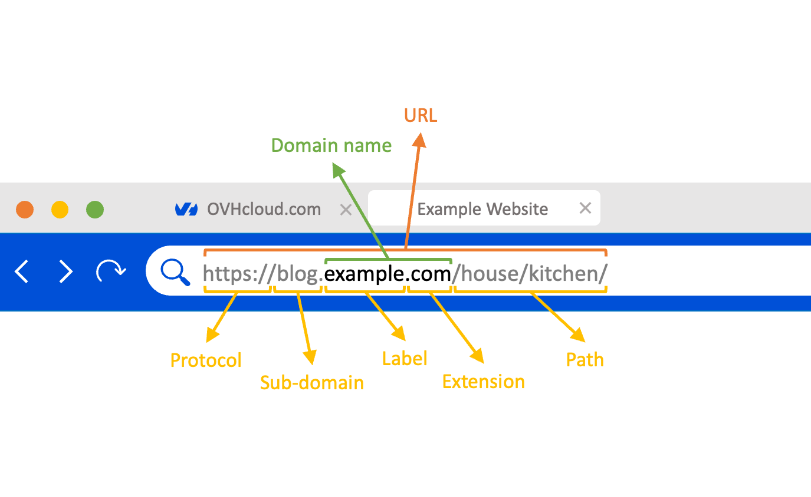

> [!primary]
> Esta traducción ha sido generada de forma automática por nuestro partner SYSTRAN. En algunos casos puede contener términos imprecisos, como en las etiquetas de los botones o los detalles técnicos. En caso de duda, le recomendamos que consulte la versión inglesa o francesa de la guía. Si quiere ayudarnos a mejorar esta traducción, por favor, utilice el botón "Contribuir" de esta página.
>

## Objetivo 

Internet se compone de *servidores* y *dispositivos* que interactúan entre sí a través de una red global. Cuando estos *servidores* y sus *dispositivos* están conectados a la red Internet, se les asigna una *dirección IP pública* (equivalente a una dirección postal). Esta *dirección IP* permite conectar a distancia un servidor o un dispositivo, de modo que un usuario puede consultar un sitio web introduciendo esta *dirección IP* gracias a su navegador de internet instalado en su ordenador.

Los **dominios** se han creado para facilitar a los usuarios el acceso a un sitio web. En efecto, es más fácil elegir un nombre compuesto por una cadena de caracteres elegidos (por ejemplo: ovhcloud.com), que una secuencia de números que compone una *dirección IP* (por ejemplo: 54.39.46.56).

Un **nombre de dominio** se compone de niveles. Estos niveles suelen estar separados por un `.` (a excepción de algunas **extensiones** del *primer nivel* como *.co.uk*, *.gouv.fr* o *.notaires.fr*):

- **T**op **L**evel **D**omain (**TLD**): representa los dominios de *primer nivel*. Más comúnmente las denominamos **extensiones**. Actualmente hay 4 tipos de dominio de primer nivel: 

    - Los **c**ountry **c**ode **T**op **L**evel **D**omains (**ccTLDs**): compuestos de dos caracteres, corresponden a los distintos países del globo. Por ejemplo, las extensiones *.fr*, *.es*, *.it* o *.pl* son ccTLDs;
    - Los **g**eneric **T**op **L**evel **D**omains (**gTLDs**): compuestos por al menos tres caracteres, representan temas o sectores de actividad más generales. Por ejemplo, las extensiones *.com*, *.net*, *.org* o *.info* son gTLDs;
    - Los **new** **g**eneric **T**op **L**evel **D**omains (**new gTLDs**):
    Nuevas extensiones creadas a partir de 2012 por el **I**nternet **C**orporation for **A**ssigned **N**ames and **N**umbers (**ICANN**) para dar respuesta al fuerte aumento de las solicitudes de creación de dominios. Pueden ser temas genéricos, marcas, regiones o ciudades. Por ejemplo, las extensiones *.love*, *.ovh* o *.paris* son new gTLDs;
    - Los **Corp**oration **T**op **L**evel **D**omains (**CorpTLDs**): en realidad se trata de una subcategoría de los new GTLDs. A petición de la **ICANN**, las empresas u organizaciones podrán solicitar la creación de su propio TLD. Por ejemplo, la extensión *.ovh* es un CorpTLD creado por OVHcloud hace unos años.

- **S**econd **L**evel **D**omain (**SLD**): representa los dominios de *segundo nivel*. Más comúnmente los llamamos **labels**. Al contratar un dominio, puede elegir libremente el **label** (siempre que no haya sido ya registrado por otro usuario con la misma extensión y con un límite de 63 caracteres). Por ejemplo, *ovhcloud* corresponde al sello del dominio *ovhcloud.com*.

- Third Level Domain (**subdomain**): A partir de este tercer nivel, hablamos de *subdominio*. Esta guía explica en detalle su definición y cómo utilizarla con los distintos servicios.

{.thumbnail}
  
**Descubra los subdominios y cómo crearlos en OVHcloud.**