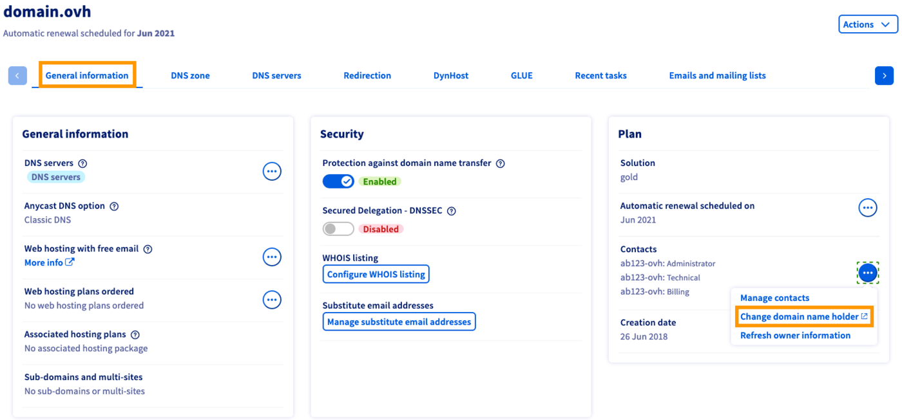

> [!primary]
> Tłumaczenie zostało wygenerowane automatycznie przez system naszego partnera SYSTRAN. W niektórych przypadkach mogą wystąpić nieprecyzyjne sformułowania, na przykład w tłumaczeniu nazw przycisków lub szczegółów technicznych. W przypadku jakichkolwiek wątpliwości zalecamy zapoznanie się z angielską/francuską wersją przewodnika. Jeśli chcesz przyczynić się do ulepszenia tłumaczenia, kliknij przycisk "Zgłóś propozycję modyfikacji" na tej stronie.
>

## Wprowadzenie

Oprócz [zarządzania kontaktami](/pages/account_and_service_management/account_information/managing_contacts), zarejestrowanie domeny wymaga podania informacji dotyczących jej właściciela. Właściciel **domeny** w tym kontekście dotyczy osoby lub firmy posiadającej prawa do tej domeny. **Zmiana właściciela** odnosi się do przeniesienia praw własności z jednej osoby lub firmy na inną, informacje **właściciela** mają moc prawną. Na przykład proces ten jest obowiązkowy, jeśli firma zmienia nazwę.

> [!primary]
>Operacja ta nie przenosi Twojej domeny na inne konto klienta OVHcloud.
>
>W tym celu należy [zmienić kontakty](/pages/account_and_service_management/account_information/managing_contacts) domeny.
>
> Jeśli potrzebujesz dokonać zmiany właściciela i kontaktu dla tej samej nazwy domeny, nie ma preferencyjnej kolejności. Jednak to kontakt administratora jest w stanie zainicjować te operacje. Te dwie zmiany są zatem wprowadzane w obszarze klienta kontaktu administratora nazwy domeny.

**Dowiedz się, jak zmienić właściciela domeny**

## Wymagania początkowe

- Dostęp do [Panelu klienta OVHcloud](https://www.ovh.com/auth/?action=gotomanager&from=https://www.ovh.pl/&ovhSubsidiary=pl){.external}
- Posiadanie domeny zarejestrowanej w OVHcloud dla której nie trwa żadna operacja (zmiana właściciela, transfer, utworzenie). Jeśli operacja została ostatnio zakończona w ramach Twojej domeny, przed wykonaniem nowej operacji musi upłynąć co najmniej 60 dni kalendarzowych.
- Posiadanie statusu [kontaktu administracyjnego](/pages/account_and_service_management/account_information/managing_contacts) danej domeny.
- Zgoda aktualnego właściciela domeny na zmianę właściciela.

## W praktyce

> [!warning]
>
> Poniższe instrukcje opisują najpopularniejszy sposób zmiany właściciela domeny. Są one ważne dla większości obszarów wyższego poziomu, powszechnie znanych jako **T**op **L**evel **D**omain (**TLD**). 
>**TLD** oznacza koniec Twojej domeny, np. *.com*, *.net*, *.fr*, itp.
>
> Szczegółowe zasady procesu rejestracji domen **TLD** są określone wyłącznie przez właściwy organ przydziału, tj. **registry**. Rejestrator (lub operator), taki jak OVHcloud, musi przestrzegać tych zasad i nie ma wpływu na decyzje dotyczące rejestracji.
>
> Istnieją głównie dwa rodzaje **TLD**: **ccTLD** oraz **gTLD**. **ccTLD** odnosi się do **TLD** dotyczących regionu lub kraju (*.fr*, *.be*, *.uk*, *.de*, *.paris*, itp.). **gTLD** odnosi się do **TLD** plus ogólne (*.net*, *.com*, *.info*, *.org*, itp.).
>
> Dokładna procedura zmiany właściciela domeny może się zatem różnić, w szczególności w przypadku niektórych **ccTLD**, takich jak *.lu*, *.hk*, *.ro*, *.be*, *.lt*, *.dk*, *.at*, *.fi*, itp.) oraz w przypadku niektórych **TLD** (*.am*,*,*, fm*, itp.) W przypadku niektórych z nich zmiana właściciela to operacja płatna. Zmiana właściciela może być również zawieszona z różnych powodów, na przykład z powodu nieopłacenia zamówienia, nadużycia lub zablokowania przez registry. 
>
> W przypadku wątpliwości zalecamy sprawdzenie następujących zasobów:
>
> - strona internetowa rejestru **TLD**;
> - Lista [TLD dostępnych na OVHcloud](https://www.ovhcloud.com/pl/domains/tld/);
> - sekcja `Operacje w trakcie`{.action} w [Panelu klienta OVHcloud](https://www.ovh.com/auth/?action=gotomanager&from=https://www.ovh.pl/&ovhSubsidiary=pl), aby sprawdzić aktualizacje statusu domeny.
>

### Etap 1: wybierz domenę

Zaloguj się do [Panelu klienta OVHcloud](https://www.ovh.com/auth/?action=gotomanager&from=https://www.ovh.pl/&ovhSubsidiary=pl) w sekcji `Web Cloud`{.action}. Kliknij `Domeny`{.action}, wybierz domenę globalną (gTLD), dla której chcesz zmienić właściciela.

### Etap 2: uruchomienie procedury zmiany właściciela

W karcie `Informacje ogólne`{.action} przejdź do sekcji **Abonament** w prawym dolnym rogu. Kliknij `...`{.action} przed **kontaktami**, po czym kliknij `Zmień właściciela`{.action}.

{.thumbnail}

> [!warning]
>
> Każda zmiana nazwiska, nazwiska, organizacji, statusu prawnego i adresu e-mail właściciela jest uważana za zmianę właściciela.
>
> Jeśli zmienisz tylko dane właściciela inne niż wymienione powyżej, przejdź do sekcji [Aktualizacja danych właściciela](#updateownerinformation) poniżej.
>

Otworzy się nowa zakładka przeglądarki z wszystkimi domenami uprawnionymi do zmiany właściciela. Wybierz z listy nazwę domeny, zaznaczając kratkę po lewej stronie. Etap ten może być również wykorzystany do rozpoczęcia operacji zbiorczej: można zainicjować zmianę właściciela dla kilku domen jednocześnie, na przykład w celu zmiany właściciela dla wszystkich domen *.ovh*. Po dokonaniu wyboru kliknij `Dalej`{.action}.

{.thumbnail}

W formularzu szczegółów właściciela wprowadź poprawne informacje we wszystkich obowiązkowych polach. Uważaj na błędy podczas wprowadzania danych i unikaj używania [znaków ASCII](http://facweb.cs.depaul.edu/sjost/it212/documents/ascii-pr.htm), jeśli to możliwe. Należy pamiętać, że wszelkie niedokładne lub błędne informacje mogą powodować błąd techniczny, a tym samym opóźnienie w całym procesie wymiany informacji.

Po potwierdzeniu zlecenia wymiany otrzymasz dwa e-maile, które pozwolą na potwierdzenie lub anulowanie zlecenia:

- e-mail wysłany do aktualnego właściciela;
- e-mail wysłany do przyszłego właściciela.

Jeśli adres e-mail nie został zmieniony w związku ze zmianą właściciela, referencyjny adres e-mail otrzyma oba e-maile, ale każdy z nich musi zostać potwierdzony.
 Zmiana właściciela domeny wejdzie w życie po potwierdzeniu wniosku przez e-mail.

> [!warning]
>
> - Procedura musi zostać zatwierdzona przez obie strony w ciągu 14 dni od złożenia wniosku. **Po tym terminie zabieg zostaje anulowany**.
> 
> - Jeżeli jedna ze stron odrzuci zmianę, wniosek zostaje anulowany.
>
> - Jeśli adres e-mail aktualnego właściciela jest przestarzały lub niedostępny, możesz **w tym przypadku** skontaktować się bezpośrednio z działem pomocy, wysyłając zgłoszenie w [Centrum pomocy OVHcloud](https://help.ovhcloud.com/csm?id=csm_get_help).
>
> - Jeśli właściciel domeny został zmieniony, domena nie będzie mogła zostać [przeniesiona do innego operatora](/pages/web_cloud/domains/transfer_outgoing_domain) przez 60 dni.

### Aktualizacja danych właściciela 

Jeśli musisz zaktualizować niektóre informacje uboczne, takie jak numer telefonu, adres itp., nie musisz wszczynać postępowania handlowego. Informacje te mogą zostać zmienione bezpośrednio w [Panelu klienta OVHcloud](https://www.ovh.com/auth/?action=gotomanager&from=https://www.ovh.pl/&ovhSubsidiary=pl).

W sekcji **Abonament** w zakładce `Informacje ogólne`{.action} kliknij `...`{.action} przed **kontaktami**, a następnie kliknij `Aktualizuj dane właściciela`{.action}.

{.thumbnail}

W przypadku tej operacji nie musisz potwierdzać modyfikacji za pomocą e-maila.

## Sprawdź również

[Zarządzanie kontaktami swoich usług](/pages/account_and_service_management/account_information/managing_contacts)

W przypadku wyspecjalizowanych usług (pozycjonowanie, rozwój, etc.) skontaktuj się z [partnerami OVHcloud](https://partner.ovhcloud.com/pl/directory/).

Jeśli chcesz otrzymywać wsparcie w zakresie konfiguracji i użytkowania Twoich rozwiązań OVHcloud, zapoznaj się z naszymi [ofertami pomocy](https://www.ovhcloud.com/pl/support-levels/).

Dołącz do społeczności naszych użytkowników na stronie <https://community.ovh.com/en/>. 
