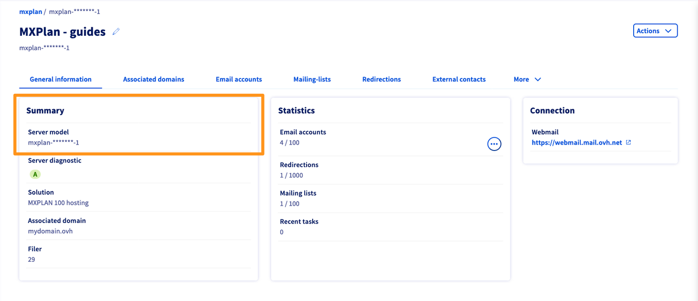
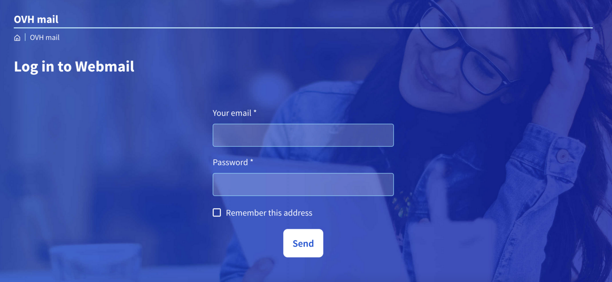
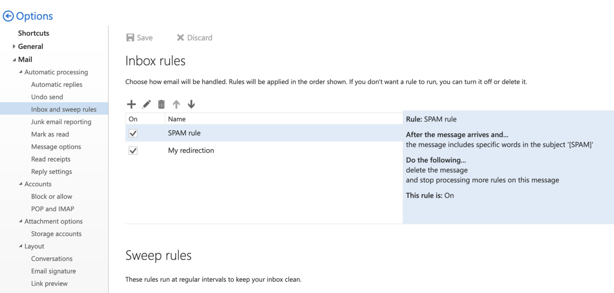
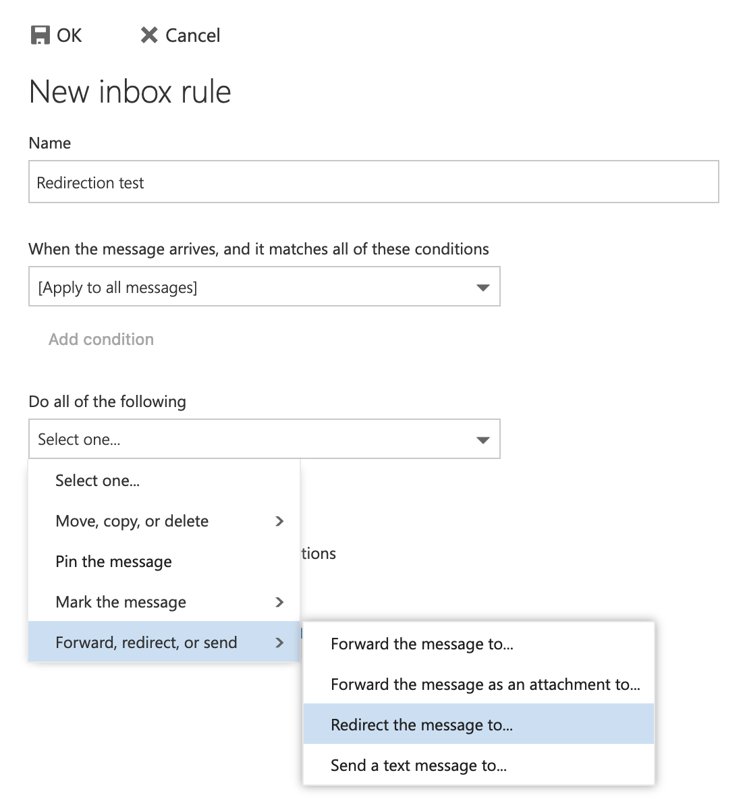
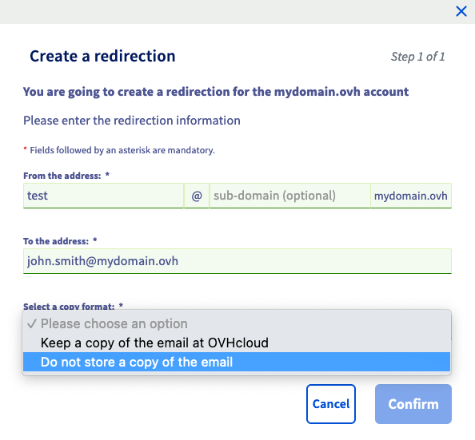

> [!primary]
> Questa traduzione è stata generata automaticamente dal nostro partner SYSTRAN. I contenuti potrebbero presentare imprecisioni, ad esempio la nomenclatura dei pulsanti o alcuni dettagli tecnici. In caso di dubbi consigliamo di fare riferimento alla versione inglese o francese della guida. Per aiutarci a migliorare questa traduzione, utilizza il pulsante "Contribuisci" di questa pagina.
>

## Obiettivo

In questa guida troverai informazioni e suggerimenti sulla configurazione dei tuoi reindirizzamenti e alias email, ad esempio per reindirizzare le email ricevute su un indirizzo A verso un indirizzo B.

**Come gestire gli alias e i reindirizzamenti email**

### Che cos’è un reindirizzamento email?

Un reindirizzamento permette di modificare il percorso iniziale di un'email verso uno o più indirizzi email.

Ad esempio, desiderate che all'invio di un'email su **contact@mydomain.ovh**, quest'ultima sia ugualmente rinviata verso **john.smith@otherdomain.ovh**. In questo modo è possibile inviare automaticamente un'email da **contact@mydomain.ovh** a **john.smith@otherdomain.ovh**.

### Cos'è un alias email?

Diversamente dal reindirizzamento, l'indirizzo email associato all'alias non è un indirizzo consultabile ma è una "maschera".

Creare un alias per il tuo indirizzo email ti permette di comunicare un indirizzo "mask" ai tuoi contatti, senza dover comunicare il tuo indirizzo email personale al mittente. Un indirizzo email può avere diversi alias.

Ad esempio, il tuo indirizzo email è **john.smith@mydomain.ovh** e il tuo alias **information@mydomain.ovh**. Puoi così comunicare ai tuoi contatti l'indirizzo **information@mydomain.ovh** e ricevere le tue email su **john.smith@mydomain.ovh**, senza che il mittente sia a conoscenza di **john.smith@mydomain.ovh**.

### Reindirizzamento e alias in immagine 

- **Il reindirizzamento semplice (schema n°1 qui sotto)**: l'email viene inoltrata direttamente all'indirizzo di reindirizzamento, il destinatario iniziale non riceve l'email.

- **Il reindirizzamento con copia locale (schema n°2 qui sotto)**: l'email viene inviata al destinatario iniziale e all'indirizzo di reindirizzamento.

- **L'alias email (schema n°3 qui sotto)**: l'email è indirizzata all'alias che lo restituisce al destinatario su cui l'alias è stato configurato.

{.thumbnail}

> [!primary]
>
> Ti ricordiamo che è possibile configurare un reindirizzamento verso diversi indirizzi email.

## Prerequisiti

- Avere accesso allo [Spazio Cliente OVHcloud](https://www.ovh.com/auth/?action=gotomanager&from=https://www.ovh.it/&ovhSubsidiary=it)
- Disporre di una soluzione email OVHcloud configurata precedentemente (**MX Plan**, inclusa nelle nostre [soluzioni di hosting Web](https://www.ovhcloud.com/it/web-hosting/), inclusa in un [Hosting gratuito 100M](https://www.ovhcloud.com/it/domains/free-web-hosting/) o ordinata separatamente come soluzione autonoma, come [Hosted Exchange](https://www.ovhcloud.com/it/emails/hosted-exchange/) o [Email Pro](https://www.ovhcloud.com/it/emails/email-pro/))

## Procedura

Le sezioni "[creare un reindirizzamento](#redirect)" e "[creare un alias](#alias)" riguardano tutte le nostre soluzioni di posta OVHcloud, **a meno che**:

- se disponi della versione storica dell'offerta MXplan (per verificarla, consulta la riquadro qui sotto).
- se hai un dominio registrato in OVHcloud senza un servizio email associato,

Per entrambe le eccezioni, è possibile solo il reindirizzamento. Per maggiori informazioni, consulta il capitolo "[Creare un reindirizzamento o un alias su un'offerta MX Plan storico o un dominio senza offerta email](#mxplanlegacy)".

>
> In base alla data di attivazione della tua offerta MXplan o in caso [di recente migrazione della soluzione](https://www.ovhcloud.com/it/web-hosting/mxplan-migration/), è possibile che tu disponga della versione storica o della nuova versione dell'offerta. Prima di proseguire, è necessario identificarla. 
>
> Accedi alla sezione `Web Cloud`{.action} dello [Spazio Cliente OVHcloud](https://www.ovh.com/auth/?action=gotomanager&from=https://www.ovh.com/fr/&ovhSubsidiary=fr). Clicca su `Email`{.action} e seleziona il servizio MX Plan interessato. Prosegui nella lettura di questa guida in base alla versione di cui disponi: 
>
> |Vecchia versione della soluzione MX Plan|Nuova versione della soluzione MX Plan|
> |---|---|
> |{.thumbnail}  Il servizio è indicato nel riquadro “Abbonamento”|{.thumbnail} Il servizio è indicato nel riquadro “Riepilogo”, sotto la voce `Referenza server`|
> |Continua la lettura alla sezione "[Versione storica dell'offerta MX Plan](#mxplanlegacy)"|Continua la lettura a [Creare un reindirizzamento](#redirect) o [Creare un alias](#alias)|

### Crea un reindirizzamento 

La gestione dei reindirizzamenti non avviene tramite lo Spazio Cliente, ma direttamente tramite la webmail dell'indirizzo email in questione.

Accedi all'indirizzo <https://www.ovhcloud.com/it/mail/>. inserendo **indirizzo email** e **password**.

{.thumbnail}

Nel nostro esempio, si tratta di un **reindirizzamento con copia in locale** (vedi lo [schema 2](#diagram) all’inizio di questa guida). Se questo è ciò di cui hai bisogno, clicca su `OK`{.action} (icona del floppy disk) in alto a sinistra e la regola diventa effettiva. Altrimenti, passa allo step successivo.

Per seguire gli step descritti, clicca su ciascuna scheda qui sotto:

> [!tabs]
> **Passo 1**
>>
>> Una volta connesso al tuo indirizzo email tramite la [webmail](https://www.ovhcloud.com/it/mail/), clicca sull'icona a forma di ingranaggio in alto a destra e poi su `Opzioni`{.action}.  
>> {.thumbnail} 
>>
> **Passo 2**
>> Dalla finestra **Opzioni**, nella colonna di sinistra, vai alla categoria **Elaborazione automatica** della sezione **Posta** e poi clicca su `Regole Posta in arrivo e posta`{.action}.   
>> {.thumbnail}  
>> Questa finestra permette di gestire i reindirizzamenti e applicare filtri su tutte le email in entrata. 
>>
> **Passo 3**
>>
>> Dalla pagina di gestione **Regole di Posta in arrivo**, clicca sul simbolo`+`{.action} in alto a sinistra.  
>> {.thumbnail}  
>>
> **Passo 4**
>>
>> **Nome**: definisci il nome del tuo reindirizzamento.  
>> **Quando il messaggio arriva e soddisfa tutte queste condizioni** : se il tuo reindirizzamento si applica a tutti i messaggi, seleziona `[Applica a tutti i messaggi]`{.action}.  
>>{.thumbnail .w-640}  
>>
> **Passo 5**
>>
>> **Esegui tutte le operazioni seguenti**: applica il reindirizzamento, seleziona `Trasferisci, reindirizza o invia`{.action}, quindi `Reindirizza il messaggio verso...`{.action}.  
>>{.thumbnail .w-640}  
>>
> **Passo 6**
>>
>> Dopodiché inserisci l'indirizzo verso cui vuoi reindirizzare l'email davanti a **Reindirizzare il messaggio verso...**. e poi clicca su `Salva`{.action}. Infine clicca su `OK`{.action} (icona del floppy disk) per completare il reindirizzamento.  
>>{.thumbnail .w-640}  
>>

> [!primary]
> Per applicare un **reindirizzamento semplice** (vedi [schema 1](#diagram) all'inizio di questa guida), aggiungi una regola aggiuntiva al tuo **reindirizzamento con copia in locale** da questa finestra. Clicca su `Aggiungi un'azione`{.action} (riquadro 1) e poi su `Sposta, copia o elimina`{.action} e infine clicca su `Elimina il messaggio`{.action}. Questa regola sposta il messaggio direttamente nel cestino, dopo averlo inoltrato all’altro indirizzo.  
> {.thumbnail .w-640}

### Crea un alias 

Accedi allo [Spazio Cliente OVHcloud](https://www.ovh.com/auth/?action=gotomanager&from=https://www.ovh.it/&ovhSubsidiary=it) e clicca sulla sezione `Web Cloud`. Seleziona il menu in base al servizio di posta:

- **Exchange**: seleziona `Microsoft`{.action} e `Exchange`{.action}. Clicca sulla scheda `Account email`{.action}.

- **Email Pro**: in `Email Pro`{.action}, seleziona la piattaforma e clicca sulla scheda `Account email`{.action}.

- **Email** (MXplan): in `Email`{.action}, seleziona la piattaforma e clicca sulla scheda `Account email`{.action}.

Per aggiungere un alias al tuo account email, segui gli step descritti cliccando poi su ogni scheda qui sotto:

> [!tabs]
> **Passo 1**
>>
>> Visualizzi una tabella con la colonna `Alias`.  
>> {.thumbnail} 
>>
> **Passo 2**
>>
>> Clicca sui tre puntini `...`{.action} e poi su `Configura gli alias`{.action} (o `Gestisci gli alias`{.action}).  
>> {.thumbnail} 
>>
> **Passo 3**
>>
>> Clicca su `Aggiungi un alias`{.action} e inserisci l'indirizzo che hai scelto per il tuo alias e conferma la tua scelta.  
>> {.thumbnail} 

#### Elimina un alias

Dalla scheda `Account email`{.action}, clicca sul pulsante `...`{.action} a destra dell'indirizzo email in questione. Clicca su `Configura gli alias`{.action} (o `Gestisci gli alias`{.action}).

Clicca sui tre puntini `...`{.action} a destra dell'alias in questione nel menu di gestione degli alias. Infine clicca su `Elimina l'alias`{.action}

{.thumbnail}

#### Creare un reindirizzamento o un alias su una soluzione MX Plan storica o un dominio senza offerta email 

Accedi allo [Spazio Cliente OVHcloud](https://www.ovh.com/auth/?action=gotomanager&from=https://www.ovh.it/&ovhSubsidiary=it) e clicca sulla sezione `Web Cloud`. Clicca sulla sezione `Email`{.action}:

Il metodo per creare un alias o un reindirizzamento è strettamente lo stesso. Per seguire gli step descritti, clicca su ciascuna scheda qui sotto:

> [!tabs]
> **Passo 1**
>> Di default, ti trovi nella scheda `Informazioni generali`{.action} della tua soluzione MXPlan. Clicca sulla scheda `Email`{.action} e poi sul pulsante `Gestisci i reindirizzamenti`{.action} a destra.  
>> {.thumbnail} 
>>
> **Passo 2**
>>
>> Si apre la tabella dei reindirizzamenti già attivi. A destra, clicca su `Aggiungi un reindirizzamento`{.action}.  
>>
>> > [!primary]
>> >
>> > Per modificare o eliminare un reindirizzamento, clicca su `...`{.action}, a destra del reindirizzamento in questione.
>>
>> {.thumbnail} 
>>
> **Passo 3**
>>
>> **Dall'indirizzo**: inserisci qui l'indirizzo email che vuoi reindirizzare.  
>> **All'indirizzo**: inserisci qui l'indirizzo di destinazione del tuo reindirizzamento. Può essere uno dei tuoi indirizzi email OVHcloud o un account esterno.  
>> **Scegli una modalità di copia**: scegli se vuoi:   - **Conservare una copia dell'email in OVHcloud** (ricevere l'email sul tuo indirizzo principale e l'indirizzo di reindirizzamento)  *cf. lo [schema 2](#diagram) all'inizio di questa guida.*   - **Non conservare una copia dell'email** (inoltrare direttamente all'indirizzo di reindirizzamento senza che l'indirizzo principale lo riceva)   *cf. lo [schema 1](#diagram) all'inizio di questa guida.*  
>> Clicca su `Conferma`{.action} per aggiungere il reindirizzamento.  
>> {.thumbnail}

> [!primary]
>
> Quando scegli la modalità di copia "**Conserva una copia dell'email in OVHcloud**", viene automaticamente creato un reindirizzamento dell'indirizzo email verso se stesso nella lista dei reindirizzamenti, si materializza questa copia locale.
> 

## Per saperne di più

Contatta la nostra Community di utenti all’indirizzo <https://community.ovh.com/en/>.