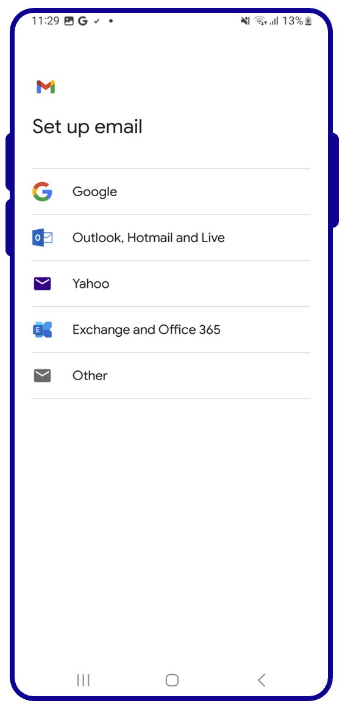
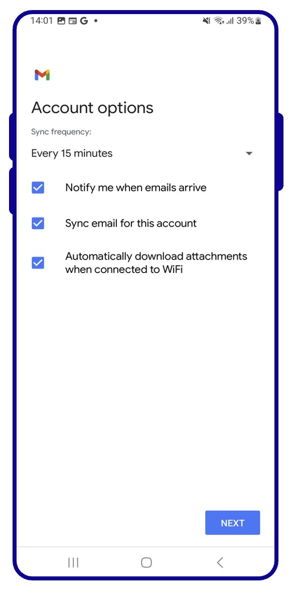

## Objectif

Les adresses e-mail de l'offre E-mail Pro peuvent être configurées sur différents logiciels de messagerie compatibles. Cela vous permet d'envoyer et de recevoir vos messages depuis l'appareil de votre choix. Retrouvez dans ce guide les étapes de configuration d'une adresse e-mail E-mail Pro depuis l'application Gmail présente sur les appareils Android.

**Apprenez à configurer un compte E-mail Pro sur Android, via l'application Gmail.**

> [!warning]
>
> OVHcloud met à votre disposition des services dont la configuration, la gestion et la responsabilité vous incombent. Il vous revient de ce fait d'en assurer le bon fonctionnement.
>
> Nous mettons à votre disposition ce guide afin de vous accompagner au mieux sur des tâches courantes. Néanmoins, nous vous recommandons de faire appel à un [prestataire spécialisé](https://partner.ovhcloud.com/fr/) et/ou de contacter l'éditeur du service si vous éprouvez des difficultés. En effet, nous ne serons pas en mesure de vous fournir une assistance. Plus d'informations dans la section « Aller plus loin » de ce guide.

## Prérequis

- Disposer d'une offre [E-mail Pro](https://www.ovhcloud.com/fr/emails/email-pro/){.external}.
- Disposer de l'application Gmail sur votre appareil. Vous pouvez installer cette dernière depuis le Google Play Store.
- Disposer des identifiants relatifs à l'adresse e-mail que vous souhaitez paramétrer.

> [!primary]
>
> Cette documentation a été réalisée depuis un appareil utilisant la version 13 d'Android.
>

## En pratique

### Comment ajouter votre compte e-mail

> [!primary]
>
> Dans nos exemples, nous utilisons la mention serveur : pro**?**.mail.ovh.net. Vous devrez remplacer le « ? » par le chiffre désignant le serveur de votre service E-mail Pro.
>
> Retrouvez ce chiffre dans votre [espace client OVHcloud](https://www.ovh.com/auth/?action=gotomanager&from=https://www.ovh.com/fr/&ovhSubsidiary=fr){.external}, dans la rubrique `Web Cloud`{.action} puis `E-mail Pro`{.action}. Le nom du serveur est visible dans le cadre **Connexion** de l'onglet `Informations Générales`{.action}.
>

Sur l'écran d'accueil de votre appareil, rendez-vous dans l'application `Gmail`{.action}.

{.thumbnail .w-400}

L’ajout d’un compte se fera différemment **si aucun compte n'est paramétré** ou **si un compte a déjà été paramétré**. Sélectionnez l'onglet correspondant à l'une des 2 situations évoquées :

> [!tabs]
> **Première configuration**
>>
>> Sélectionnez `Ajouter une adresse e-mail`{.action}  
>> {.thumbnail}
>>
> **Configuration existante**
>>
>> 1. Dirigez-vous vers le menu situé dans la partie supérieure gauche de l'écran  2.Sélectionnez `Paramètres`{.action}  3.Sélectionnez `Ajouter un compte`{.action}  
>> {.thumbnail}
>>

Suivez les étapes successives de configuration en parcourant les onglets ci-dessous :

> [!tabs]
> **Etape 1**
>> Dans le menu des types de comptes e-mail, sélectionnez `Autre`{.action}.  
>> {.thumbnail}
>>
> **Etape 2**
>> Saisissez votre adresse e-mail.  
>> {.thumbnail}
>>
> **Etape 3**
>> Sélectionnez le protocole de réception des e-mails. Il est conseillé de sélectionner `Personnel (IMAP)`{.action}  Retrouvez [plus de détails sur les protocoles POP et IMAP](#popimap) à la fin de ce guide pour comprendre leurs différences.  
>> {.thumbnail}
>>
> **Etape 4**
>> Saisissez le mot de passe de votre adresse e-mail.  
>> {.thumbnail}
>>
> **Etape 5**
>> Complétez les « **Paramètres de serveur entrant** »  - **Nom d'utilisateur** : Votre adresse e-mail complète - **Mot de passe** : Le mot de passe de votre adresse e-mail - **Serveur** : saisissez **pro**?**.mail.ovh.net** (remplacez bien «**?**» par le numéro de votre serveur).   
>> {.thumbnail}
>>
> **Etape 6**
>> Complétez les « **Paramètres de serveur sortant** »  - **Nom d'utilisateur** : Votre adresse e-mail complète - **Mot de passe** : Le mot de passe de votre adresse e-mail - **Serveur SMTP** : saisissez **pro**?**.mail.ovh.net** (remplacez bien «**?**» par le numéro de votre serveur).   
>> {.thumbnail}
>>
> **Etape 7**
>> Choisissez la fréquence de synchronisation de vos e-mails selon vos préférences.  
>> {.thumbnail}
>>
> **Etape 8**
>> Déterminez le nom d'affichage de votre adresse e-mail dans l'application Gmail puis appuyez sur `Suivante`{.action}.  
>> {.thumbnail}
>>

Une fois l'adresse e-mail configurée, il ne reste plus qu’à l'utiliser ! Vous pouvez dès à présent envoyer et recevoir des messages depuis votre application Gmail.

> [!success]
>
> OVHcloud propose une application web permettant d'accéder à votre adresse e-mail depuis un navigateur web, à l’adresse <https://www.ovhcloud.com/fr/mail/>. Vous pouvez vous y connecter grâce aux identifiants de votre adresse e-mail.

### Paramètres POP, IMAP et SMTP

Pour la réception des e-mails, lors du choix du type de compte, nous vous conseillons une utilisation en **IMAP**. Vous pouvez cependant sélectionner **POP**. Pour comprendre leur fonctionnement respectif, consultez notre section [« POP ou IMAP, quelle est la différence ? »](#popimap)

- **Pour une configuration en POP**

|Information|Description|
|---|---|
|Nom d'utilisateur|Renseignez l'adresse e-mail **complète**|
|Mot de passe|Renseignez le mot de passe de l'adresse e-mail|
|Serveur|pro**?**.mail.ovh.net (remplacez bien «**?**» par le numéro de votre serveur)|
|Port|995|
|Type de sécurité|SSL/TLS|

- **Pour une configuration en IMAP**

|Information|Description|
|---|---|
|Nom d'utilisateur|Renseignez l'adresse e-mail **complète**|
|Mot de passe|Renseignez le mot de passe de l'adresse e-mail|
|Serveur|pro**?**.mail.ovh.net (remplacez bien «**?**» par le numéro de votre serveur)|
|Port|993|
|Type de sécurité|SSL/TLS|

Pour l'envoi des e-mails, si vous devez renseigner manuellement les paramètres **SMTP** dans les préférences du compte, vous trouverez ci-dessous les paramètres à utiliser :

- **Configuration SMTP**

|Information|Description|
|---|---|
|Nom d'utilisateur|Renseignez l'adresse e-mail **complète**|
|Mot de passe|Renseignez le mot de passe de l'adresse e-mail|
|Serveur|pro**?**.mail.ovh.net (remplacez bien «**?**» par le numéro de votre serveur)|
|Port|587|
|Type de sécurité|STARTTLS|

### POP ou IMAP, quelle est la différence ? 

Lorsque vous configurez votre adresse e-mail manuellement, votre client de messagerie vous demande si vous souhaitez utiliser le protocole **POP** (**P**ost **O**ffice **P**rotocol) ou **IMAP**(**I**nternet **M**essage **A**ccess **P**rotocol). Pour bien comprendre, il faut situer la place des protocoles POP et IMAP dans la configuration de votre adresse e-mail.

Lors de la configuration de votre client de messagerie, vous devez lui renseigner les informations du **serveur entrant** pour recevoir les e-mails et le **serveur sortant** pour envoyer les e-mails. Pour envoyer les e-mails, il n'y a pas de choix, c'est le protocole **SMTP** (**S**imple **M**ail **T**ransfer **P**rotocol) qui est utilisé. Pour la réception, vous aurez donc le choix entre **POP** ou **IMAP**.

{.thumbnail}

Pour comprendre la différence entre l'utilisation du protocole POP et IMAP, nous allons détailler les éléments qui composent le traitement de vos e-mails en réception :

1. **Votre appareil** : un ordinateur, un smartphone ou une tablette. C'est votre support de consultation.

2. **Votre client de messagerie** : logiciel ou application dédié(e) à la gestion de vos e-mails. Son choix déterminera le niveau d'ergonomie et de fonctionnalités dont vous aurez besoin pour consulter vos e-mails.

3. **Le protocole de réception** : choix déterminant la façon de relever les e-mails sur votre appareil. Son choix a une incidence sur les autres appareils qui consultent ce même compte e-mail.
    - **IMAP** : votre client de messagerie interroge le serveur e-mail et télécharge les e-mails sur votre appareil. Lorsque vous consultez un e-mail non lu, le serveur le marque comme « lu » par défaut. Les autres appareils configurés en IMAP pourront constater cet état et consulter cet e-mail tant qu'il n'aura pas été supprimé sur l'un des appareils.
    - **POP** : votre client de messagerie interroge le serveur e-mail et va télécharger les e-mails sur votre appareil. Par défaut, une fois l'e-mail téléchargé sur votre appareil, le message est supprimé du serveur. Par conséquent, les autres appareils connectés à cette adresse e-mail ne pourront pas consulter cet e-mail.

{.thumbnail}

> [!primary]
>
> Ce descriptif est une synthèse, il représente le fonctionnement standard de ces deux protocoles. Il est possible de paramétrer le POP pour que les e-mails ne soit pas supprimés lorsque vous relevez vos e-mails. L'objectif ici est de décrire le fonctionnement natif de ces deux protocoles et de vous éviter des manipulations supplémentaires afin de répondre à votre besoin.

## Aller plus loin

[MXplan - Configurer une adresse e-mail dans Gmail pour Android](/pages/web_cloud/email_and_collaborative_solutions/mx_plan/how_to_configure_android).

[Exchange - Configurer une adresse e-mail dans Gmail pour Android](/pages/web_cloud/email_and_collaborative_solutions/microsoft_exchange/how_to_configure_android).

Échangez avec notre communauté d'utilisateurs sur [https://community.ovh.com](https://community.ovh.com){.external}.