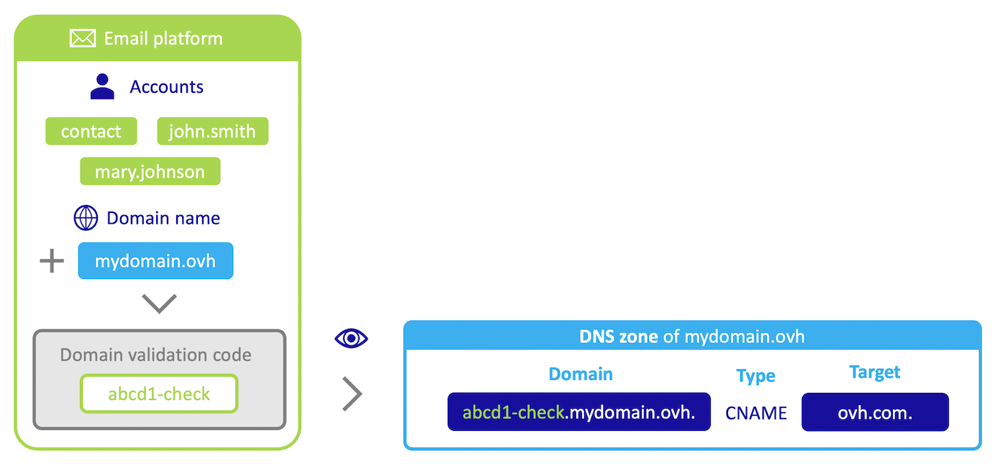
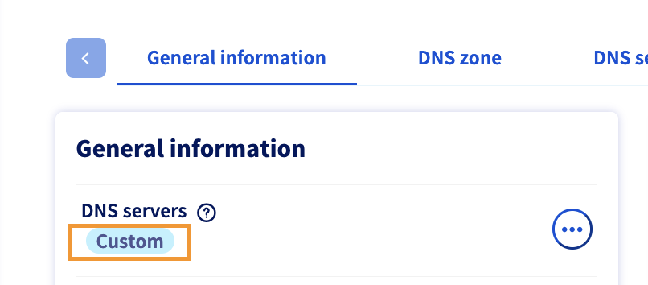

## Objective

When you add a domain name to your email platform, you may be asked to configure a CNAME record in the DNS zone. The purpose of this procedure is to ensure that the domain name concerned is legitimate for use on the email platform.

> [!primary]
>
> If the domain name added is managed in the same customer account as the email platform, and more specifically its DNS zone, there is no CNAME record to configure.

**Find out how to validate your domain name on your email platform by adding a CNAME record.**

## Requirements

- access to the [OVHcloud Control Panel](https://www.ovh.com/auth/?action=gotomanager&from=https://www.ovh.co.uk/&ovhSubsidiary=GB){.external}, in the `Web Cloud`{.action} section.
- an [Exchange](https://www.ovhcloud.com/en-gb/emails/) or [Email Pro](https://www.ovhcloud.com/en-gb/emails/email-pro/) solution.
- a domain name added to your email platform. You can refer to our guide on [Adding a domain name to an email](/pages/web_cloud/email_and_collaborative_solutions/microsoft_exchange/exchange_adding_domain) platform , if required.
- You must be able to configure the DNS zone for the domain name concerned, [from your OVHcloud Control Panel](/pages/web_cloud/domains/dns_zone_edit), or from the management interface where it is registered.

## Instructions

### Why create a CNAME record?

The CNAME record is used here as an alias, it points to a target that itself points to an IP address. This is not a record linked to an email service.

As part of our [**Hosted Exchange**](https://www.ovhcloud.com/en-gb/emails/hosted-exchange/) and [**Email Pro**](https://www.ovhcloud.com/en-gb/emails/email-pro/) solutions, this CNAME record is used as a validation code (token) that will be visible in the DNS zone of the domain name you want to validate. The purpose is to check that the user of the email platform is the manager of the domain name they are adding.

In the diagram below, the email platform ([Exchange](https://www.ovhcloud.com/en-gb/emails/) or [Email Pro](https://www.ovhcloud.com/en/emails/email-pro/)) is represented by the green box.<br>
To train the email addresses, you add accounts (here represented by “**contact**”, “**john.smith**” and “**mary.johnson**”).<br>
The domain name **mydomain.ovh** has been added to the email platform (please refer to the guide “[Adding a domain name to an email platform](/pages/web_cloud/email_and_collaborative_solutions/microsoft_exchange/exchange_adding_domain”).<br>
A validation code is generated by the platform (in the form “**abcd1-check**” in our example).<br>
If the DNS zone for the domain name **mydomain.ovh** is not managed in the same OVHcloud customer account, or is managed from an external management interface, this code must then be added as a CNAME record. This record is represented by the blue box in the example.<br>
The email platform can observe the DNS records of the domain name **mydomain.ovh** to verify the presence of the validation code.

{.thumbnail}

Once the email platform has been able to read the validation code in the DNS zone of the domain name **mydomain.ovh**, it becomes possible to train the addresses **contact@mydomain.ovh**, **john.smith@mydomain.ovh** and **mary.johnson@mydomain.ovh**.

### Step 1 - Understand the OVHcloud CNAME diagnostic <a name="step1"></a>

The **CNAME** diagnostic box will appear in the `Associated domains`{.action} tab of your email platform after you have added your domain name.

{.thumbnail}

In the example above, the box is red. Here are the possible reasons for this diagnosis:

- **the domain name declared is not managed in the same OVHcloud customer account as your email platform**: follow [step 3](#step3) of this guide from the OVHcloud account control panel, which manages the domain name’s DNS zone.
- **The domain name declared uses DNS servers external to OVHcloud**. The domain name is registered with OVHcloud, but you use “custom” DNS servers. To check this, in the `Domain names`{.action} section on the left-hand column, select the domain name concerned. In the `General information`{.action} tab, check the “DNS servers” comment. If it says `Custom`{.action}, you will need to log in to the management interface for the DNS servers registered in the `DNS Servers`{.action} tab

{.thumbnail}

- **the domain name declared is not registered with OVHcloud and does not use OVHcloud DNS servers**: the domain name is registered at another registrar. You will need to check the DNS servers used to identify where you need to configure the DNS zone.

### Step 2 - Retrieve the validation code <a name="step2"></a>

Go to the `Associated domains`{.action} tab, and click on the red `CNAME` box in the “diagnostic” column to retrieve the information required.

The CNAME record is described in the dialog box that appears.

{.thumbnail}

Then note the unique code visible on the middle line (`a1bcd-check.mydomain.ovh to ovh.com.` in the example above).

### Step 3 - Create the CNAME record <a name="step3"></a>

Select the tab that corresponds to your situation:

> [!tabs]
> **Via the OVHcloud Control Panel**
>> In the `Web Cloud`{.action} section, click `Domain`{.action} names, then click on the domain name concerned. Then select the `DNS zone`{.action} tab.<br>
>> Your DNS zone configuration will appear. To add a CNAME record, click the `Add Entry`{.action} button on the right.<br>
>> In the new window, you can view several DNS records. Click `CNAME`{.action} and fill in the fields depending on the information retrieved in [step 2](#step2) of this guide.<br>
>> For example, if the validation code is “**a1bcd-check**”, it must be entered in the “sub-domain” box. Finally, enter “**ovh.com.**” in the “target” section, keeping in mind the final “**.**”.
>>
>> {.thumbnail}
>>
>> Once you have entered this information, click `Next`{.action}. Verify that the information displayed is correct, then click `Confirm`{.action}.<br>
>>
>> > [!warning]
>> >
>> > The modification requires a propagation time that is usually applied in a few minutes. However, it can be up to 24 hours maximum.
>>
> **From an interface external to OVHcloud**
>>
>> Log in to the interface that manages the domain name’s DNS zone, and add a CNAME record to it, with the following settings:
>>
>> - **sub-domain**: enter the value in the form “**xxxxx-check**”, replacing the “**x**” with the unique code listed in [step 2](#step2) of this guide.
>> - **Target**: Enter the value “**ovh.com.**”, keeping in mind the final “**.**” if your input interface does not do so automatically.
>>
>> Confirm this change in your DNS zone.
>>
>> > [!warning]
>> >
>> > This modification requires a propagation time, usually applied in a few minutes. However, it can be up to 24 hours maximum.
>> >
>>
>> Here is an example of a DNS response after adding a validation CNAME record:
>>
>> ```bash
>> ab1cd-check.mydomain.ovh. 3600	IN	CNAME	ovh.com.
>> ```

To check that the CNAME record configuration has been read by your email platform, go back to it and go to the Associated `domains tab`{.action}. If the `CNAME` box is no longer present in the “diagnostic” column, the domain name is correctly added. If not, then the configuration changes you have made may not have propagated fully.

{.thumbnail}

## Go further

Join our community of users on <https://community.ovh.com/en/>.