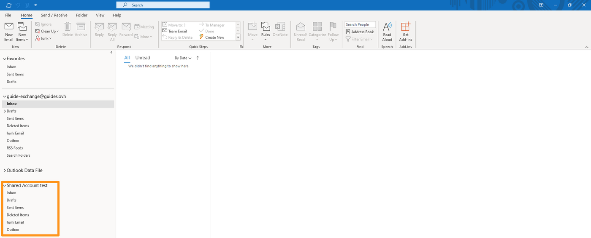

> [!primary]
> Diese Übersetzung wurde durch unseren Partner SYSTRAN automatisch erstellt. In manchen Fällen können ungenaue Formulierungen verwendet worden sein, z.B. bei der Beschriftung von Schaltflächen oder technischen Details. Bitte ziehen Sie im Zweifelsfall die englische oder französische Fassung der Anleitung zu Rate. Möchten Sie mithelfen, diese Übersetzung zu verbessern? Dann nutzen Sie dazu bitte den Button "Beitragen" auf dieser Seite.
>

## Ziel

Ein **freigegebenes Postfach** ist eine Mailbox, die zwischen mehreren Exchange Accounts geteilt wird und ausschließlich über diese erreichbar ist. Ein freigegebenes Postfach hat kein Passwort, daher muss der Zugriff an ein oder mehrere Exchange-Konten desselben Dienstes delegiert werden.
 Freigegebene Postfächer sind mittels Delegation über OWA (Exchange Webmail) oder Outlook erreichbar.

**Diese Anleitung erklärt, wie Sie ein freigegebenes Exchange Konto auf Ihrer Exchange Plattform erstellen und verwalten.**

## Voraussetzungen

- Sie haben Zugriff auf Ihr [OVHcloud Kundencenter](https://www.ovh.com/auth/?action=gotomanager&from=https://www.ovh.de/&ovhSubsidiary=de).
- Sie haben einen [OVHcloud Exchange](https://www.ovhcloud.com/de/emails/hosted-exchange/) Dienst eingerichtet.

## In der praktischen Anwendung

### Freigegebenes Postfach hinzufügen

Loggen Sie sich in Ihrem [OVHcloud Kundencenter](https://www.ovh.com/auth/?action=gotomanager&from=https://www.ovh.de/&ovhSubsidiary=de) ein und wählen Sie unter `Microsoft`{.action} und `Exchange`{.action} Ihren Exchange Dienst aus.

Wählen Sie den Tab `Freigegebene Postfächer`{.action} aus und klicken Sie auf `Freigegebenes Postfach hinzufügen`{.action}.

{.thumbnail}

Füllen die Felder aus:

|Funktion|Beschreibung|
|---|---|
|E-Mail-Account|Wählen Sie den Namen Ihres freigegebenen Accounts aus. **Es darf sich nicht um eine bestehende E-Mail-Adresse handeln.**|
|Quota|Geben Sie das gewünschte Speicherkontingent für Ihren freigegebenen Account an, [abhängig vom verfügbaren Speicherplatz](#size).|
|Anzeigename|Anzeigename, die Sie beim Versand über Ihr freigegebenes Postfach anzeigen möchten.|
|Adresse im Adressbuch verbergen|Das Ausblenden der Adresse im Adressbuch sorgt dafür, dass die Adresse des freigegebenen Postfachs nicht vom Exchange-Dienst gelistet wird.|

> [!primary]
>
> Der für die Erstellung eines gemeinsamen Accounts verfügbare Speicherplatz hängt von der Anzahl der Accounts ab, die für Ihre Plattform abonniert wurden. Jeder Exchange Account, der für Ihre Plattform registriert ist, entsperrt 5 GB für die gemeinsam genutzten Accounts.
>
> **Beispiel:**
>
> Sie haben 4 Exchange Accounts auf Ihrer Plattform abonniert, sodass Sie **4 x 5 GB** haben. Dies entspricht **20 GB** dem für die freigegebenen Accounts Ihrer Exchange Plattform zugewiesenen Speicherplatz.

Klicken Sie auf `Weiter`{.action}, um zur Zusammenfassung zu gelangen und klicken Sie auf `Bestätigen`{.action}.

{.thumbnail}

### Verwaltung der Delegation eines freigegebenen Postfachs

Sobald Ihr freigegebenes Postfach erstellt wurde, können einem oder mehreren Konten des Exchange-Dienstes Zugriffsberechtigungen erteilt werden.

Ein freigegebenes Postfach ist nicht direkt erreichbar, da es kein Passwort besitzt. Es ist also nicht unmittelbar in einem Outlook-Client oder über Webmail einzurichten.

Es muss daher eine Delegation zwischen einem Exchange Account und dem freigegebenen Postfach eingerichtet werden.

Klicken Sie im Tab Tab `Freigegebene Postfächer`{.action} des Exchange-Dienstes auf den Button `...`{.action} und anschließend auf `Berechtigungen konfigurieren`{.action}. Sie können dann in der Liste auswählen, welche Konten auf das freigegebene Postfach zugreifen können sollen.

{.thumbnail}

Wählen Sie für den ausgewählten Account die Berechtigungen aus:

|Funktion|Beschreibung|
|---|---|
|Senden als|Erlaubt dem ausgewählten Account, als das freigegebene Postfach zu versenden.|
|Senden im Auftrag von|Erlaubt dem ausgewählten Account, "im Auftrag" des freigegebenen Postfachs zu senden.|
|Zugriffsrechte|Erlaubt dem ausgewählten Account, das freigegebene Postfach über OWA oder Outlook anzuzeigen und zu verwalten.|

Klicken Sie anschließend auf `Weiter`{.action} und `Bestätigen`{.action}, um die Änderungen zu speichern.

{.thumbnail}

In unserem Beispiel erlauben wir den Accounts **guide-exchange@** und **test@** auf **shared_test@** zuzugreifen.
 Der Account **guide-exchange@** hat zusätzlich das Recht, E-Mails "als" **shared_test@** zu versenden.
 Der Account **test@** kann E-Mails "im Auftrag" von **shared_test@** versenden.

### Nutzung des freigegebenen Postfachs über OWA (Webmail)

Loggen Sie sich [im Webmail](https://www.ovh.de/mail/) mit einem Account ein, der Zugriff auf das freigegebene Postfach hat.
 In unserem Beispiel verbinden wir uns über den Account **guide-exchange@**.

Wenn Sie eingeloggt sind, klicken Sie mit der rechten Maustaste auf Ihre E-Mail-Adresse in der linken Menüspalte. Wählen Sie aus dem Kontextmenü `Freigegebenen Ordner hinzufügen`{.action}. 

{.thumbnail}

Geben Sie anschließend den Namen Ihres freigegebenen Accounts ein und klicken Sie auf `Hinzufügen`{.action}, wenn dieser im Exchange-Verzeichnis gefunden wurde.

{.thumbnail}

In unserem Beispiel ist das freigegebene Postfach nun über den Account **guide-exchange@** verfügbar.

{.thumbnail}

### Verwendung des freigegebenen Accounts in Outlook

Im Outlook-Client finden Sie Ihr freigegebenes Postfach in der linken Spalte, genau wie im Webmail.

{.thumbnail}

## Weiterführende Informationen

[Verwendung der Outlook Web App](/pages/web_cloud/email_and_collaborative_solutions/using_the_outlook_web_app_webmail/email_owa)

[Berechtigungen für einen Exchange Account übertragen](/pages/web_cloud/email_and_collaborative_solutions/microsoft_exchange/feature_delegation)

[Kalender in OWA freigeben](/pages/web_cloud/email_and_collaborative_solutions/using_the_outlook_web_app_webmail/owa_calendar_sharing)

[Automatische Signaturen erstellen](/pages/web_cloud/email_and_collaborative_solutions/microsoft_exchange/feature_footers)

Für den Austausch mit unserer User Community gehen Sie auf <https://community.ovh.com/en/>.
