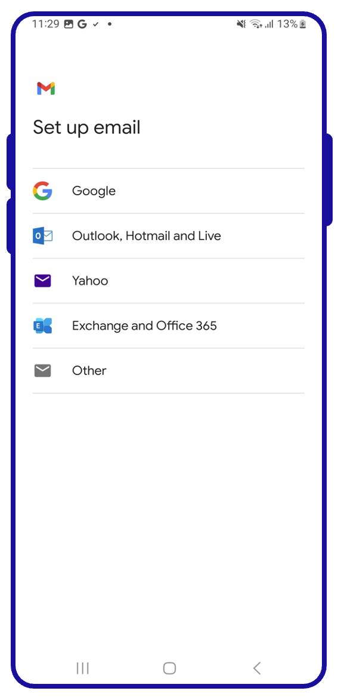
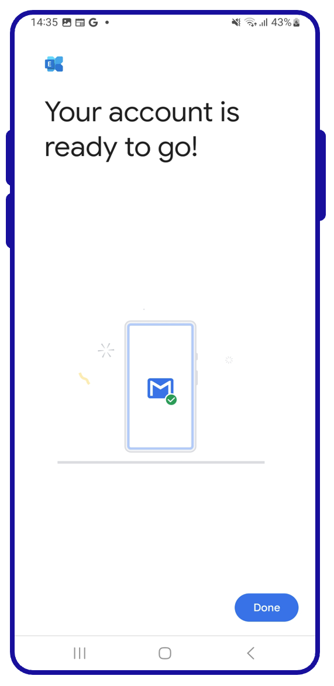

> [!primary]
> Diese Übersetzung wurde durch unseren Partner SYSTRAN automatisch erstellt. In manchen Fällen können ungenaue Formulierungen verwendet worden sein, z.B. bei der Beschriftung von Schaltflächen oder technischen Details. Bitte ziehen Sie im Zweifelsfall die englische oder französische Fassung der Anleitung zu Rate. Möchten Sie mithelfen, diese Übersetzung zu verbessern? Dann nutzen Sie dazu bitte den Button "Beitragen" auf dieser Seite.
>

## Ziel

Die E-Mail-Adressen des Exchange Angebots können auf verschiedenen kompatiblen E-Mail-Clients konfiguriert werden. So können Sie Ihr bevorzugtes Gerät für Versand und Empfang Ihrer E-Mails verwenden. In dieser Anleitung erfahren Sie, wie Sie eine Exchange E-Mail-Adresse über die Gmail-App auf Android-Geräten konfigurieren.

**In dieser Anleitung erfahren Sie, wie Sie Ihren Exchange Account in Android über die Gmail-App einrichten.**

> [!warning]
>
> OVHcloud stellt Ihnen Dienstleistungen zur Verfügung, für deren Konfiguration und Verwaltung Sie die alleinige Verantwortung tragen. Es liegt somit bei Ihnen, sicherzustellen, dass diese ordnungsgemäß funktionieren.
>
> Wir stellen Ihnen diese Anleitung zur Verfügung, um Ihnen bei der Bewältigung alltäglicher Verwaltungsaufgaben zu helfen. Dennoch empfehlen wir Ihnen, falls Sie Hilfe brauchen, einen [spezialisierten Dienstleister](https://partner.ovhcloud.com/de/) und/oder den Herausgeber des Dienstes zu kontaktieren. Für externe Dienstleistungen bietet OVHcloud leider keine Unterstützung. Genauere Informationen finden Sie im Teil "Weiterführende Informationen" dieser Anleitung.

## Voraussetzungen

- Sie besitzen ein [Exchange](https://www.ovhcloud.com/de/emails/){.external} Angebot.
- Die Gmail-App ist auf Ihrem Gerät installiert. Sie können diese über den Google Play Store installieren.
- Sie haben die Login-Daten der E-Mail-Adresse, die Sie einrichten möchten.

> [!primary]
>
> Diese Anleitung wurde auf einem Gerät mit Android Version 13 erstellt.
>

## In der praktischen Anwendung

### So fügen Sie Ihren E-Mail-Account hinzu

> [!primary]
>
> In unseren Beispielen verwenden wir den Servernamen: ex**?**.mail.ovh.net. Ersetzen Sie "?" durch die Zahl des Servers Ihres E-Mail Pro Dienstes.
>
> Diese Zahl finden Sie in Ihrem [OVHcloud Kundencenter](https://www.ovh.com/auth/?action=gotomanager&from=https://www.ovh.de/&ovhSubsidiary=de){.external} in der Rubrik `Web Cloud`{.action} und dann `E-Mail Pro`{.action}. Den Servernamen sehen Sie im Rahmen  **Verbindung** des Tabs `Allgemeine Informationen`{.action}.
>

Tippen Sie auf dem Bildschirm Ihres Geräts auf die `Gmail`{.action}-App.

{.thumbnail .w-400}

Das Hinzufügen eines Accounts erfolgt anders, **wenn noch kein Account eingerichtet** ist oder **wenn bereits ein Account eingerichtet** wurde. Wählen Sie die Registerkarte für eine der beiden Situationen aus:

> [!tabs]
> **Erste Konfiguration**
>>
>> Wählen Sie `E-Mail-Adresse hinzufügen aus`{.action}  
>> {.thumbnail .h-600}
>>
> **Vorhandene Konfiguration**
>>
>> 1. Gehen Sie zum Menü oben links auf dem Bildschirm  
>> 2. Wählen Sie `Einstellungen aus`{.action}  
>> 3. Wählen Sie Konto `hinzufügen aus`{.action}  
>> {.thumbnail}
>>

Gehen Sie wie folgt vor, indem Sie die folgenden Registerkarten durchsuchen:

> [!tabs]
> **Schritt 1**
>> Wählen Sie im Menü E-Mail-Kontotypen die Option `Exchange und Office`{.action} aus.  
>> {.thumbnail .h-600}
>>
> **Schritt 2**
>> Geben Sie Ihre E-Mail-Adresse ein und tippen Sie dann auf `Weiter`{.action}.  
>> {.thumbnail .h-600}
>>
> **Schritt 4**
>> Geben Sie das Passwort Ihrer E-Mail-Adresse ein und tippen Sie dann auf `Weiter`{.action}.  
>> {.thumbnail .h-600}
>>
> **Schritt 5**
>> Vervollständigen Sie die Seite "**Adresskonfiguration**"  - **E-Mail**: Ihre vollständige E-Mail-Adresse - **Passwort**: das Passwort Ihrer E-Mail-Adresse - **Zertifikat**: Lassen Sie "Keine" - **Domain\Benutzername**: Ihre vollständige E-Mail-Adresse - **Server**: der mit Ihrem E-Mail-Account verbundene Domainname - **Port**: 443 - **Sicherheitstyp**: SSL/TLS  Tippen Sie auf `Weiter`{.action}, um die Konfiguration zu bestätigen.  
>> {.thumbnail .h-600}
>>
> **Schritt 6**
>> Die Meldung "Sie können Ihr Konto jetzt verwenden" sollte angezeigt werden. Tippen Sie auf `OK`{.action}, um die Konfiguration abzuschließen.  
>> {.thumbnail .h-600}
>>

Wenn Ihre E-Mail-Adresse eingerichtet ist, können Sie sie verwenden. Sie können ab sofort E-Mails über Ihre Gmail-App versenden und empfangen.

> [!success]
>
> Eine OVHcloud Webanwendung, mit der Sie über einen Webbrowser auf Ihre E-Mail-Adresse zugreifen können, ist verfügbar unter <https://www.ovhcloud.com/de/mail/>. Sie können sich mit den Login-Daten Ihrer E-Mail-Adresse anmelden.

## Weiterführende Informationen 

[MXplan - Konfiguration einer E-Mail-Adresse in Gmail für Android](/pages/web_cloud/email_and_collaborative_solutions/mx_plan/how_to_configure_android).

[E-Mail Pro - Konfiguration einer E-Mail-Adresse in Gmail für Android](/pages/web_cloud/email_and_collaborative_solutions/email_pro/how_to_configure_android).

Für den Austausch mit unserer User Community gehen Sie auf <https://community.ovh.com/en/>.