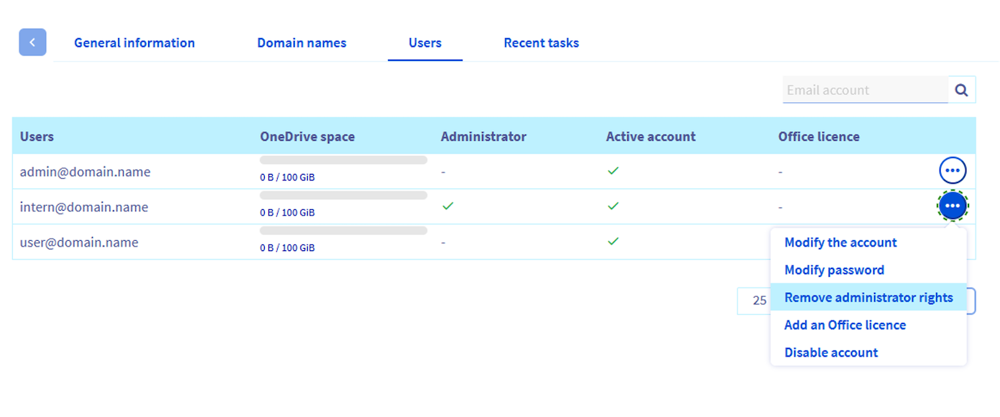

## Objectif

Si vous souhaitez récupérer les données de votre plateforme sharepoint OVHcloud pour les migrer, vous trouverez dans ce guide les étapes nécessaires pour extraire l'ensemble des données présentes.

**Découvrez comment migrer des données de votre cloud Microsoft Sharepoint OVH vers un autre service Microsoft Sharepoint.**

## Prérequis
 
- Être connecté à votre [espace client OVHcloud](https://www.ovh.com/auth/?action=gotomanager&from=https://www.ovh.com/fr/&ovhSubsidiary=fr).
- Disposer d'une [solution Sharepoint OVHcloud](https://www.ovhcloud.com/fr/collaborative-tools/sharepoint/)
- Disposer d'un ordinateur utilisant le système d'exploitation Microsoft Windows pour réaliser les étapes de migration.

## En pratique

Ce guide est décomposé en 4 étapes :

- [Étape 1: Installer OneDrive Entreprise](#installonedrive) : Installez OneDrive Entreprise pour effectuer le transfert des données de votre Sharepoint vers votre ordinateur
- [Étape 2: Préparer la migration depuis l'espace client OVHcloud](#controlpanelconfig) : Configurer votre plateforme Sharepoint en désignant un seul compte administrateur qui sera en mesure de transférer le contenu du OneDrive de chaque compte Sharepoint.
- [Étape 3: Lancer la migration depuis votre interface Sharepoint](#migrationignition) : Connectez-vous au compte désigné à l'étape 2 pour transférer le contenu vers votre ordinateur.
- [Étape 4: Migrer le contenu des autres comptes Sharepoint](#migrationother) : Suivez le processus permettant de visualiser et synchroniser l'espace OneDrive de chaque compte sur votre plateforme Sharepoint.

### Étape 1: Installer OneDrive Entreprise <a name="installonedrive"></a>

Pour migrer les données de votre service SharePoint OVHcloud, vous devez utiliser l'application OneDrive Entreprise, dont le nom technique est « Groove.exe ».

Pour l'installer, suivez les instructions ci-dessous:

1. Téléchargez le fichier ISO à partir du lien <https://download.mail.ovh.net/sharepoint/onedrive.iso>
2. Faites un clic droit sur le fichier `onedrive.iso` > `Propriétés` > cochez `Débloquer` > cliquez sur `Appliquer` > puis sur`OK`.
3. Double-cliquez sur `onedrive.iso` pour l'ouvrir.
4. Double-cliquez sur le fichier `setup.bat` pour lancer l'installation.
5. Attendez que les fenêtres soient fermées. Cette opération peut durer quelques minutes, attendez bien que la fenêtre se ferme pour que l'installation soit terminée.

> [!warning]
>
> Si le fichier `setup.bat` ne se lance pas correctement à l'étape « 4. ». Vous pouvez copier le contenu du fichier `onedrive.iso` dans un dossier sur le bureau de votre ordinateur et tenter à nouveau l'étape « 4. »

{.thumbnail}

> [!primary]
>
> Si cette méthode n'est pas fonctionnelle sur votre ordincateur, vous pouvez installer OneDrive Entreprise en suivant la procédure officielle Microsoft, à l'adresse <https://learn.microsoft.com/sharepoint/install-previous-sync-app#install-groove-exe-with-office-2016>.

### Étape 2: Préparer la migration depuis l'espace client OVHcloud <a name="controlpanelconfig"></a>

Pour accéder à l'ensemble des espaces OneDrive au sein de votre service Sharepoint, vous devez supprimer le droit d'administrateur de tous les utilisateurs via votre [espace client OVHcloud](https://www.ovh.com/auth/?action=gotomanager&from=https://www.ovh.com/fr/&ovhSubsidiary=fr).

Dirigez-vous dans la section `Web Cloud`{.action} de votre espace client. Cliquez sur `Microsoft`{.action} puis sur `Sharepoint`{.action} et sélectionnez la plateforme SharePoint concernée.

Depuis l'onglet `Utilisateurs`{.action}, accédez à la gestion des comptes Sharepoint de votre plateforme. Pour chaque compte, cliquez sur le bouton `...`{.action} à droite, puis sur `Retirer droits administrateur`{.action}.

{.thumbnail}

Une fois que le droit administrateur a été retiré pour l'ensemble des comptes Sharepoint, il vous sera nécessaire de désigner un seul compte qui permettra d'accéder à l'ensemble des espaces OneDrive de la plateforme.

Activer le droit administrateur au compte que vous avez désigné.

Toujours depuis l'onglet `Utilisateurs`{.action} de votre plateforme Sharepoint, cliquez sur le bouton `...`{.action} à droite du compte désigné, puis sur `Activer les droits administrateur`{.action}.

{.thumbnail}

Vous êtes maintenant en mesure de synchroniser l'ensemble des espaces OneDrive de votre plateforme Sharepoint par l'intermédiaire de ce compte.

### Étape 3: Lancer la migration depuis votre interface Sharepoint <a name="migrationignition"></a>

Accédez à l'interface en ligne de votre service SharePoint. Vous trouverez l'URL d'accès depuis votre espace client dans l'onglet `informations générales`{.action}, sous la mention `URL consultation`.

{.thumbnail}

Connectez-vous à l'utilisateur qui dispose des droits d'administrateur en saisissant l'adresse et le mot de passe associé.

{.thumbnail}

Pour accéder à la section OneDrive, cliquez sur l'îcone en haut à gauche de l'interface Sharepoint, puis cliquez et sur l'icône `OneDrive`{.action}.

{.thumbnail}

Pour synchroniser le contenu du OneDrive sur votre ordinateur, cliquez sur le bouton `Synchroniser`{.action}, puis sur `Synchroniser maintenant`{.action}.

{.thumbnail}

Une fenêtre pour autoriser le site à ouvrir le lien **grvopen** s'affiche. Pour l'autoriser, cochez la mention « Toujours autoriser **https://myServiceAddress.spX.ovh.net** à ouvrir les liens **grvopen** », puis cliquez sur `Ouvrir le lien`{.action}.

{.thumbnail}

Saisissez les identifiants du compte Sharepoint administrateur vous seront demandés. Veuillez utiliser l'utilisateur avec des droits d'administrateur que vous avez configuré à [l'étape 2](#controlpanelconfig).

{.thumbnail}

Cliquer sur `Synchroniser maintenant`{.action}.

{.thumbnail}

Choisissez le modèle de bibliothèque « **Form Templates** » depuis la fenêtre « Sélectionnez la bibliothèque que vous voulez synchroniser », puis cliquez sur `Synchronisation sélectionnée`{.action}.

{.thumbnail}

Une fois cette synchronisation terminée sur votre ordinateur, seules les données du compte sharepoint sur lequel vous êtes connecté seront transférées sur votre ordinateur.

**Pour transférer le contenu des OneDrive de chaque compte de votre plateforme Sharepoint, suivez l'étape 4.**

### Étape 4: Migrer le contenu des autres compte Sharepoint <a name="migrationother"></a>

Pour accéder à l'espace OneDrive des autres utilisateurs de votre plateforme et synchroniser les données associées, vous devrez modifier l'URL d'accès lorsque vous êtes connecté au OneDrive du compte administrateur, depuis votre navigateur.

Pour cela, remplacez la section de l'utilisateur qui se trouve entre la partie `personal` et  `Documents` dans l'URL qui s'affiche.

Par exemple, si votre utilisateur est **intern@domain.name**, il faut simplement remplacer « **@** » et « **.** » par un « **_** », vous obtenez « intern_domain_name ». Par conséquent, votre lien se présentera de la façon suivante :

``` console
https://myServiceAddress.spX.ovh.net/mysites/personal/intern_domain_name/Documents/Forms/All.aspx
```

Vous pourrez synchroniser les comptes suivants en recommençant cette étape.

## Go further

Join our community of users on <https://community.ovh.com/en/>.