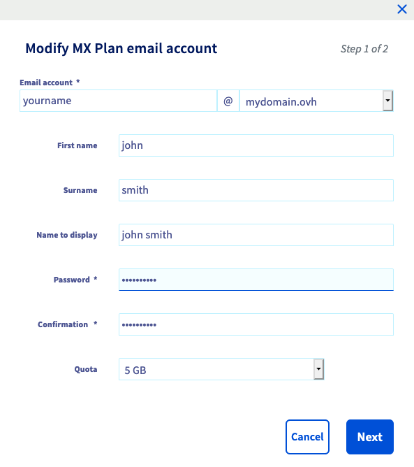
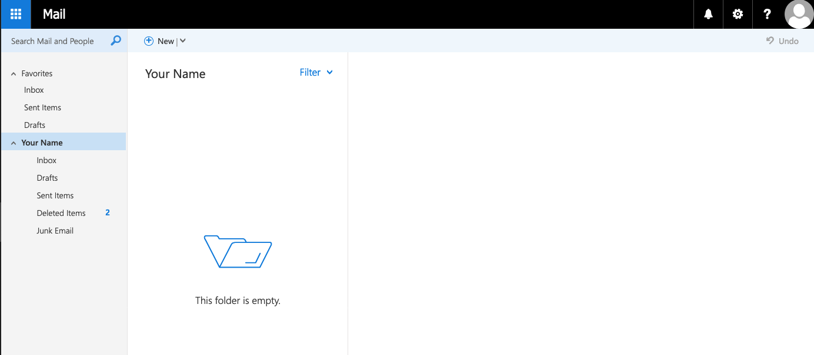

> [!primary]
> Esta traducción ha sido generada de forma automática por nuestro partner SYSTRAN. En algunos casos puede contener términos imprecisos, como en las etiquetas de los botones o los detalles técnicos. En caso de duda, le recomendamos que consulte la versión inglesa o francesa de la guía. Si quiere ayudarnos a mejorar esta traducción, por favor, utilice el botón «Contribuir» de esta página.
>

## Objetivo

Usted acaba de adquirir una solución MX Plan que permite disfrutar de direcciones de correo electrónico para enviar y recibir mensajes desde cualquier dispositivo.

**Esta guía explica cómo empezar a utilizar la solución MX Plan.**

## Requisitos

- Tener una solución MX Plan, que está disponible disponible en un [plan de hosting](https://www.ovhcloud.com/es-es/web-hosting/), el [Alojamiento gratuito 100M](https://www.ovhcloud.com/es-es/domains/free-web-hosting/) o la solución MX Plan.
- Estar conectado al [área de cliente de OVHcloud](https://www.ovh.com/auth/?action=gotomanager&from=https://www.ovh.es/&ovhSubsidiary=es), en la sección `Web Cloud`{.action}.

## Procedimiento 

Una vez que la solución MX Plan haya sido creada y esté disponible, podrá administrarla desde el [área de cliente de OVHcloud](https://www.ovh.com/auth/?action=gotomanager&from=https://www.ovh.es/&ovhSubsidiary=es). En función de cuándo haya activado su MX Plan o de si [el servicio ha sido migrado recientemente](https://www.ovh.es/mxplan-migration/), tendrá una versión diferente. Antes de continuar, compruebe de qué versión dispone.

Para ello, conéctese al [área de cliente de OVHcloud](https://www.ovh.com/auth/?action=gotomanager&from=https://www.ovh.es/&ovhSubsidiary=es){.external}, en la sección `Web Cloud`{.action}. Haga clic en `Correo electrónico`{.action} y seleccione el servicio MX Plan correspondiente. Siga leyendo esta guía en función de su versión:

|Versión histórica de la solución MX Plan|Nueva versión de la solución MX Plan|
|---|---|
|{.thumbnail}  El nombre del producto aparece en el recuadro "Suscripción", en el epígrafe Producto.|{.thumbnail} El nombre del producto aparece en el recuadro "Resumen", en el epígrafe "Referencia del servidor".|
|Siga leyendo esta guía en el apartado [Versión histórica de la solución MX Plan](#oldmxplan).|Siga leyendo esta guía en el apartado [Nueva versión de la solución MX Plan](#newmxplan).|

### Nueva versión de la solución MX Plan 

#### Acceder a la gestión del servicio

Si dispone de la nueva versión de la solución MX Plan, Si no obtiene la siguiente vista, consulte la [información anterior](#instructions).  

{.thumbnail}

#### Añadir una cuenta de correo

Para crear una dirección de correo electrónico, abra la pestaña `Cuentas de correo`{.action}. Se mostrarán las cuentas disponibles y las que puede crear. Para añadir una nueva cuenta de correo, haga clic en el botón `Añadir una cuenta`{.action}.

{.thumbnail}

A continuación, introduzca la información solicitada:

|Elemento|Descripción|
|---|---|
|Cuenta de correo electrónico|Un nombre temporal se autocompletará en el cuadro de texto: elimine la cuenta e indique su nueva dirección de correo electrónico (por ejemplo, nombre.apellido). El dominio que formará la dirección de correo completa aparecerá preseleccionado en la lista.|
|Nombre|Introduzca un nombre.|
|Apellidos|Introduzca los apellidos.|
|Nombre mostrado|Introduzca el nombre que quiera que figure como remitente cuando envíe mensajes de correo desde esa dirección.|
|Contraseña|[Establezca una contraseña](/pages/account_and_service_management/account_information/manage-ovh-password) y confírmela introduciéndola de nuevo. Por motivos de seguridad, le recomendamos que no utilice dos veces la misma contraseña, que la contraseña no guarde ninguna relación con sus datos personales (evite mencionar su nombre, apellidos o fecha de nacimiento, por ejemplo) y que la cambie periódicamente.|

Una vez que haya completado todos los campos, haga clic en `Siguiente`{.action} y compruebe que la información indicada en el resumen es correcta. Si lo es, haga clic en `Aceptar`{.action}. Repita el procedimiento descrito en este apartado para crear las cuentas que desee, en función del número de cuentas a su disposición.

{.thumbnail}

#### Utilizar las direcciones de correo

Una vez que haya creado las direcciones de correo, ya puede empezar a usarlas. Para ello, puede utilizar el webmail Outlook Web App (OWA) o el programa que desee.

##### **1. Utilizar el webmail Outlook Web App (OWA)**

Vaya a la [página de conexión al webmail](https://www.ovh.es/mail/) e introduzca su dirección de correo y contraseña. Haga clic en el botón `Conexión`{.action}.

La primera vez que se conecte al webmail, deberá seleccionar el idioma de la interfaz y la zona horaria en la que se encuentra. A continuación se abrirá la bandeja de entrada. Para más información, consulte nuestra guía [Utilizar una dirección de correo desde el webmail Outlook Web App (OWA)](/pages/web_cloud/email_and_collaborative_solutions/using_the_outlook_web_app_webmail/email_owa).

{.thumbnail}

##### **2. Utilizar el programa que elija**

Para utilizar su cuenta de correo electrónico en un software de terceros, debe configurar esta dirección de correo electrónico en el dispositivo que desee (PC, Mac, smartphone o tablet). Si lo necesita, consulte la guía correspondiente:

|Windows|Outlook|Apple|Android|
|---|---|---|---|
|[Windows 10](/pages/web_cloud/email_and_collaborative_solutions/mx_plan/how_to_configure_windows_10)|[Outlook Windows](/pages/web_cloud/email_and_collaborative_solutions/mx_plan/how_to_configure_outlook_2016)|[Mail de macOS (última versión)](/pages/web_cloud/email_and_collaborative_solutions/mx_plan/how_to_configure_mail_macos)|[Android (última versión)](/pages/web_cloud/email_and_collaborative_solutions/mx_plan/how_to_configure_android)|
|[Thunderbird en Windows](/pages/web_cloud/email_and_collaborative_solutions/mx_plan/how_to_configure_thunderbird_windows)|[Outlook Mac OS](/pages/web_cloud/email_and_collaborative_solutions/mx_plan/how_to_configure_outlook_2016_mac)|[Correo electrónico para iPhone o iPad](/pages/web_cloud/email_and_collaborative_solutions/mx_plan/how_to_configure_ios)|
|||[Thunderbird en Mac](/pages/web_cloud/email_and_collaborative_solutions/mx_plan/how_to_configure_thunderbird_mac)|

A continuación se indican los parámetros necesarios para configurar una cuenta MX Plan:

- **Configuración en IMAP (recomendada)**

|Tipo de servidor|Nombre del servidor|Puerto (con SSL)|Puerto (sin SSL)|
|---|---|---|---|
|Entrante|ssl0.ovh.net|993|143|
|Saliente|ssl0.ovh.net|465|587|

- **Configuración en POP**

|Tipo de servidor|Nombre del servidor|Puerto (con SSL)|Puerto (sin SSL)|
|---|---|---|---|
|Entrante|ssl0.ovh.net|995|110|
|Saliente|ssl0.ovh.net|465|587|

> [!warning]
>
> Si necesita ayuda para configurar la dirección de correo en su dispositivo, consulte nuestras [guías de configuración](/products/web-cloud-email-collaborative-solutions-mx-plan) o contacte con el editor de la aplicación que utilice.
>

#### Funcionalidades avanzadas

##### **Política de seguridad**

¿Quiere reforzar la seguridad de acceso a sus direcciones de correo?

Puede hacerlo configurando la política de seguridad de su solución MX Plan.

Para más información, consulte nuestra guía [Gestionar la política de seguridad de un servicio de correo](/pages/web_cloud/email_and_collaborative_solutions/common_email_features/security-policy).

##### **Redirecciones**

Desea redirigir los mensajes hacia otro destinatario, crear un alias o copiar sistemáticamente otra dirección de correo.

Para ello, deberá crear una redirección.

Puede hacerlo de dos formas:

- crear su redirección desde el webmail, a través de las reglas de la bandeja de entrada. Para ello, consulte nuestra guía Reglas de la bandeja de entrada desde la [interfaz OWA](/pages/web_cloud/email_and_collaborative_solutions/using_the_outlook_web_app_webmail/creating-inbox-rules-in-owa-mx-plan#ejemplo-1-redireccionamiento-de-mensajes-de-correo-electronico-a-otra-direccion).

- crear la redirección desde el [área de cliente de OVHcloud](https://www.ovh.com/auth/?action=gotomanager&from=https://www.ovh.es/&ovhSubsidiary=es). Este método permite, por ejemplo, crear un alias, es decir, redirigir una dirección de correo electrónico que no exista a una dirección de correo existente. Para ello, consulte nuestra guía [Utilizar las redirecciones de correo](/pages/web_cloud/email_and_collaborative_solutions/common_email_features/feature_redirections#nueva-version-de-la-solucion-mx-plan).

##### **Contestador**

Tiene que salir de vacaciones o no tendrá acceso a su dirección de correo durante un cierto período.

A continuación, puede crear un contestador automático. Para más información, consulte nuestra guía [Implementar un contestador automático desde la interfaz OWA](/pages/web_cloud/email_and_collaborative_solutions/using_the_outlook_web_app_webmail/owa_automatic_replies).

##### **Delegaciones**

Desea enviar un email desde su dirección de correo personal, **en su lugar** o **desde otra dirección** de correo de su nombre de dominio.

Para ello, debe configurar la delegación de la dirección de correo electrónico correspondiente. Para más información, consulte nuestra guía [Establecer permisos sobre una cuenta](/pages/web_cloud/email_and_collaborative_solutions/microsoft_exchange/feature_delegation).

##### **Listas de correo**

Desea enviar una newsletter regularmente a sus contactos.

Para ello, puede crear una lista de difusión. Siga nuestra guía [Gestionar y utilizar las listas de correo](/pages/web_cloud/email_and_collaborative_solutions/mx_plan/feature_mailing_list).

##### **Pie de página**

Quiere aplicar una firma global a todas las direcciones de correo de su dominio.

El pie de página le permite configurarlo desde el área de cliente. Siga nuestra guía [Añadir un pie de página a su correo electrónico](/pages/web_cloud/email_and_collaborative_solutions/microsoft_exchange/feature_footers).

### Versión histórica de la solución MX Plan 

#### Acceder a la gestión del servicio

Si dispone de la versión histórica de la solución MX Plan, Si no obtiene la siguiente vista, consulte la [información anterior](./#instructions).

{.thumbnail}

#### Añadir una cuenta de correo

Para crear una dirección de correo electrónico, abra la pestaña `Cuentas de correo`{.action}. Se mostrará una tabla con todas las direcciones de correo electrónico creadas en el MX Plan. Haga clic en el botón `Crear una dirección de correo`{.action}.

{.thumbnail}

A continuación, introduzca la información solicitada:

|Elemento|Descripción|  
|---|---|  
|Nombre de la cuenta|Introduzca el nombre que quiera asignar a la dirección de correo (por ejemplo, «nombre.apellido»). El dominio aparecerá ya completado.|  
|Descripción de la cuenta|Introduzca una descripción que le permita diferenciar su cuenta del resto de cuentas de su área de cliente de OVHcloud.|  
|Tamaño de la cuenta|Seleccione el tamaño de la cuenta de correo, es decir, su capacidad para almacenar mensajes de correo electrónico.|  
|Contraseña|Introduzca una contraseña y luego confírmela en el último campo. Por motivos de seguridad, le recomendamos que no utilice dos veces la misma contraseña, que la contraseña no guarde ninguna relación con sus datos personales (evite mencionar su nombre, apellidos o fecha de nacimiento, por ejemplo) y que la cambie periódicamente.|

Una vez que haya completado todos los campos, haga clic en `Siguiente`{.action} y compruebe que la información indicada en el resumen es correcta. Si lo es, haga clic en `Aceptar`{.action}. Repita el procedimiento descrito en este apartado para crear las cuentas que desee, en función del número de cuentas a su disposición.

{.thumbnail}

#### Utilizar las direcciones de correo

Una vez que haya creado las direcciones de correo, ya puede empezar a usarlas. Para ello, puede utilizar el webmail Roundcube o el programa que desee.

##### **1. Utilizar el webmail Roundcube**

Vaya a la [página de conexión al webmail](https://www.ovh.es/mail/) e introduzca su dirección de correo y contraseña. Haga clic en el botón `Conexión`{.action}.

Se abrirá la bandeja de entrada. Para más información, consulte nuestra guía [Webmail: Guía de uso de Roundcube](/pages/web_cloud/email_and_collaborative_solutions/mx_plan/email_roundcube).

{.thumbnail}

##### **2. Utilizar el programa que elija**

Para utilizar su cuenta de correo electrónico en un software de terceros, debe configurar esta dirección de correo electrónico en el dispositivo que desee (PC, Mac, smartphone o tablet). Si lo necesita, consulte la guía correspondiente:

|Windows|Outlook|Apple|Android|
|---|---|---|---|
|[Windows 10](/pages/web_cloud/email_and_collaborative_solutions/mx_plan/how_to_configure_windows_10)|[Outlook Windows](/pages/web_cloud/email_and_collaborative_solutions/mx_plan/how_to_configure_outlook_2016)|[Mail de macOS (última versión)](/pages/web_cloud/email_and_collaborative_solutions/mx_plan/how_to_configure_mail_macos)|[Android (última versión)](/pages/web_cloud/email_and_collaborative_solutions/mx_plan/how_to_configure_android)|
|[Thunderbird en Windows](/pages/web_cloud/email_and_collaborative_solutions/mx_plan/how_to_configure_thunderbird_windows)|[Outlook Mac OS](/pages/web_cloud/email_and_collaborative_solutions/mx_plan/how_to_configure_outlook_2016_mac)|[Correo electrónico para iPhone o iPad](/pages/web_cloud/email_and_collaborative_solutions/mx_plan/how_to_configure_ios)|
|||[Thunderbird en Mac](/pages/web_cloud/email_and_collaborative_solutions/mx_plan/how_to_configure_thunderbird_mac)|

A continuación se indican los parámetros necesarios para configurar una cuenta MX Plan:

- **Configuración en IMAP (recomendada)**

|Tipo de servidor|Nombre del servidor|Puerto (con SSL)|Puerto (sin SSL)|
|---|---|---|---|
|Entrante|ssl0.ovh.net|993|143|
|Saliente|ssl0.ovh.net|465|587|

- **Configuración en POP**

|Tipo de servidor|Nombre del servidor|Puerto (con SSL)|Puerto (sin SSL)|
|---|---|---|---|
|Entrante|ssl0.ovh.net|995|110|
|Saliente|ssl0.ovh.net|465|587|

> [!warning]
>
> Si necesita ayuda para configurar la dirección de correo en su dispositivo, consulte nuestras [guías de configuración](/products/web-cloud-email-collaborative-solutions-mx-plan) o contacte con el editor de la aplicación que utilice.

#### Funcionalidades avanzadas

##### **Redirección**

Desea redirigir los mensajes hacia otro destinatario, crear un alias o copiar sistemáticamente otra dirección de correo.

Para ello, deberá crear una redirección. Para más información, consulte nuestra guía [Utilizar las redirecciones de correo](/pages/web_cloud/email_and_collaborative_solutions/common_email_features/feature_redirections#version-historica-de-la-solucion-mx-plan).

##### **Contestador**

Tiene que salir de vacaciones o no tendrá acceso a su dirección de correo durante un cierto período.

A continuación, podrá utilizar el contestador automático en su dirección de correo. Siga nuestra guía [Crear un contestador para una dirección de correo electrónico](/pages/web_cloud/email_and_collaborative_solutions/mx_plan/feature_auto_responses).

##### **Delegaciones**

Desea **delegar todo el servicio de correo de un dominio a otra cuenta de OVHcloud** o **delegar una o varias cuentas de correo en otra cuenta de OVHcloud**, por ejemplo, para permitir al titular de esta otra cuenta de OVHcloud cambiar la contraseña de una dirección de correo.

Le invitamos a seguir nuestra guía [Celebrar la gestión de su correo a otra persona](/pages/web_cloud/email_and_collaborative_solutions/mx_plan/feature_delegation).

##### **Listas de correo**

Desea enviar una newsletter regularmente a sus contactos.

Para ello, puede crear una lista de difusión. Siga nuestra guía [Gestionar y utilizar las listas de correo](/pages/web_cloud/email_and_collaborative_solutions/mx_plan/feature_mailing_list).

## Más información

Si sus necesidades evolucionan y quiere disfrutar de funcionalidades adicionales, también puede [migrar una dirección de correo MX Plan a una cuenta Email Pro o Exchange](/pages/web_cloud/email_and_collaborative_solutions/migrating/migration_control_panel).

Interactúe con nuestra comunidad de usuarios en <https://community.ovh.com/en/>.
