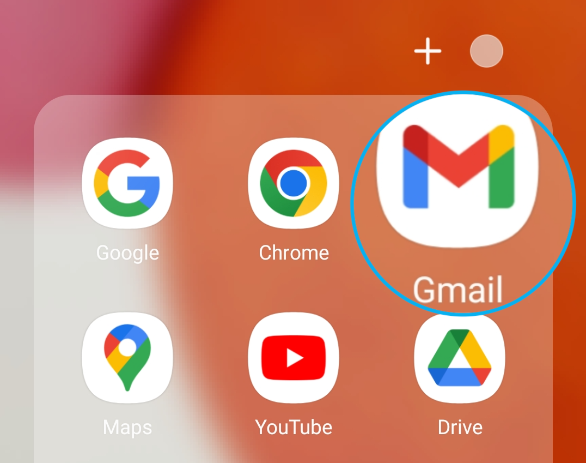
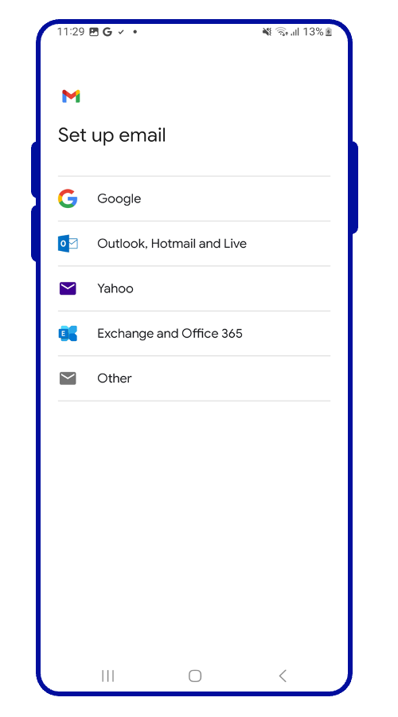
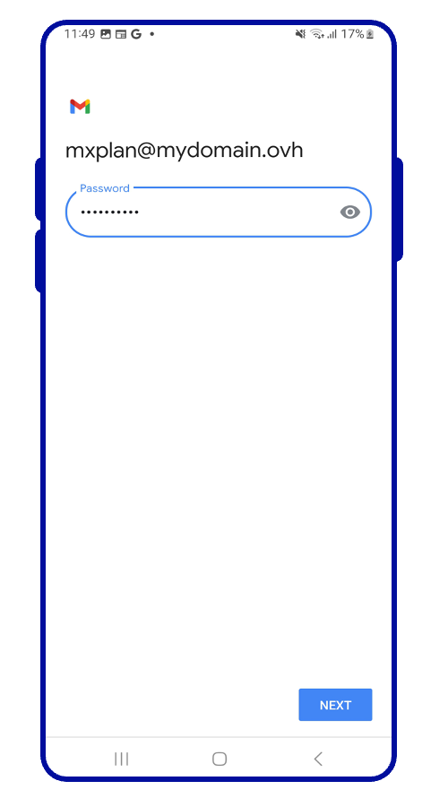
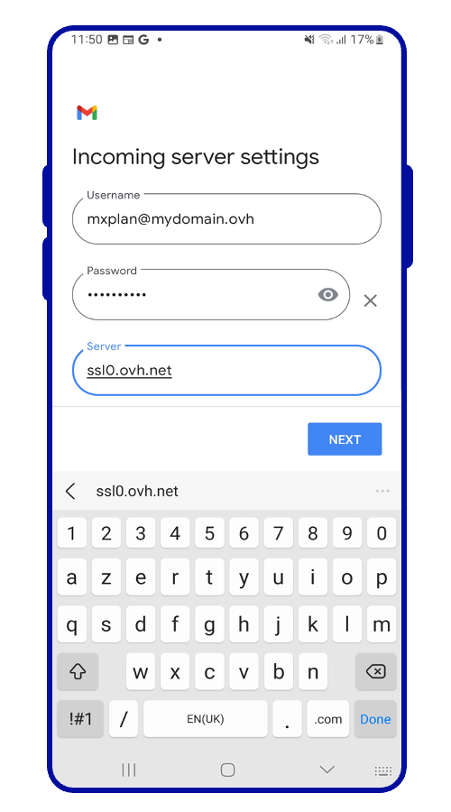
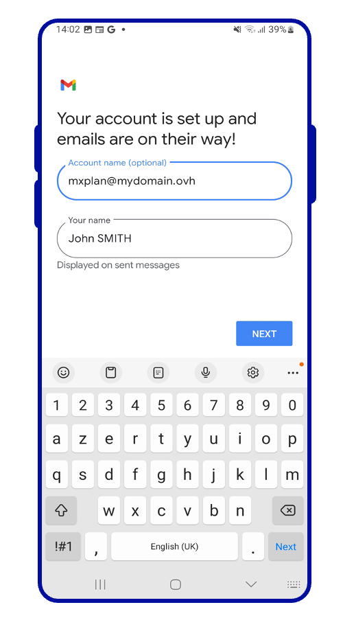

> [!primary]
> Questa traduzione è stata generata automaticamente dal nostro partner SYSTRAN. I contenuti potrebbero presentare imprecisioni, ad esempio la nomenclatura dei pulsanti o alcuni dettagli tecnici. In caso di dubbi consigliamo di fare riferimento alla versione inglese o francese della guida. Per aiutarci a migliorare questa traduzione, utilizza il pulsante "Contribuisci" di questa pagina.
>

## Obiettivo

Gli indirizzi email dell’offerta MX Plan possono essere configurati su diversi client di posta elettronica compatibili per permetterti di utilizzare il tuo account email dal dispositivo che preferisci. Questa guida ti mostra in dettaglio il processo di configurazione di un indirizzo email MXplan dall’applicazione Gmail presente sui dispositivi Android.

**Questa guida ti mostra come configurare un indirizzo email MX Plan su Android tramite l’applicazione Gmail.**

> [!warning]
>
> OVHcloud mette a tua disposizione servizi di cui tu sei responsabile per la configurazione e la gestione. Garantirne quotidianamente il corretto funzionamento è quindi responsabilità dell’utente.
>
> Questa guida ti aiuta a realizzare le operazioni più ricorrenti. Tuttavia, in caso di difficoltà o dubbi, ti consigliamo di contattare un [fornitore specializzato](https://partner.ovhcloud.com/it/directory/) o il fornitore del servizio. OVHcloud non potrà fornirti alcuna assistenza. Per maggiori informazioni consulta la sezione “Per saperne di più” di questa guida.

## Prerequisiti

- Disporre di un indirizzo email MX Plan (compreso in una soluzione MX Plan o in piano di [hosting Web OVHcloud](https://www.ovhcloud.com/it/web-hosting/)).
- Aver installato sul proprio dispositivo l’applicazione Gmail Se non è già presente, è possibile installarla dal Google Play Store.
- Disporre delle credenziali associate all’account email da configurare

> [!primary]
>
> Questa guida è stata realizzata da un dispositivo che utilizza la versione 13 di Android.
>

## Procedura

### Come aggiungere un account email

Sulla schermata Home del tuo dispositivo clicca sull’applicazione `Gmail`{.action}.

{.thumbnail .w-400}

L’aggiunta di un account avverrà in modo diverso **se non ne è stato impostato** uno o **se ne è già stato impostato uno**. Seleziona la scheda corrispondente a una delle due situazioni menzionate:

> [!tabs]
> **Prima configurazione**
>>
>> | | |
>> |---|---|
>> |{.thumbnail}|Seleziona `Aggiungi un indirizzo email`{.action}|
>>
> **Configurazione esistente**
>>
>> | | |
>> |---|---|
>> |{.thumbnail}|1. Passare al menu nell'angolo superiore sinistro dello schermo  2.Selezionare `Impostazioni`{.action}  3.Selezionare `Aggiungi account`{.action}|
>>

Segui i passaggi successivi di configurazione scorrendo le schede seguenti:

> [!tabs]
> **Step 1**
>> | | |
>> |---|---|
>> |{.thumbnail}|Selezionare `Altro`{.action} dal menu dei tipi di account di posta elettronica.|
>>
> **Step 2**
>> | | |
>> |---|---|
>> |{.thumbnail}|Inserisci il tuo indirizzo e-mail.|
>>
> **Step 3**
>> | | |
>> |---|---|
>> |{.thumbnail}|Seleziona il protocollo di ricezione delle email. Ti consigliamo di selezionare `Personale (IMAP)`{.action}  Per [maggiori dettagli sui protocolli POP e IMAP](#popimap), consulta la fine di questa guida per comprenderne le differenze.|
>>
> **Step 4**
>> | | |
>> |---|---|
>> |{.thumbnail}|Inserisci la password del tuo indirizzo email. |
>>
> **Step 5**
>> | | |
>> |---|---|
>> |{.thumbnail}|Completa le "**Impostazioni server in entrata**"  - **Nome utente**: Il tuo indirizzo email completo - **Password**: La password del tuo indirizzo email - **Server**: inserisci **ssl0.ovh.net** |
>>
> **Step 6**
>> | | |
>> |---|---|
>> |{.thumbnail}|Completa le "**Impostazioni server in uscita**"  - **Nome utente**: Il tuo indirizzo email completo - **Password**: La password del tuo indirizzo email - **Server SMTP**: inserisci **ssl0.ovh.net** |
>>
> **Step 7**
>> | | |
>> |---|---|
>> |{.thumbnail}|Scegli la frequenza di sincronizzazione delle tue email in base alle tue preferenze.|
>>
> **Step 8**
>> | | |
>> |---|---|
>> |{.thumbnail}|Determina il nome visualizzato del tuo indirizzo email nell’applicazione Gmail e clicca su `Avanti`{.action}|
>>

Una volta configurato l’indirizzo email, non ti resta che utilizzarlo! Da questo momento è possibile inviare e ricevere messaggi dall’applicazione Gmail.

> [!success]
>
> OVHcloud propone un'applicazione Web che permette di accedere al tuo indirizzo email da un browser Web, all'indirizzo <https://www.ovhcloud.com/it/mail/>. accessibile utilizzando le credenziali del tuo account.

### Impostazioni POP, IMAP e SMTP

Per la ricezione delle email, durante la scelta del tipo di account, ti consigliamo di utilizzare **IMAP**. Tuttavia, è possibile selezionare **POP**. Per maggiori informazioni sul loro funzionamento, consulta la nostra sezione ["POP o IMAP, qual è la differenza?"](#popimap)

- **Configurazione POP**

|Campo|Descrizione|
|---|---|
|Nome utente|Inserisci l’indirizzo email **completo**|
|Password|Inserisci la password associata all’indirizzo email|
|Server|ssl0.ovh.net|
|Porta|995|
|Tipo di sicurezza|SSL/TLS|

- **per una configurazione IMAP**

|Campo|Descrizione|
|---|---|
|Nome utente|Inserisci l’indirizzo email **completo**|
|Password|Inserisci la password associata all’indirizzo email|
|Server|ssl0.ovh.net|
|Porta|993|
|Tipo di sicurezza|SSL/TLS|

Per l’invio delle email, se hai necessità di inserire manualmente le impostazioni **SMTP** nelle preferenze dell’account, ecco i parametri da utilizzare:

- **Configurazione SMTP**

|Campo|Descrizione|
|---|---|
|Nome utente|Inserisci l’indirizzo email **completo**|
|Password|Inserisci la password associata all’indirizzo email|
|Server|ssl0.ovh.net|
|Porta|465|
|Tipo di sicurezza|SSL/TLS|

### POP o IMAP, qual è la differenza? 

Quando si configura l'indirizzo di posta elettronica manualmente, il client di posta elettronica chiede se si desidera utilizzare il protocollo **POP** (**P**ost **O**ffice **P**rotocol) o **IMAP** (**I**nternet **M**essage ******** Access∕Protocol). Per capirlo meglio, è necessario localizzare i protocolli POP e IMAP nella configurazione del tuo indirizzo email.

Durante la configurazione del client di posta, è necessario fornire le informazioni sul **server in entrata** per ricevere le email e sul **server in uscita** per inviare le email. Per inviare le email non è possibile scegliere, ma viene utilizzato il protocollo **SMTP** (**S**imple **M**ail **T**ransfer **P**rotocol). Per la ricezione, potrete quindi scegliere tra **POP** o **IMAP**.

{.thumbnail}

Per comprendere la differenza tra l'utilizzo del protocollo POP e IMAP, scomponiamo gli elementi che compongono l'elaborazione delle tue email in ricezione:

1. **Il tuo dispositivo**: un computer, uno smartphone o un tablet. È il vostro supporto di consultazione.

2. **Il client di posta**: software o applicazione dedicata alla gestione delle email. La sua scelta determinerà il livello di ergonomia e funzionalità di cui avrete bisogno per consultare le vostre email.

3. **Protocollo di ricezione**: una scelta fondamentale per il rilevamento delle email sul dispositivo. La sua scelta ha un impatto sugli altri dispositivi che consultano lo stesso account email.
    - **IMAP**: il client di posta interroga il server di posta e scarica le email sul tuo dispositivo. Quando visualizzi un messaggio non letto, il server lo contrassegna come "letto" di default. Gli altri dispositivi configurati in IMAP potranno visualizzare questo stato e controllare questo messaggio fino a quando non verrà eliminato da uno dei dispositivi.
    - **POP**: il tuo client di posta interroga il server di posta e scaricherà le email sul tuo dispositivo. Per impostazione predefinita, una volta scaricata l'email sul dispositivo, il messaggio viene eliminato dal server. Di conseguenza, gli altri dispositivi connessi a questo indirizzo email non potranno consultare questa email.

{.thumbnail}

> [!primary]
>
> Questa descrizione è una sintesi, rappresenta il funzionamento standard di entrambi i protocolli. È possibile configurare il POP in modo che le email non vengano eliminate quando si raccolgono i messaggi. L’obiettivo è descrivere il funzionamento nativo di questi due protocolli ed evitare operazioni aggiuntive per rispondere alle tue necessità.

## Per saperne di più

[Configurare un account E-mail Pro su Android tramite l’applicazione Gmail](/pages/web_cloud/email_and_collaborative_solutions/email_pro/how_to_configure_android).

[Configurare un account Exchange su Android tramite l’applicazione Gmail](/pages/web_cloud/email_and_collaborative_solutions/microsoft_exchange/how_to_configure_android).

Contatta la nostra Community di utenti all’indirizzo <https://community.ovh.com>.