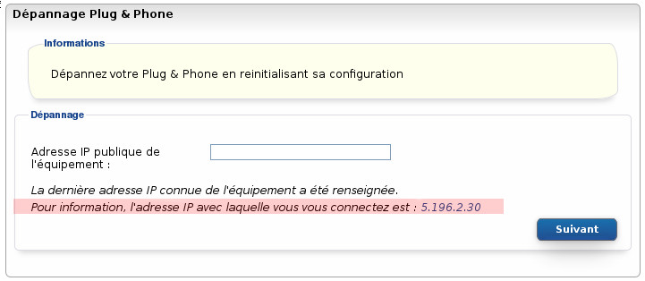
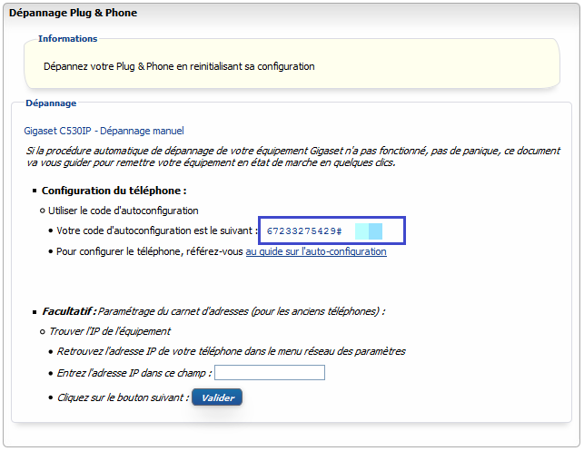
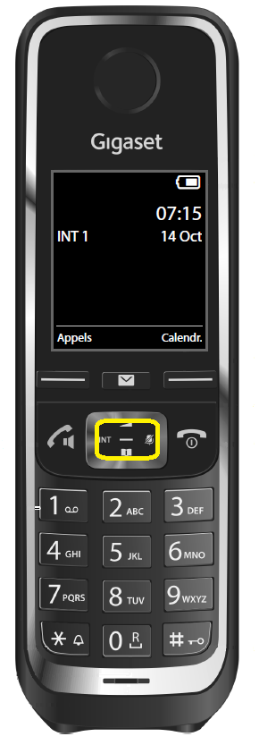
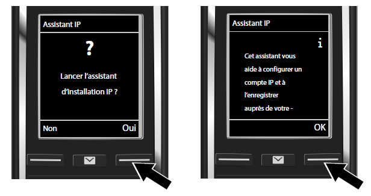
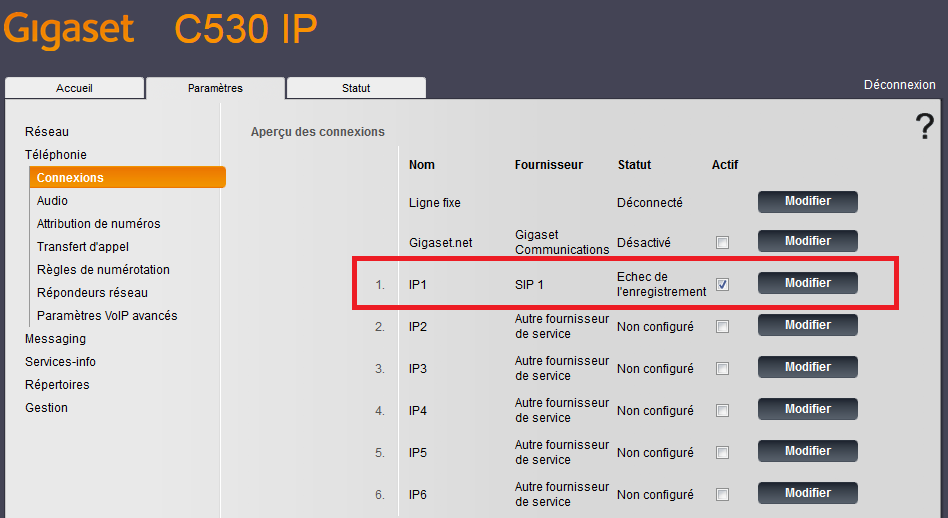

**Sommaire :**

### Configuration automatique via code d'auto-configuration {#configuration-automatique-via-code-dauto-configuration}

En cas de mauvaise manipulation OVH met à disposition un système de génération de code permettant au téléphone de récupérer sa configuration initiale.

L'Espace Client génère un code spécifique qu'il faut rentrer sur le combiné associé à la base.

Pour générer ce code d'auto-configuration rendez-vous dans votre Espace Client :

-   [Connectez-vous avec vos identifiants : https://www.ovhtelecom.fr/espaceclient/](https://www.ovhtelecom.fr/espaceclient/){.external-link}
-   Cliquez sur le lien "**Manager v4**".
-   Sélectionnez la ligne que vous souhaitez reconfigurer.
-   Cliquez sur "**Assistance**".
-   Cliquez sur "**Dépannage Plug & Phone**".

{.thumbnail}

-   Un pop-up apparaît vous demandant l'adresse IP publique de votre connexion Internet. Si votre PC est sur le même réseau que le téléphone, l'IP publique sera donc identique. Celle-ci vous sera donc indiquée par la phrase "***Pour information, l'adresse IP avec laquelle vous vous connectez est :xxx****.xxx.xxx.xxx"*.

{.thumbnail}

-   Une fois l'IP publique saisie cliquez sur le bouton "**Suivant**".
-   Un code d'auto-configuration est alors généré :

{.thumbnail}

-   Pour saisir ce code sur votre combiné il faut appuyer sur le bouton central :{.thumbnail}
-   Rendez-vous sur le menu "**Réglages**" caractérisé par une roue crantée.
-   Puis sur "**Téléphonie"**et "**Assistant VoIP"**.

{.thumbnail}

-   Sélectionnez le compte l'emplacement du compte SIP souhaité, par défaut IP1 {.thumbnail}

-   Validez en appuyant sur le bouton correspondant au choix "**Oui**".
-   Saisissez le code généré dans l'Espace Client puis validez en appuyant sur le bouton correspondant au choix "**OK**".
-   Un message "**Enregistrement auprès du fournisseur**" apparaîtra suivi du message "**Compte IP enregistré auprès du fournisseur**" si l'opération réussie.
-   Comme le C530 IP peut avoir plusieurs combinés un choix vous est proposé : **Affect connexion à combiné ?INT 1 ?**Par défaut vous pouvez valider et passer à l'étape suivante cela permet de confirmer le choix de recevoir les appels du compte SIP sur le combiné INT1.
-   Le même choix vous sera proposé pour émettre les appels.
-   Une fois ces étapes réalisées votre téléphone est fonctionnel.

### Mon combiné affiche "Pas de base" {#mon-combiné-affiche-pas-de-base}

Si votre combiné affiche ce message c'est qu'il n'arrive pas à dialoguer avec la base.

-   Vérifiez dans un premier temps que la base est bien alimentée électriquement et que le bouton central soit allumé en bleu.   {.thumbnail}
-   Si le voyant de la base est bien bleu il faut procéder à l'enregistrement du combiné.
-   Cliquez sur le bouton central du téléphone.
-   Déplacez vous sur "**Réglages**" puis validez en appuyant sur OK.
-   Puis sur "**Enreg. combiné**" et validez en appuyant sur OK.
-   Sélectionnez remplacer Base 1 par défaut et validez en appuyant sur OK.
-   Il vous faut maintenant rester appuyé sur le bouton centrale de la base jusqu'à que le combiné vous indique qu'il ai trouvé une base. Un code PIN vous sera demandé, par défaut c'est "0000" (sans guillemets).
-   Si l'opération réussie vous aurez un message vous confirmant le bon enregistrement.

### Echec connexion fournis. services {#echec-connexion-fournis.-services}

Lorsque votre combiné affiche ce message c'est que la base n'arrive pas à enregistrer le compte SIP inscrit en elle.

Si vous allez dans l'interface web du C530 IP dans la partie **Paramètres &gt; Téléphonie &gt; Connexions** vous obtiendrez ceci :

{.thumbnail}

Dans 95% de cas, si en cliquant sur "**Modifier**" puis "**Afficher les réglages avancés"** les champs sont bien remplis, c'est que vous êtes probablement confronté à un firewall un peut trop restrictif.

Nos téléphones SIP utilisent les ports 5060 et 5962 pour s'enregistrer. Le 5060 peut chez certains FAI être bloqué. Nous préconisons alors de passer par l'outbound proxy qui est une seconde porte.

Pour changer ce paramètre :

{.thumbnail}

-   Validez la modification en cliquant sur "**Définir**".
-   Si après cette étape le téléphone ne s'enregistre toujours pas, il faudra regarder au niveau du firewall.

