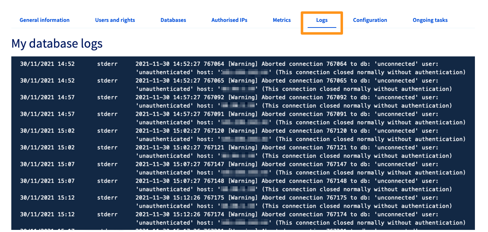

> [!primary]
> Diese Übersetzung wurde durch unseren Partner SYSTRAN automatisch erstellt. In manchen Fällen können ungenaue Formulierungen verwendet worden sein, z.B. bei der Beschriftung von Schaltflächen oder technischen Details. Bitte ziehen Sie im Zweifelsfall die englische oder französische Fassung der Anleitung zu Rate. Möchten Sie mithelfen, diese Übersetzung zu verbessern? Dann nutzen Sie dazu bitte den Button "Beitragen" auf dieser Seite.
>

## Ziel

Mit der Lösung [Web Cloud Databases](https://www.ovhcloud.com/de/web-cloud/databases/) können Sie mehrere Datenbanken hosten. In manchen Situationen kann es notwendig sein, die Logs einzusehen / abzurufen:

- Ihres Web Cloud Databases Servers;
- für eine der auf Ihrem Web Cloud Databases Server gehosteten Datenbanken.

**Diese Anleitung erklärt, wie Sie die auf Ihrem Web Cloud Databases Server gehostet werden**

## Voraussetzungen

- Sie verfügen über eine [Web Cloud Databases](https://www.ovhcloud.com/de/web-cloud/databases/) Lösung (in einem [Performance Web Hosting](https://www.ovhcloud.com/de/web-hosting/) Angebot enthalten oder nicht).
- Sie sind in Ihrem [OVHcloud Kundencenter](https://www.ovh.com/auth/?action=gotomanager&from=https://www.ovh.de/&ovhSubsidiary=de){.external} eingeloggt.

## In der praktischen Anwendung

> [!warning]
>
> OVHcloud stellt Ihnen Dienste zur Verfügung, für deren Konfiguration, Verwaltung und Verwaltung Sie die alleinige Verantwortung tragen. Es liegt somit in Ihrer Verantwortung, sicherzustellen, dass diese ordnungsgemäß funktionieren.
> 
> Wir stellen Ihnen dieses Tutorial zur Verfügung, um Sie bestmöglich bei gängigen Aufgaben zu begleiten. Dennoch empfehlen wir Ihnen, falls Sie Hilfe brauchen, einen [spezialisierten Dienstleister](https://partner.ovhcloud.com/de/directory/) zu kontaktieren. Wir sind nicht in der Lage, Ihnen bei der Interpretation der für Ihre Web Cloud Databases Lösung verfügbaren Logs zu helfen. Weitere Informationen finden Sie im Abschnitt „[Weiterführende Informationen](#go-further)“ dieser Anleitung.
>

### Die Logs Ihrer Web Cloud Databases Lösung in Echtzeit einsehen

So überprüfen Sie die Logs Ihrer Web Cloud Databases Lösung in Echtzeit:

1. Verbinden Sie sich mit Ihrem [OVHcloud Kundencenter](https://www.ovh.com/auth/?action=gotomanager&from=https://www.ovh.de/&ovhSubsidiary=de).
2. Klicken Sie oben im Kundencenter auf den Tab `Web Cloud`{.action}.
3. Klicken Sie in der linken Spalte auf das Dropdown-Menü `Web Cloud Databases`{.action}.
4. Wählen Sie die betreffende Web Cloud Databases Lösung aus.
5. Klicken Sie auf der angezeigten Seite auf den Tab `Logs`{.action}.

{.thumbnail}

In dieser integrierten Konsole finden Sie in Echtzeit die Logs Ihrer Web Cloud Databases Lösung.

> [!primary]
>
> Wie bereits erwähnt, sind die Logs hier nur in Echtzeit verfügbar. Das bedeutet, dass diese Logs nur angezeigt werden, wenn sie erstellt werden, während Sie sich im Tab `Logs`{.action} befinden. 
>
> Wenn Sie den Tab `Logs`{.action} verlassen und später darauf zurückkehren, wird der zuvor angezeigte Verlauf nicht mehr angezeigt.
>

### Loghistorie Ihrer Web Cloud Databases Lösung abrufen

Um den Logverlauf Ihrer Web Cloud Databases Lösung abzurufen, müssen Sie sich via SFTP damit verbinden.

> [!warning]
>
> Vergewissern Sie sich vor dem Login, dass die öffentliche IP-Adresse des verwendeten Rechners auf Ihrem Web Cloud Databases Server autorisiert ist. Die Option `SFTP` ist aktiviert.
>
> Um dies zu überprüfen, rufen Sie die öffentliche IP-Adresse Ihres Internetzugriffspunkts ab und lesen Sie den Abschnitt **Autorisieren einer IP-Adresse*** in [dieser Anleitung](/pages/web_cloud/web_cloud_databases/starting_with_clouddb).
>

So finden Sie die SFTP-Verbindungsinformationen zu Ihrer Web Cloud Databases Lösung:

1. Verbinden Sie sich mit Ihrem [OVHcloud Kundencenter](https://www.ovh.com/auth/?action=gotomanager&from=https://www.ovh.de/&ovhSubsidiary=de).
2. Klicken Sie oben im Kundencenter auf den Tab `Web Cloud`{.action}.
3. Klicken Sie in der linken Spalte auf das Dropdown-Menü `Web Cloud Databases`{.action}.
4. Wählen Sie die betreffende Web Cloud Databases Lösung aus.
5. Bleiben Sie auf der angezeigten Seite auf dem Tab `Allgemeine Informationen`{.action}, und navigieren Sie dann zur Randleiste `Verbindungsinformationen`{.action}.
6. Unter `SFTP`{.action} finden Sie alle notwendigen Informationen, um sich via SFTP zu verbinden.

> [!primary]
>
> Wenn Sie das `Server-Passwort` nicht kennen, klicken Sie auf den Button `...`{.action} rechts, um es zu ändern.
>

{.thumbnail}

Nachdem Sie die SFTP-Login-Daten abgerufen haben, verbinden Sie sich über einen FTP-Client (FileZilla, Cyberduck, WinSCP usw.).

Gehen Sie für FileZilla links oben in das Menü `File`{.action} und klicken Sie dann auf `Site Manager`{.action}.

Klicken Sie auf `New Site`{.action} und geben Sie die zuvor ermittelten Parameter ein.

{.thumbnail}

Die Log-Datei mit dem Namen `stdout.log` befindet sich im Wurzelverzeichnis.

Sie können es auf Ihren Computer herunterladen, um es einzusehen.

> [!primary]
>
> Im SFTP-Wurzelverzeichnis Ihres Web Cloud Databases Servers kann eine zusätzliche Logdatei mit dem Namen `slow-query.log` angezeigt werden.
> Diese Datei enthält den Verlauf der langsamen Anfragen, die auf Ihrem Web Cloud Databases Server ausgeführt wurden. 
> 
> Standardmäßig ist der Wert für Web Cloud Databases-Lösungen in der Variablen **long_query_time** auf 1 Sekunde festgelegt.
> 
> Mit dieser Datei können Sie Ihre Skripte und den Inhalt Ihrer Datenbank(en) optimieren, um die Performance Ihrer verschiedenen dazugehörigen Dienste zu verbessern.
>

## Weiterführende Informationen 

[Erste Schritte mit Ihren Web Cloud Databases](/pages/web_cloud/web_cloud_databases/starting_with_clouddb)
 
Kontaktieren Sie für spezialisierte Dienstleistungen (SEO, Web-Entwicklung etc.) die [OVHcloud Partner](https://partner.ovhcloud.com/de/directory/).
 
Für den Austausch mit unserer User Community gehen Sie auf <https://community.ovh.com/en/>.