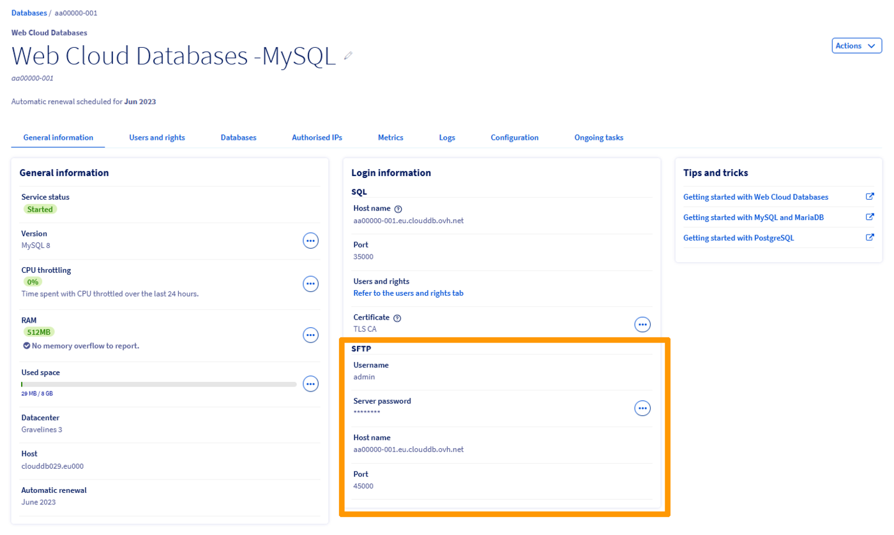

> [!primary]
> Tłumaczenie zostało wygenerowane automatycznie przez system naszego partnera SYSTRAN. W niektórych przypadkach mogą wystąpić nieprecyzyjne sformułowania, na przykład w tłumaczeniu nazw przycisków lub szczegółów technicznych. W przypadku jakichkolwiek wątpliwości zalecamy zapoznanie się z angielską/francuską wersją przewodnika. Jeśli chcesz przyczynić się do ulepszenia tłumaczenia, kliknij przycisk "Zgłoś propozycję modyfikacji” na tej stronie.
>

## Wprowadzenie

Rozwiązanie [Web Cloud Databases](https://www.ovhcloud.com/pl/web-cloud/databases/) umożliwia hostowanie kilku baz danych. W niektórych sytuacjach możesz sprawdzić/pobrać logi:

- serwera Web Cloud Databases ;
- dla jednej z baz danych hostowanych na serwerze Web Cloud Databases.

**Dowiedz się, jak pobrać logi baz danych hostowanych na serwerze Web Cloud Databases**

## Wymagania początkowe

- Posiadanie rozwiązania [Web Cloud Databases](https://www.ovhcloud.com/pl/web-cloud/databases/) (zawartego lub nie w ofercie [hostingu performance](https://www.ovhcloud.com/pl/web-hosting/)).
- Dostęp do [panelu klienta OVHcloud](https://www.ovh.com/auth/?action=gotomanager&from=https://www.ovh.pl/&ovhSubsidiary=pl){.external}.

## W praktyce

> [!warning]
>
> OVHcloud udostępnia różnorodne usługi, jednak to Ty odpowiadasz za ich konfigurację i zarządzanie nimi. Ponosisz więc odpowiedzialność za ich prawidłowe funkcjonowanie.
> 
> Oddajemy w Twoje ręce tutorial, którego celem jest pomoc w jak najbardziej optymalnym wykonywaniu bieżących zadań. Jeśli jednak napotkasz trudności, zalecamy skontaktowanie się z [wyspecjalizowanym dostawcą](https://partner.ovhcloud.com/pl/directory/). Niestety OVH nie jest w stanie udzielić Ci wsparcia w interpretacji logów dostępnych w ramach Twojego rozwiązania Web Cloud Databases. Więcej informacji znajduje się w sekcji "[Sprawdź również](#go-further)" tego tutoriala.
>

### Sprawdzanie logów usługi Web Cloud Databases w czasie rzeczywistym

Aby w czasie rzeczywistym sprawdzać logi rozwiązania Web Cloud Databases, wykonaj następujące czynności:

1. Zaloguj się do [Panelu klienta OVHcloud](https://www.ovh.com/auth/?action=gotomanager&from=https://www.ovh.pl/&ovhSubsidiary=pl).
2. W wierszu u góry Panelu klienta kliknij zakładkę `Web Cloud`{.action}.
3. W lewej kolumnie kliknij menu rozwijane `Web Cloud Databases`{.action}.
4. Wybierz odpowiednie rozwiązanie Web Cloud Databases.
5. Na stronie, która się wyświetli kliknij zakładkę `Logi`{.action}.

{.thumbnail}

To na tej wbudowanej konsoli znajdują się, w czasie rzeczywistym, logi rozwiązania Web Cloud Databases.

> [!primary]
>
> Jak wspomniano powyżej, logi są dostępne tutaj tylko w czasie rzeczywistym. Oznacza to, że logi te nie pojawią się, dopóki nie zostaną wygenerowane w momencie, gdy będziesz w zakładce `Logi`{.action}. 
>
> Jeśli opuścisz zakładkę `Logi`{.action} i powrócisz do niej później, historia, która się wcześniej wyświetlała, zniknie.
>

### Historia logów usługi Web Cloud Databases

Aby pobrać historię logów rozwiązania Web Cloud Databases, należy połączyć się z nim za pomocą SFTP.

> [!warning]
>
> Przed zalogowaniem się upewnij się, że publiczny adres IP stacji, której używasz jest autoryzowany na Twoim serwerze Web Cloud Databases, zaznaczając opcję `SFTP`.
>
> Aby to sprawdzić, pobierz publiczny adres IP punktu dostępu do Internetu i sprawdź sekcję **Autoryzuj adres IP** w [tym przewodniku](/pages/web_cloud/web_cloud_databases/starting_with_clouddb).
>

Aby uzyskać informacje na temat logowania przez SFTP do rozwiązania Web Cloud Databases, wykonaj następujące czynności:

1. Zaloguj się do [Panelu klienta OVHcloud](https://www.ovh.com/auth/?action=gotomanager&from=https://www.ovh.pl/&ovhSubsidiary=pl).
2. W wierszu u góry Panelu klienta kliknij zakładkę `Web Cloud`{.action}.
3. W lewej kolumnie kliknij menu rozwijane `Web Cloud Databases`{.action}.
4. Wybierz odpowiednie rozwiązanie Web Cloud Databases.
5. Na stronie, która się wyświetli pozostań w zakładce `Informacje ogólne`{.action} i przejdź do rubryki zatytułowanej `Informacje na temat połączenia`{.action}.
6. Pod napisem `SFTP`{.action} znajdziesz wszystkie informacje niezbędne do logowania się przez SFTP.

> [!primary]
>
> Jeśli nie znasz `Hasło do serwera`, kliknij przycisk `...`{.action} po prawej stronie, aby je zmienić.
>

{.thumbnail}

Po pobraniu danych logowania SFTP zaloguj się za pomocą klienta FTP (FileZilla, Cyberduck, WinSCP, etc.).

W przypadku programu FileZilla przejdź do menu `file`{.action} w lewym górnym rogu i kliknij opcję `Site Manager`{.action}.

Kliknij `New site`{.action}, po czym wpisz wybrane wcześniej parametry.

{.thumbnail}

Plik logów o nazwie `stdout.log` znajduje się w katalogu głównym.

Możesz go pobrać na swoje stanowisko i sprawdzić.

> [!primary]
>
> Dodatkowy plik logów o nazwie `slow-query.log` może pojawić się w katalogu głównym SFTP Twojego serwera Web Cloud Databases.
> Ten plik zawiera historię powolnych zapytań uruchomionych na serwerze Web Cloud Databases. 
> 
> Domyślnie w przypadku rozwiązań Web Cloud Databases wartość ta jest ustawiona na 1 sekundę w zmiennej **long_query_time**.
> 
> Dzięki temu plikowi zoptymalizujesz skrypty i zawartość Twojej bazy (baz) danych, aby zwiększyć wydajność różnych przypisanych usług.
>

## Sprawdź również 

[Pierwsze kroki z Web Cloud Databases](/pages/web_cloud/web_cloud_databases/starting_with_clouddb)
 
W przypadku wyspecjalizowanych usług (pozycjonowanie, rozwój, etc.) skontaktuj się z [partnerami OVHcloud](https://partner.ovhcloud.com/pl/directory/).
 
Dołącz do społeczności naszych użytkowników na stronie <https://community.ovh.com/en/>.