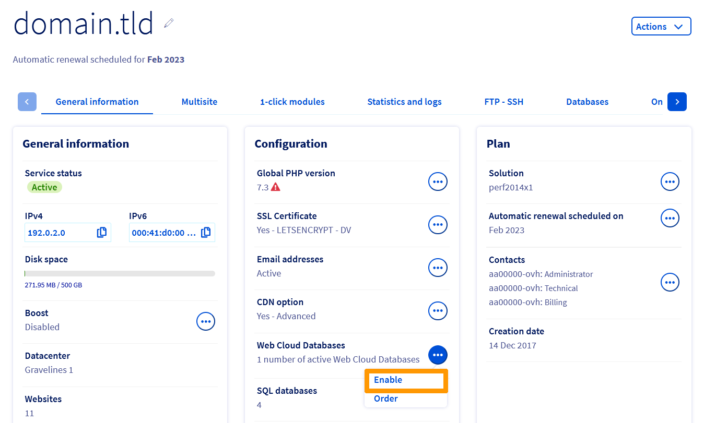
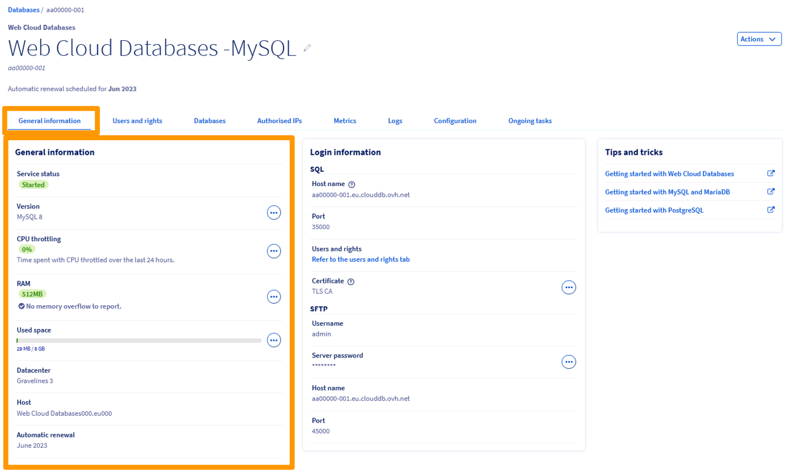
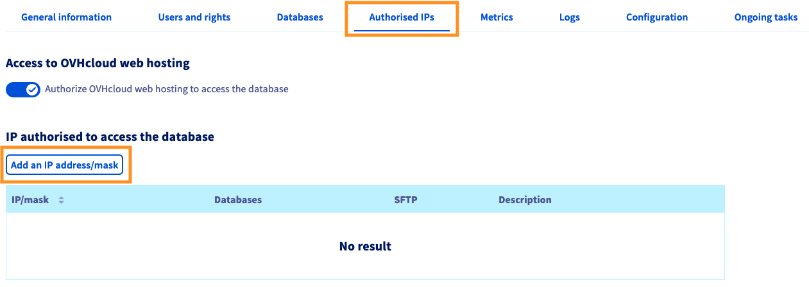
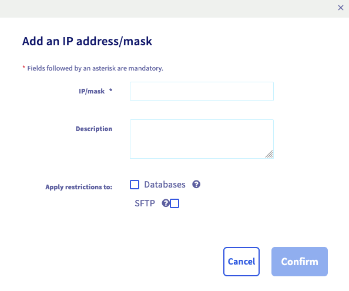

> [!primary]
> Esta tradução foi automaticamente gerada pelo nosso parceiro SYSTRAN. Em certos casos, poderão ocorrer formulações imprecisas, como por exemplo nomes de botões ou detalhes técnicos. Recomendamos que consulte a versão inglesa ou francesa do manual, caso tenha alguma dúvida. Se nos quiser ajudar a melhorar esta tradução, clique em "Contribuir" nesta página.
>

## Sumário

A solução Web Cloud Databases permite beneficiar de uma instância de bases de dados, cujos recursos são dedicados e garantidos que lhe oferecem performance e flexibilidade.
A sua solução Web Cloud Databases está associada de forma padrão à rede de alojamentos web da OVHcloud. É possível associá-la a qualquer outra rede, através de uma lista de endereços IP autorizados.

**Saiba como começar a usar e a gerir o serviço Web Cloud Databases.**

## Requisitos

- Dispor de uma [instância Web Cloud Databases](https://www.ovh.pt/cloud/cloud-databases/) (associada a um [alojamento web](https://www.ovhcloud.com/pt/web-hosting/)).
- Aceder à [Área de Cliente OVHcloud](https://www.ovh.com/auth/?action=gotomanager&from=https://www.ovh.pt/&ovhSubsidiary=pt){.external}.

## Instruções

### Ativação do seu servidor Web Cloud Databases incluído com o seu plano de alojamento web

Se a sua oferta de alojamento inclui a opção Web Cloud Databases, aceda à [Área de Cliente OVHcloud](https://www.ovh.com/auth/?action=gotomanager&from=https://www.ovh.pt/&ovhSubsidiary=pt){.external}. Na secção `Web Cloud`{.action}, clique em `Alojamentos`{.action} na coluna da esquerda.

No separador `Informações gerais`, no quadro `Configuração`, clique no botão `...`{.action} à direita da **Web Cloud Databases**. Finalmente, clique em `Ativar`{.action} para lançar o processo de ativação.

{.thumbnail}

Para concluir, siga as instruções seguintes para determinar o tipo e a versão do seu servidor Web Cloud Databases. De seguida, poderá aceder através da coluna da esquerda na `Web Cloud Databases`{.action}.

### Consultar informações gerais da instância Web Cloud Databases

Na[Área de Cliente OVHcloud](https://www.ovh.com/auth/?action=gotomanager&from=https://www.ovh.pt/&ovhSubsidiary=pt){.external}, no menu à esquerda, aceda à secção `Web Cloud Databases`{.action} e clique na instância em causa. Certifique-se que está no separador `Informações gerais`{.action}.

> [!primary]
>
> Na Área de Cliente, o nome do serviço Web Cloud Databases é composto por uma parte do identificador de cliente e acaba com três algarismos (001 para o primeiro serviço Web Cloud Databases instalado, 002 para o segundo, etc.).
>

Aí pode consultar as informações mais relevantes relativamente à sua instância. Sugerimos que dedique alguns minutos para verificar se estão corretas ou se correspondem às indicações descritas abaixo.

|Informação|Detalhes|
|---|---|
|Estado do serviço|Indica se a instância está ativada, a ser reiniciada ou suspensa. Para configurar a instância SQL, esta tem que estar ativada.|
|Tipo|Indica o sistema de base de dados usado pelo servidor.|
|Versão|Indica a versão do sistema da base de dados usado pelo servidor. Por favor, verifique a compatibilidade do seu site com a versão selecionada.|
|Saturação CPU|Mostra o tempo CPU que passou a saturação. A sua instância Web Cloud Databases não está limitada em termos de CPU, mas deve ter o cuidado de não sobrecarregar o CPU do seu Web Cloud Databases.|
|RAM|Indica a RAM disponível para a instância, e avisa quando os limites da RAM são ultrapassados. A sua instância Web Cloud Databases dispõe de recursos dedicados e garantidos: a sua memória RAM. Se precisar de mais recursos, pode fazer um upgrade e receber notificações quando o limite de memória for atingido.|
|Infraestrutura|Indica a infraestrutura / plataforma usada pela sua instância (i.e. informação relativa à infraestrutura da OVHcloud). Trata-se de uma informação inerente à infraestrutura da OVHcloud.|
|Datacenter|Indica o datacenter onde instância está alojada.|
|Host|Indica o servidor OVHcloud onde a instância foi criada. Esta informação, inerente à infraestrutura da OVHcloud, poderá ser incluída na página sobre o [Estado dos Serviços](https://www.status-ovhcloud.com/){.external}.|

{.thumbnail}

### Criar uma base de dados

> [!primary]
>
> Esta etapa não se aplica ao sistema de bases de dados Redis.
>

Para criar a primeira base de dados na instância Web Cloud Databases, clique no separador `Bases de dados`{.action} e no botão `Criar base de dados`{.action}.

{.thumbnail}

Na janela que se abrir, e além da criação da base de dados, pode optar por:

-  **criar um utilizador**: este último poderá efetuar pedidos na base de dados (como leitura, inserção ou supressão de dados);

- **adicionar um endereço IP autorizado**: os pedidos provenientes deste último serão autorizados a aceder às suas bases de dados.

Segundo o que preferir, complete de seguida as informações pedidas e clique em `Validar`{.action}.

|Informação|Descrição|
|---|---|
|Nome da base|Trata-se do nome da sua futura base de dados.|
|Nome de utilizador|Trata-se do utilizador que poderá conectar-se à sua base de dados e efetuar pedidos (facultativo se a opção «*Criar um utilizador*» não for selecionada).|
|Permissões|Trata-se das autorizações que serão associadas ao utilizador; para uma utilização normal, escolha `Administrador`{.action} (facultativo se a opção «*Criar um utilizador*» não for selecionada).|
|Palavra-passe|Escolha uma palavra-passe e confirme-a (facultativo se a opção «*Criar um utilizador*» não for selecionada).|
|IP/máscara|Trata-se do endereço IP, da máscara de IP ou dos servidores que serão autorizados a aceder às bases de dados (facultativo se a opção «*Adicionar um endereço IP autorizado*» não for selecionada).|

> [!warning]
>
> Por razões de segurança, preencha os campos de acordo com as indicações apresentadas.
>

{.thumbnail}

### Criação de um utilizador

> [!primary]
>
> Esta etapa não se aplica ao sistema de bases de dados Redis.
>

Se criou o utilizador ao mesmo tempo que a base de dados durante a etapa anterior, esta é facultativa. Todavia, certos projetos exigem o acesso de vários utilizadores autorizados à base de dados. Por exemplo, um dos utilizadores associados a uma base de dados pode beneficiar de uma permissão de leitura e escrita, enquanto outro beneficia apenas de uma autorização de leitura.

Se o seu projeto não precisa de um utilizador adicional, pode passar à etapa seguinte. Caso contrário, para criar um utilizador na instância Web Cloud Databases, clique no separador `Utilizadores e permissões`{.action} e no botão `Adicionar utilizador`{.action}.

{.thumbnail}

Na janela que se abrir, introduza as informações pedidas e clique em `Validar`{.action}.

|Informação|Descrição|
|---|---|
|Nome de utilizador|Trata-se do utilizador com permissão para aceder à instância. Pode de seguida associar-lhe permissões relativas à base de dados.|
|Palavra-passe|Escolha uma palavra-passe e confirme-a.|

> [!warning]
>
> Por razões de segurança, preencha os campos de acordo com as indicações apresentadas.
>

{.thumbnail}

Depois de criar o utilizador, é necessário atribuir-lhe permissões para agir sobre a base de dados (ações como a leitura, inserção ou eliminação de dados). Para isso, clique no ícone em forma de roda dentada e em `Gerir permissões`{.action}. Agora selecione o tipo de permissão. Para uma utilização normal, selecione `Administrador`{.action}.

{.thumbnail}

### Importação de uma base de dados

> [!primary]
>
> Esta etapa só se aplica se desejar importar um backup de uma base de dados já existente. Se não for o caso, passe à fase seguinte.
>

As bases de dados podem ser importadas de várias formas. Mas tem à sua disposição uma ferramenta na Área de Cliente OVHcloud, e é desse método que vamos agora tratar. No entanto, pode recorrer a outro, de acordo com as suas preferências e conhecimentos.

As etapas a seguir descrevem como importar uma base de dados por meio da ferramenta disponível na Área de Cliente OVHcloud.

- **Etapa 1: aceder à interface de importação**

Clique no separador `Bases de dados`{.action}. A seguir clique no ícone em forma de roda dentada e em `Importar ficheiro`{.action}. Na nova janela, selecione `Importar novo ficheiro`{.action}. Clique em `Seguinte`{.action}.

{.thumbnail}

- **Etapa 2: selecionar e enviar o ficheiro de backup**

Introduza um nome de ficheiro que lhe permita identificar este backup mais tarde se desejar restaurá-lo. A seguir, ao lado de **Ficheiro**, selecione no seu computador o ficheiro de backup da base de dados e clique em `Enviar`{.action}. Aguarde a confirmação de envio. De seguida, clique em `Seguinte`{.action}.

{.thumbnail}

- **Etapa 3: iniciar a importação da base de dados**

Escolha aplicar ou não as opções adicionais descritas abaixo e clique em `Confirmar`{.action}.

|Opções adicionais|Descrição|
|---|---|
|Limpar a base de dados atual|O conteúdo presente na base de dados será eliminado por inteiro e substituído pelo conteúdo do backup.|
|Enviar um e-mail no final da importação|No final do processo, é-lhe enviado um e-mail para informar que a importação foi concluída.|

{.thumbnail} 

### Autorizar um endereço IP 

De modo que o acesso à sua instância Web Cloud Databases funcione, é obrigatório indicar os IP ou intervalos de IP que podem conectar-se às suas bases de dados. Para isso, clique no separador `IP autorizados`{.action} e a seguir no botão `Adicionar um endereço IP/máscara`{.action}.

{.thumbnail}

Na janela que se abrir, indique em `IP/máscara`{.action} o endereço IP ou a máscara que pretende autorizar e adicione uma descrição se desejar. Decida se quer dar acesso apenas às bases de dados ou ao SFTP. Por fim, clique em `Validar`{.action}.

{.thumbnail}

#### Autorizar a ligação a um alojamento web OVHcloud 

Por predefinição, a sua solução Web Cloud Databases está automaticamente associada aos alojamentos web da OVHcloud. No entanto, se desejar, pode desativar o acesso dos alojamentos web da OVHcloud à sua base de dados Web Cloud Databases.

Para isso, clique no separador `IP autorizados`{.action} e no botão `Acesso aos alojamentos web OVHcloud`{.action}.

{.thumbnail}

### Ligar o site à base de dados

Agora que a sua base de dados está criada, que um ou vários utilizadores têm permissões para aceder à sua instância Web Cloud Databases, e que pelo menos um endereço IP ou que os alojamentos web da OVHcloud foram autorizados para aceder à sua base de dados. Esta etapa pode ser realizada de várias formas, em função do site ou do CMS (WordPress, Joomla!, etc.) utilizado, bem como da etapa em que se encontra se instala um website.

Durante este procedimento, serão solicitadas cinco informações essenciais:

|Informação|Descrição|
|---|---|
|Nome da base de dados|Trata-se do nome que definiu durante a criação da base de dados. Pode encontrar as bases de dados que criou na instância Web Cloud Databases no separador `Bases de dados`{.action}.|
|Nome de utilizador|Trata-se do nome de utilizador que definiu durante a criação da base de dados ou de um eventual utilizador adicional que terá acrescentado. Pode encontrar os utilizadores criados na instância Web Cloud Databases no separador `Utilizadores e permissões`{.action}.|
|Palavra-passe do utilizador|Trata-se da palavra-passe, ligada ao utilizador, que definiu durante as etapas anteriores.|
|Nome do servidor host|Trata-se do servidor a informar de modo que o site possa ligar-se à base de dados. Esta informação está disponível na Área de Cliente, separador `Informações gerais`{.action}, tabela **Informações da ligação**.|
|Porta do servidor|Trata-se da porta de ligação à instância Web Cloud Databases, que permite a comunicação entre o site e a base de dados. Esta informação está disponível na Área de Cliente, separador `Informações gerais`{.action}, tabela **Informações da ligação**.|

> [!warning]
>
> O campo `port`{.action} pode não estar disponível na configuração do seu site. Terá de adicionar este campo após o nome do anfitrião do seu servidor, separando-os com um *:*.   
> Por exemplo, para o nome do host `zz1111111-002.eu.clouddb.ovh.net` com porta SQL `34567`, você precisará inserir `zz1111111-002.eu.clouddb.ovh.net:34567` no Parte "Host" / "Hostname".
>

{.thumbnail}

#### Obter os logs do seu servidor Web Cloud Databases

Para verificar os últimos logs da sua base de dados, aceda ao separador `Logs`{.action} do seu servidor Web Cloud Databases. Este separador apresenta em tempo real os alertas e os erros.

{.thumbnail}

Para obter o conjunto dos logs do seu servidor Web Cloud Databases, ligue-se através de SFTP neste último.

> [!warning]
>
> Antes de se conectar, verifique que o endereço de IP do computador que utiliza é autorizado no seu servidor Web Cloud Databases, com a opção "SFTP`" selecionada. Para mais informações, consulte a secção [Autorizar a ligação a um alojamento web da OVHcloud](#trustip) neste guia.

Encontre as informações de ligação SFTP a partir do separador `Informações gerais`{.action} do seu servidor Web Cloud Databases. Se não sabe a palavra-passe do servidor, clique no botão `...`{.action} à direita para o modificar.

{.thumbnail}

Ligue-se através de um cliente FTP (FileZilla, Cyberduck, WinSCP, etc.).

Para o FileZilla, no menu `Ficheiro`{.action}, dirija-se ao `Gestor dos websites`{.action}. Clique em `Novo site`{.action} e introduza os parâmetros anteriormente identificados.

{.thumbnail}

O ficheiro de logs, chamado `stdout.log`, encontra-se na raiz.

## Quer saber mais?

Para serviços especializados (referenciamento, desenvolvimento, etc), contacte os [parceiros OVHcloud](https://partner.ovhcloud.com/pt/directory).

Se pretender usufruir de uma assistência na utilização e na configuração das suas soluções OVHcloud, consulte as nossas diferentes [ofertas de suporte](https://www.ovhcloud.com/pt/support-levels/).

Fale com nossa comunidade de utilizadores: <https://community.ovh.com/en/>. 
