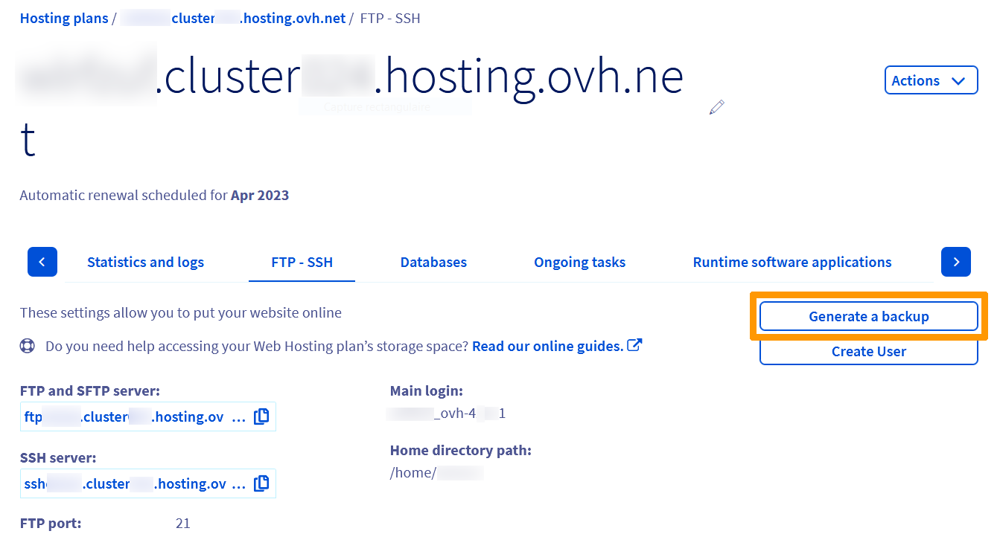
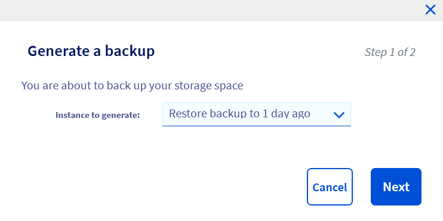
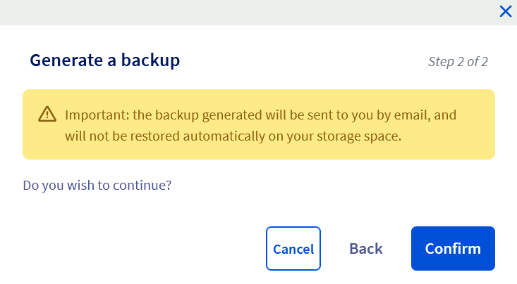
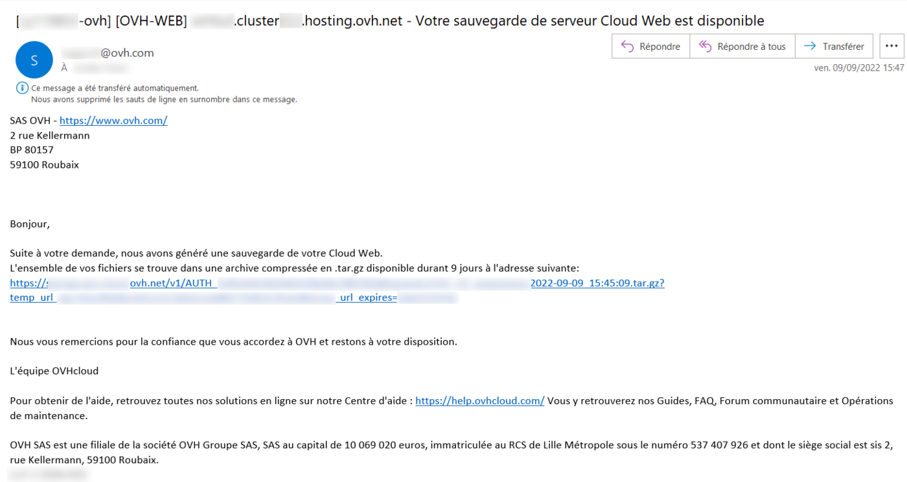

> [!primary]
>
> Questa traduzione è stata generata automaticamente dal nostro partner SYSTRAN. I contenuti potrebbero presentare imprecisioni, ad esempio la nomenclatura dei pulsanti o alcuni dettagli tecnici. In caso di dubbi consigliamo di fare riferimento alla versione inglese o francese della guida. Per aiutarci a migliorare questa traduzione, utilizza il pulsante "Contribuisci" di questa pagina.
>

## Obiettivo

Il tuo hosting Cloud Web dispone di uno spazio di storage in cui puoi ospitare siti e applicazioni.

**Questa guida ti mostra come recuperare un backup dello spazio FTP del tuo hosting Cloud Web**.

> [!primary]
> 
> I backup proposti da OVHcloud per gli hosting Cloud Web sono non contrattuali. disponibili per completare i tuoi servizi di backup in caso di emergenze. Per evitare eventuali perdite di dati, ti consigliamo di effettuare regolarmente i tuoi backup di sicurezza.
> 
> Quando effettui un backup di sicurezza per il tuo sito e utilizzi un database, fai anche un backup di quest'ultimo. Per [recuperare un backup del tuo database](/pages/web_cloud/web_hosting/sql_database_export), consulta la nostra guida.
> 

**Questa guida ti mostra come recuperare e ripristinare un backup FTP del tuo hosting Cloud Web.**

## Prerequisiti

- Disporre di un [hosting Cloud Web](https://www.ovhcloud.com/it/web-hosting/cloud-web-offer/){.external}
- Avere accesso allo [Spazio Cliente OVHcloud](https://www.ovh.com/auth/?action=gotomanager&from=https://www.ovh.it/&ovhSubsidiary=it){.external}
- Avere accesso all'indirizzo email di contatto associato al tuo identificativo cliente

## Procedura

Un hosting Cloud Web dispone di backup automatici attivati alle seguenti frequenze:

- il giorno stesso, effettuato dopo le 00:00.
- il giorno precedente, effettuato dopo le 00:00.
- la due giorni prima, effettuata dopo le 00:00.
- la domenica precedente, effettuata dopo le 01.00.

OVHcloud può offrire solo i backup indicati, a condizione che il tuo hosting Cloud Web esista già alle date indicate e con riserva della disponibilità dell'infrastruttura al momento della richiesta del backup.

### Recupera un backup

Diversamente dagli hosting condivisi OVHcloud, il ripristino dello spazio FTP non può essere effettuato cliccando sul tuo [Spazio Cliente OVHcloud](https://www.ovh.com/auth/?action=gotomanager&from=https://www.ovh.it/&ovhSubsidiary=it){.external}.

Viene generato un link per scaricare il backup e inviato via email all'indirizzo email associato all'identificativo cliente amministratore dell'hosting Cloud Web.

#### Step 1 - Genera il link di recupero inviato via email

Per generare il link di recupero, accedi al tuo [Spazio Cliente OVHcloud](https://www.ovh.com/auth/?action=gotomanager&from=https://www.ovh.it/&ovhSubsidiary=it){.external}, accedi alla sezione `Web Cloud`{.action}, clicca su `Hosting`{.action} e poi sul Cloud Web corrispondente. 

Seleziona la scheda `FTP - SSH`{.action} e clicca sul pulsante `Genera un backup`{.action} a destra.

{.thumbnail}

Nella nuova finestra, seleziona uno dei backup disponibili e clicca su `Avanti`{.action}.

{.thumbnail}

Si apre una nuova finestra in cui viene indicato che il link di recupero del file di backup ti verrà inviato via email e che OVHcloud non effettuerà alcun ripristino automatico sul tuo hosting Cloud Web.

{.thumbnail}

Clicca su `Conferma`{.action} per confermare la tua richiesta.

Se la generazione del backup è stata avviata correttamente, visualizzi questo messaggio nello [Spazio Cliente OVHcloud](https://www.ovh.com/auth/?action=gotomanager&from=https://www.ovh.it/&ovhSubsidiary=it){.external}:

{.thumbnail}

La generazione del backup richiede tra i 10 e i 15 minuti.

#### Step 2 - Recupera il backup

Una volta completata la generazione del backup, ricevi un'email all'indirizzo email associato all'identificativo amministratore del tuo hosting Cloud Web. 
Questa email contiene un link di download **valido 9 giorni** a partire dalla ricezione dell'email:

{.thumbnail}

Il file caricato è in formato *.tar.gz*.

### Ripristina il backup

Una volta scaricati i file, potrai [accedere al tuo spazio FTP](/pages/web_cloud/web_hosting/ftp_connection) utilizzando un software FTP come [Filezilla](/pages/web_cloud/web_hosting/ftp_filezilla_user_guide) e sostituire i file che desideri con quelli recuperati.

> [!primary]
>
> Utilizza le porte indicate nello [Spazio Cliente OVHcloud](https://www.ovh.com/auth/?action=gotomanager&from=https://www.ovh.it/&ovhSubsidiary=it){.external} per le connessioni SFTP e SSH perché la porta 22 non sarà funzionale per il tuo hosting Cloud Web.
>

## Per saperne di più 

[Connettersi allo spazio di storage di un hosting Web](/pages/web_cloud/web_hosting/ftp_connection)

[Accedi con il client Filezilla](/pages/web_cloud/web_hosting/ftp_filezilla_user_guide)

Per prestazioni specializzate (referenziamento, sviluppo, ecc...), contatta i [partner OVHcloud](https://partner.ovhcloud.com/it/directory/).

Per usufruire di un supporto per l'utilizzo e la configurazione delle soluzioni OVHcloud, consulta le nostre [soluzioni di supporto](https://www.ovhcloud.com/it/support-levels/).

Contatta la nostra Community di utenti all’indirizzo <https://community.ovh.com/en/>.