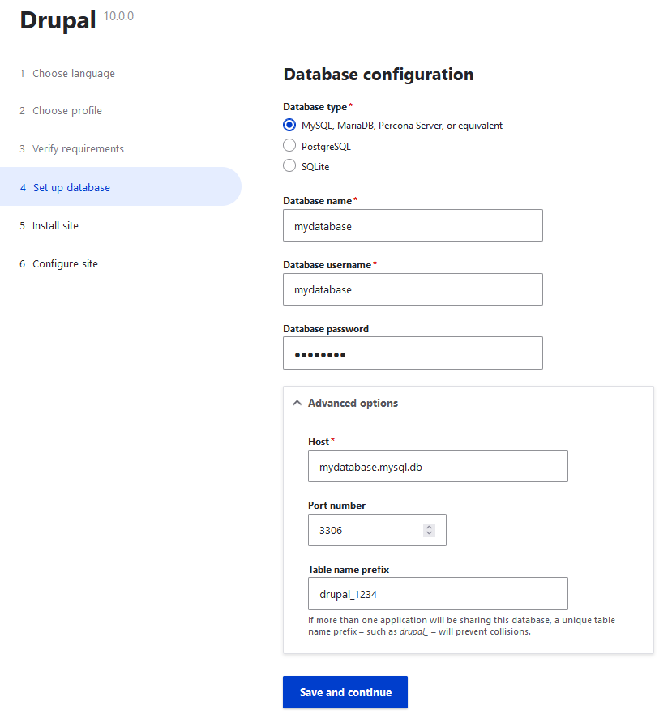
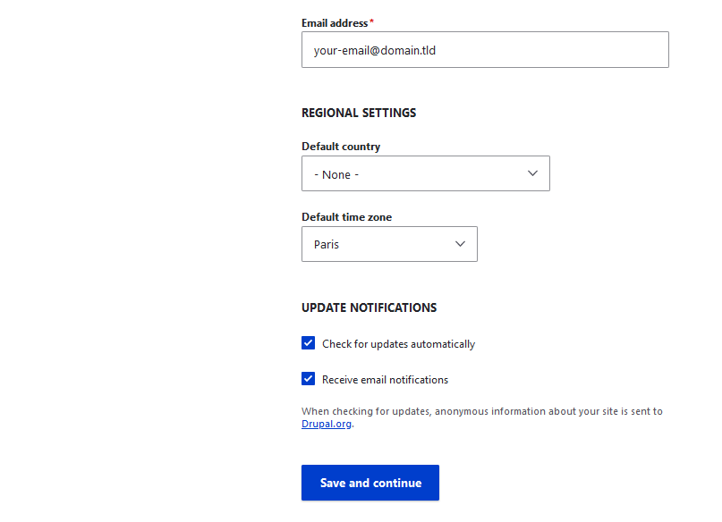

## Objective

This tutorial will help you install Drupal CMS (Content Management System) manually in just a few steps.

[!warning]
>
> OVHcloud provides services that you are responsible for with regard to their configuration and management. It is therefore your responsibility to ensure that they function properly.
>
> This tutorial is designed to help you with common tasks. Nevertheless, we recommend contacting a [specialist provider](https://partner.ovhcloud.com/en/directory/) or the [Drupal support](https://www.drupal.org/support){.external} if you encounter any difficulties. We will not be able to assist you. You can find more information in the [Go further](#go-further) section of this guide.
>

> [!success]
>
> To install Drupal **automatically** from your [OVHcloud Control Panel](https://ca.ovh.com/auth/?action=gotomanager&from=https://www.ovh.com/world/&ovhSubsidiary=we), please refer to our documentation on [installing a 1-click module](/pages/web_cloud/web_hosting/cms_install_1_click_modules).
>
> To manually **install another CMS** (WordPress, Joomla!, PrestaShop), please refer to our documentation on [installing a CMS manually](/pages/web_cloud/web_hosting/cms_manual_installation).
>

**This tutorial explains how to install your Drupal CMS manually.**

## Requirements

- An [OVHcloud web hosting plan](https://www.ovhcloud.com/en/web-hosting/) that contains at least one database
- A [domain name](https://www.ovhcloud.com/en/domains/)
- Access to the [OVHcloud Control Panel](https://ca.ovh.com/auth/?action=gotomanager&from=https://www.ovh.com/world/&ovhSubsidiary=we)

## Instructions

### Step 1: Prepare for the installation 

To install the **Drupal** CMS on your [web hosting plan](https://www.ovhcloud.com/en/web-hosting/), you will need to make some preparations.

Follow **all of steps** described in our tutorial on [installing a CMS manually](/pages/web_cloud/web_hosting/cms_manual_installation) before continuing with step 2 below.

### Step 2: Finalise the installation 

> [!success]
>
> Before you continue with the installation, clear your web browser cache to avoid any errors.
>

#### 2.1 Access your Drupal website via your browser

Enter your domain name into the address bar of your web browser.

If the Drupal source files have been correctly placed in your root folder, the Drupal page for selecting the language appears:

{.thumbnail}

Select the site language and click `Save and Continue`{.action}.

#### 2.2 Choose installation type

Drupal offers several levels of installation:

- Standard version (recommended)
- Minimum version
- Presentation version

{.thumbnail}

We recommend choosing the **Standard** installation. Then click `Save and continue`{.action}.

### 2.3 Link your Drupal to your database

Enter the information requested for the database:

{.thumbnail}

Have your database login details ready (if necessary, see **Step 1.4** in the [manual installation of a CMS tutorial](/pages/web_cloud/web_hosting/cms_manual_installation)).

- *Database type*: Select your database type from the choices available.

- *Database name*: This name was defined when the database was created in the [OVHcloud Control Panel](https://ca.ovh.com/auth/?action=gotomanager&from=https://www.ovh.com/world/&ovhSubsidiary=we).

- *Database username*: It is identical to the database name if you are using a database included with your web hosting plan. For databases created on Web Cloud Databases, please refer to the information in **Step 1.4** in the [manual installation of a CMS tutorial](/pages/web_cloud/web_hosting/cms_manual_installation).

- *Database password*: You defined it yourself when you created your database. You may have modified it in the meantime.

Click on `Advanced Options`{.action} to see the rest of the menu.

- *Host*: The name of your database server, included in the installation email and displayed in your OVHcloud Control Panel. 

> [!primary]
> 
> - The server name of a database included with your web hosting plan usually has this format: `NameOfYourDatabase.mysql.db`. 
>
> - The server name of a Web Cloud Databases database starts with your OVHcloud NIC handle and is in the following format: `OVHID(without-ovh)-XXX.eu.clouddb.ovh.net` where **XXX** is to be replaced by the reference of your Web Cloud Databases service.
>

- *Port number*: If you are using a database included with your OVHcloud hosting plan, please keep the default **3306**. If you are using a *Web Cloud Databases* service, please refer to **Step 1.4** in the tutorial on [manually installing a CMS](/pages/web_cloud/web_hosting/cms_manual_installation) to retrieve the correct port number.

- *Table name prefix*: If you are installing with a brand new database, enter your preferred prefix. If you are using a database that has already been used by another website, please refer to **Step 1.4** in the tutorial on [manually installing a CMS](/pages/web_cloud/web_hosting/cms_manual_installation) to avoid entering a table prefix that has already been used in your database.

Click `Save and Continue`{.action}.

If everything has been done correctly, Drupal will be installed:

{.thumbnail}

#### 2.4 Configure your website information and administrator access

Once the previous step is complete, the following page is displayed:

{.thumbnail}

Enter the information requested:

- *Site name*: Enter the name of your future Drupal website.

- *Site email address*: Enter a valid email address that will be used by your Drupal website.

- *Username*: Enter a username to log in to your Drupal administration panel.

- *Password* and *Confirm password*: Set the password that will be associated with your username to access your Drupal back office .

Then continue to the bottom of the page:

{.thumbnail}

- *Email address*: Enter your email address. Ideally, enter the same address you entered earlier in the form *Site email address*.

- *Default country*: Choose the country from which your website will be visited the most.

- *Default time zone*: Select the default time zone for your website.

Click `Save and Continue`{.action}.

If everything went well, the following page appears:

{.thumbnail}

> [!success]
>
> The Drupal installation is complete, you can now start creating the content of your Drupal website!
>

## Go further 

[Drupal official website](https://www.drupal.org/){.external}

For specialised services (SEO, development, etc.), contact [OVHcloud partners](https://partner.ovhcloud.com/en/directory/).

If you would like assistance using and configuring your OVHcloud solutions, please refer to our [support offers](https://www.ovhcloud.com/en/support-levels/).

Join our community of users on <https://community.ovh.com/en/>.