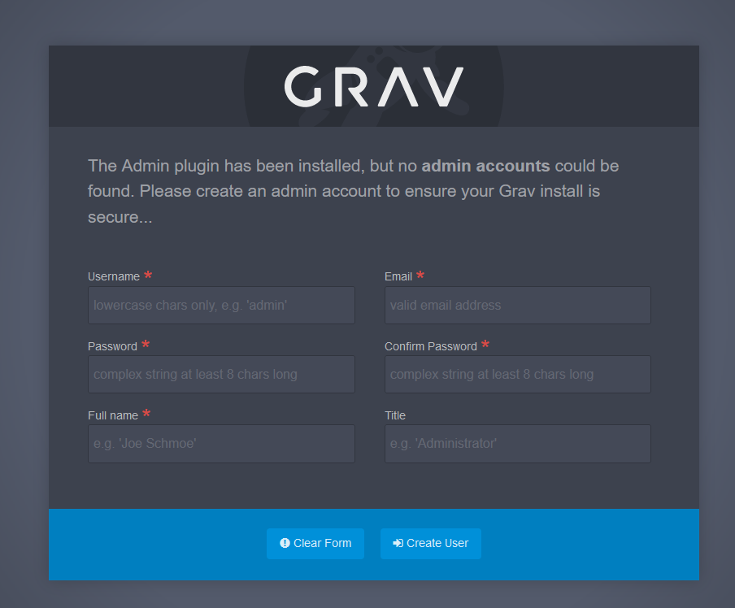

## Ziel

Das **CMS** (**C**ontent **M**anagement **S**ystem) Grav ermöglicht die schnelle Entwicklung von Websites. Grav wurde für ein optimiertes Content-Management mithilfe von Markdown-Dateien entwickelt und eignet sich hervorragend für die Erstellung persönlicher Websites oder Projekte für kleine Unternehmen, ohne Kompromisse bei der Qualität oder Personalisierung einzugehen.

**Diese Anleitung erklärt, wie Sie das Grav CMS manuell auf einem OVHcloud Webhosting installieren auf Ihrem OVHcloud Webhosting.**

## Voraussetzungen

- Sie verfügen über ein [OVHcloud Webhosting](https://www.ovhcloud.com/de/web-hosting/) Angebot.
- Sie besitzen eine [Domain](https://www.ovhcloud.com/de/domains/).
- Sie sind in Ihrem [OVHcloud Kundencenter](https://www.ovh.com/auth/?action=gotomanager&from=https://www.ovh.com/de/&ovhSubsidiary=de) eingeloggt.

## In der praktischen Anwendung

### Installation vorbereiten

Für die Installation des CMS **Grav** auf Ihrem [Webhosting](https://www.ovhcloud.com/de/web-hosting/) sind einige Vorbereitungen erforderlich.

Folgen Sie den **Schritten** in unserer Anleitung zur [manuellen Installation eines CMS](/pages/web_cloud/web_hosting/cms_manual_installation), bevor Sie zum nächsten Schritt übergehen.

### Manuelle Installation abschließen

> [!primary]
>
> Leeren Sie vor der Installation den Cache Ihres Internetbrowsers, um Fehlfunktionen zu vermeiden.
>

#### Besuchen Sie Ihre Website Grav über Ihren Browser

Geben Sie Ihren Domainnamen in die Suchleiste Ihres Webbrowsers ein.

Wenn die Quelldateien von Grav korrekt in den Wurzelordner verschoben wurden, wird die Seite `your-domain/admin` angezeigt:

{.thumbnail}

Füllen Sie das Formular aus, um einen Admin-Benutzer zu erstellen, und klicken Sie dann zur Bestätigung auf `Create User`{.action}.

Sobald Sie im Verwaltungsinterface von Grav eingeloggt sind, beginnen Sie mit der Personalisierung Ihrer Website.

### Ihre Website personalisieren

Nachdem Sie sich als Administrator im Grav-Dashboard angemeldet haben, können Sie auf eine Vielzahl von Optionen zugreifen, um Ihre Website zu konfigurieren und anzupassen.

#### Allgemeine Website-Konfiguration

##### Systemkonfiguration

Klicken Sie im Hauptmenü von Grav auf `Configuration`{.action}, und ändern Sie dann im Tab `Site`{.action} den Namen Ihrer Website, legen Sie die Standardsprache fest, oder konfigurieren Sie mehrere Einstellungen in Bezug auf Ihre Website.

Aktivieren Sie den Cache, um die Leistung Ihrer Website zu verbessern. Klicken Sie auf den Tab `System`{.action} und dann auf `Caching`{.action}. Identifizieren Sie die Zeile `Caching`{.action} und setzen Sie einen Haken `Yes`{.action}.

{.thumbnail}

##### Medienkonfiguration

Wählen Sie im Hauptmenü von Grav `Configuration`{.action} aus, und klicken Sie dann im Tab `System`{.action} auf `Media`{.action}. Legen Sie auf dieser Seite das Medienverhalten der Website fest, z. B. Bilder, Videos oder Dokumente.

#### Content Management

##### Seiten

Klicken Sie im Hauptmenü von Grav auf `Pages`{.action}, um eine Liste aller Seiten Ihrer Website anzuzeigen. Erstellen Sie neue Seiten, bearbeiten Sie vorhandene Seiten, und ordnen Sie die Struktur Ihrer Website an.

Um den Inhalt einer Seite anzuzeigen und zu bearbeiten, klicken Sie auf den Namen der Seite in der Liste. Klicken Sie beispielsweise auf `Home`{.action}, um den Titel und den Inhalt der Hauptseite Ihrer Website zu ändern.

{.thumbnail}

##### Themes

Klicken Sie im Hauptmenü von Grav auf `Themes`{.action}, um das Aussehen Ihrer Website zu ändern. Installieren Sie neue Designs, oder wählen Sie ein bereits installiertes Design als aktives Design aus.

Um das aktuelle Design zu ändern, klicken Sie auf das Design mit der Bezeichnung `Active Theme`.

{.thumbnail}

Passen Sie auf der angezeigten Seite Ihr aktives Design an.

#### Backup und Update

##### Backup

Durch die Sicherung Ihrer Website kann diese im Falle einer Störung auf einen früheren Zustand zurückgesetzt werden.

Klicken Sie im Hauptmenü von Grav auf `Tools`{.action}, wählen Sie `Backup Now`{.action} in der rechten oberen Ecke des angezeigten Bildschirms und dann `Download Backup`{.action}, um das Backup Ihrer Website auf Ihren Computer herunterzuladen. Wenn Sie die Seite `Backup` aktualisieren, wird Ihr Backup in der Liste `Backup History`{.action} angezeigt.

{.thumbnail}

##### Update

Für die Sicherheit und Leistung Ihrer Website ist es entscheidend, Ihr System auf dem neuesten Stand zu halten. Klicken Sie im Hauptmenü von Grav auf `Check for Updates`{.action}, um die verfügbaren Updates anzuzeigen.

### Fazit

Sie haben das CMS Grav manuell auf Ihrem OVHcloud Webhosting installiert. Nachdem Sie Ihre Website konfiguriert, personalisierte Inhalte hinzugefügt, das Thema angepasst und Plugins installiert haben, ist Ihre Website von Grav online über Ihren Domainnamen verfügbar.

## Weiterführende Informationen 

[Tutorial - Manuelle Installation von WordPress](/pages/web_cloud/web_hosting/cms_manual_installation_wordpress)

[Tutorial - Manuelle Installation von Joomla!](/pages/web_cloud/web_hosting/cms_manual_installation_joomla)

[Tutorial - Manuelle Installation von Drupal](/pages/web_cloud/web_hosting/cms_manual_installation_drupal)

[Tutorial - Manuelle Installation von PrestaShop](/pages/web_cloud/web_hosting/cms_manual_installation_prestashop)

[Tutorial - Manuelle Installation von Pico](/pages/web_cloud/web_hosting/cms_manual_installation_pico)

[Tutorial - Manuelles Installieren eines CMS auf meinem Hosting](/pages/web_cloud/web_hosting/cms_manual_installation)
 
Kontaktieren Sie für spezialisierte Dienstleistungen (SEO, Web-Entwicklung etc.) die [OVHcloud Partner](https://partner.ovhcloud.com/de/directory/).
 
Für den Austausch mit unserer User Community gehen Sie auf <https://community.ovh.com/en/>.