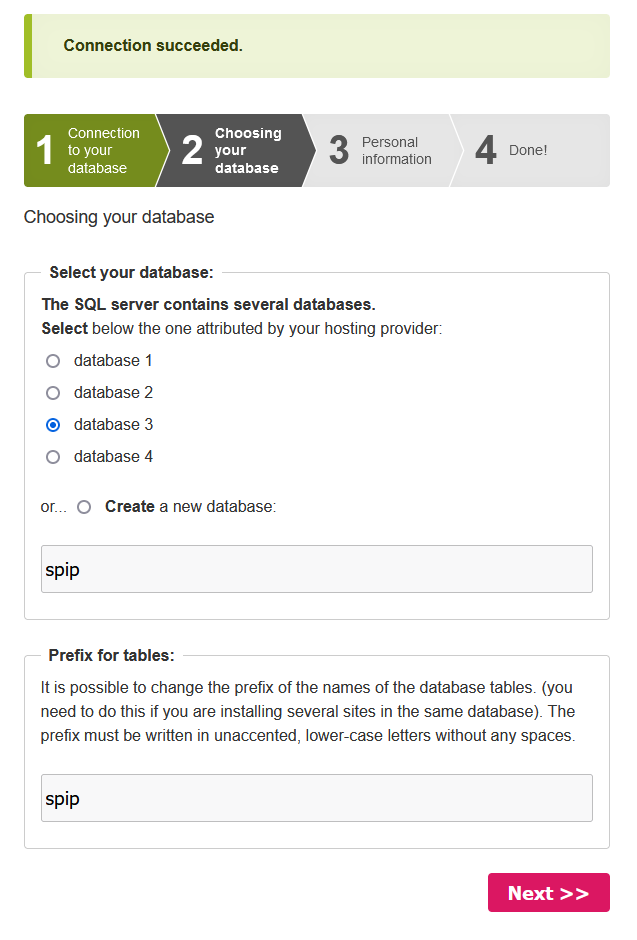

> [!primary]
> Esta traducción ha sido generada de forma automática por nuestro partner SYSTRAN. En algunos casos puede contener términos imprecisos, como en las etiquetas de los botones o los detalles técnicos. En caso de duda, le recomendamos que consulte la versión inglesa o francesa de la guía. Si quiere ayudarnos a mejorar esta traducción, por favor, utilice el botón "Contribuir" de esta página.
>

## Objetivo

El **CMS** (**C**contiene **M**Management **S**System) SPIP es una solución adecuada para sitios editoriales como revistas online, periódicos o sitios web institucionales. Gracias a su arquitectura modular y a su sistema de esqueletos personalizables, SPIP permite diseñar sitios web llenos de funcionalidades, ofreciendo al mismo tiempo una gran libertad de personalización.

**Descubra cómo instalar manualmente el CMS Spip en un alojamiento web de OVHcloud.**

## Requisitos

- Tener contratado [un plan de hosting de OVHcloud](https://www.ovhcloud.com/es/web-hosting/).
- Tener un [dominio](https://www.ovhcloud.com/es/domains/).
- Estar conectado a su [área de cliente de OVHcloud](https://ca.ovh.com/auth/?action=gotomanager&from=https://www.ovh.com/world/&ovhSubsidiary=ws).

## Procedimiento

### Preparar la instalación

Para instalar el CMS **Spip** en su [alojamiento web](https://www.ovhcloud.com/es/web-hosting/), es necesario realizar algunos preparativos.

Siga el **conjunto de pasos** descritos en nuestro tutorial sobre la [instalación manual de un CMS](/pages/web_cloud/web_hosting/cms_manual_installation) antes de continuar con el siguiente paso.

### Finalizar la instalación manual

> [!primary]
>
> Antes de continuar con la instalación, vacíe la caché de su navegador para evitar posibles fallos de funcionamiento.
>

#### Ir a su sitio web Spip a través de su navegador

Introduzca `your_domain/ecrire` en la barra de búsqueda de su navegador de Internet para iniciar la instalación de su sitio web Spip. Se abrirá la siguiente página:

{.thumbnail}

Seleccione el idioma de su sitio web Spip y haga clic en `Next`{.action} para confirmar. Aparecerá la siguiente pantalla:

{.thumbnail}

Introduzca los datos para conectarse a su SGBD (por ejemplo, MySQL). Una vez que se haya conectado correctamente a la base de datos, aparecerá la siguiente pantalla:

{.thumbnail}

Seleccione la base de datos que desea utilizar para su sitio web o [cree una nueva](/pages/web_cloud/web_hosting/sql_create_database). Elija un prefijo para las tablas de la base de datos. Por defecto, se utiliza el prefijo `spip`. Haga clic en `Next`{.action} para validar la información. Aparecerá la siguiente pantalla:

{.thumbnail}

Introduzca la información solicitada y haga clic en `Next`{.action} para confirmar. Aparecerá la siguiente pantalla:

{.thumbnail}

La pantalla muestra la lista de plugins disponibles para su sitio web y le informa de que la instalación de Spip se ha realizado correctamente.

### Conclusión

Acaba de instalar manualmente el CMS Spip en su alojamiento web de OVHcloud. Su sitio web Spip está accesible en línea a través de su nombre de dominio. Para conectarse al espacio de administrador de su sitio web Spip, introduzca `your_domain/ecrire` en la barra de búsqueda de su navegador de Internet.

## Más información 

[Tutorial - Instalar WordPress manualmente](/pages/web_cloud/web_hosting/cms_manual_installation_wordpress)

[Tutorial - Instalar Joomla! manualmente](/pages/web_cloud/web_hosting/cms_manual_installation_joomla)

[Tutorial - Instalar Drupal manualmente](/pages/web_cloud/web_hosting/cms_manual_installation_drupal)

[Tutorial - Instalar PrestaShop manualmente](/pages/web_cloud/web_hosting/cms_manual_installation_prestashop)

[Tutorial - Instalar Pico manualmente](/pages/web_cloud/web_hosting/cms_manual_installation_pico)

[Tutorial - Instalar Typo3 manualmente](/pages/web_cloud/web_hosting/cms_manual_installation_typo3)

[Tutorial - Instalar Grav manualmente](/pages/web_cloud/web_hosting/cms_manual_installation_grav)

[Tutorial - Instalar manualmente un CMS en mi alojamiento](/pages/web_cloud/web_hosting/cms_manual_installation)

[Crear una base de datos en un alojamiento web](/pages/web_cloud/web_hosting/sql_create_database)
 
Para servicios especializados (posicionamiento, desarrollo, etc.), contacte con [partners de OVHcloud](https://partner.ovhcloud.com/es/directory/).
 
Interactúe con nuestra comunidad de usuarios en <https://community.ovh.com/en/>.