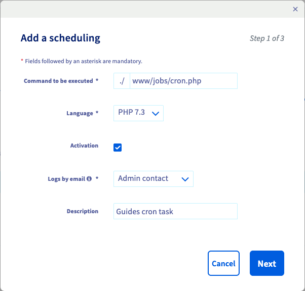
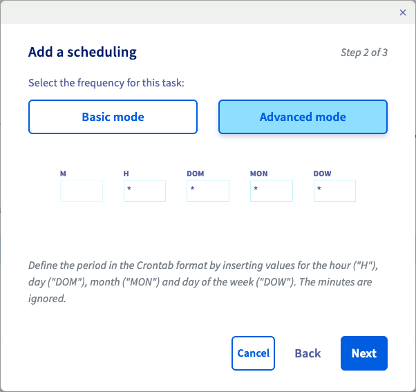

> [!primary]
> Diese Übersetzung wurde durch unseren Partner SYSTRAN automatisch erstellt. In manchen Fällen können ungenaue Formulierungen verwendet worden sein, z.B. bei der Beschriftung von Schaltflächen oder technischen Details. Bitte ziehen Sie im Zweifelsfall die englische oder französische Fassung der Anleitung zu Rate. Möchten Sie mithelfen, diese Übersetzung zu verbessern? Dann nutzen Sie dazu bitte den Button "Beitragen" auf dieser Seite.
>

## Ziel 

Auf Ihrem OVHcloud Webhosting können Sie Skripte verwenden, um bestimmte Operationen zu automatisieren. Die Erstellung eines geplanten Tasks ("CRON job") ist die einfachste Methode sicherzustellen, dass Ihre Skripte zu bestimmten Zeiten ausgeführt werden, ohne dass weitere Aktionen Ihrerseits erforderlich sind. 

**Hier erfahren Sie, wie Sie CRON-Tasks erstellen, um Ihre geplanten Tasks auf einem Webhosting zu automatisieren.**

> [!warning]
>OVHcloud stellt Ihnen Dienstleistungen zur Verfügung, für deren Konfiguration und Verwaltung Sie die alleinige Verantwortung tragen. Es liegt somit bei Ihnen, sicherzustellen, dass diese ordnungsgemäß funktionieren.
>
>Wir stellen Ihnen diese Anleitung zur Verfügung, um Ihnen bei der Bewältigung alltäglicher Verwaltungsaufgaben zu helfen. Dennoch empfehlen wir Ihnen, falls Sie Hilfe brauchen, einen [spezialisierten Dienstleister](https://partner.ovhcloud.com/de/directory/) und/oder den Herausgeber des Dienstes zu kontaktieren. Für externe Dienstleistungen bietet OVHcloud leider keine Unterstützung. Weitere Hinweise finden Sie im Teil „Weiterführende Informationen” dieser Anleitung.
>

## Voraussetzungen

- Sie haben ein [OVHcloud Webhosting](https://www.ovhcloud.com/de/web-hosting/) in Ihrem Kunden-Account.
- Sie haben Zugriff auf Ihr [OVHcloud Kundencenter](https://www.ovh.com/auth/?action=gotomanager&from=https://www.ovh.de/&ovhSubsidiary=de).

## In der praktischen Anwendung

Loggen Sie sich in Ihrem OVHcloud Kundencenter ein und öffnen Sie `Hosting-Pakete`{.action} im Bereich `Web Cloud`{.action}.

Wählen Sie das betreffende Hosting aus, klicken Sie auf den Tab `Mehr`{.action} und dann auf `Cron`{.action}.

In diesem Bereich erhalten Sie einen Überblick über Ihre geplanten Tasks und deren Einstellungen.

{.thumbnail}

### Erstellung eines automatisierten Tasks

#### Schritt 1: Definition der allgemeinen Parameter

Um einen CRON-Task zu erstellen, klicken Sie rechts auf den Button `Eine Planung hinzufügen`{.action}. Sie können die Task-Einstellungen im neuen Fenster anpassen.

{.thumbnail}

|Option|Beschreibung|   
|---|---|   
|Auszuführender Befehl|Legen Sie den Zugriffspfad zur Datei mit Ihrem Skript fest. Beispiel: www/jobs/cron.php|   
|Sprache |Wählen Sie die vom Skript verwendete PHP-Version aus.|
|Aktivierung|Wählen Sie aus, ob der Task nach seiner Erstellung aktiv sein soll oder später aktiviert wird.| 
|Logs per E-Mail|Wenn nötig wählen Sie einen Kontakt (Administrator oder Technischer) aus, an den im Falle eines Ausführungsfehlers ein Bericht versendet wird. Sie können auch eine andere E-Mail-Adresse angeben.| 
|Beschreibung|Geben Sie eine Beschreibung ein, um Ihre Tasks zu dokumentieren.| 

Klicken Sie auf `Weiter`{.action}, um zu Schritt 2 zu kommen.

#### Schritt 2: Frequenzdefinition

Das Interface bietet zwei Wege, um die Frequenz Ihres Tasks zu konfigurieren. Verwenden Sie **Einfacher Modus** für eine vereinfachte Auswahl von Planungsoptionen für Anfänger. Wenn Sie eine Frequenz ähnlich eines CRON-Tabellenformats (*crontab*) lieber direkt eingeben möchten, wählen Sie den **Experten-Modus**.

|Einfacher Modus|
|---|
|Verwenden Sie die Auswahlmenüs, um die Uhrzeit, die Tage eines Monats, die Wochentage und die Monate der Ausführung anzugeben.|
|{.thumbnail}|

|Experten-Modus| 
|---|
|Geben Sie numerische Werte ein wie in einem *crontab*. Die Sternchen stehen für "jeden Wert" des Zeitraums, was bedeutet, dass die Aufgabe in diesem Beispiel **einmal pro Stunde täglich** kontinuierlich ausgeführt würde.|
|{.thumbnail}|

Sie können während der Konfiguration zwischen den beiden Ansichten wechseln, um die Änderungen zu sehen. Beachten Sie auch die [Einschränkungen bei der Task-Planung auf einem Webhosting](./#einschrankungen-bei-geplanten-tasks-auf-ihrem-webhosting).

{.thumbnail}

#### Schritt 3: Abschluss der Installation

Die Zusammenfassung listet alle Ihre Einstellungen auf, einschließlich der *crontab*-Notation der Ausführungsfrequenz. Wenn alles korrekt ist, klicken Sie auf `Bestätigen`{.action}.

{.thumbnail}

Der Task wird in einigen Minuten bereit sein. Sie können dann alle Einstellungen ändern oder den Task löschen, indem Sie auf `...`{.action} in der Task-Übersichtstabelle im OVHcloud Kundencenter klicken.

### Einschränkungen bei geplanten Tasks auf Ihrem Webhosting

|Funktion|Beschreibung|
|---|---|
|Zeitplanung|Sie werden bemerken, dass das Feld "Minuten" im Interface deaktiviert ist (angezeigt als "?" in *crontab*). Ein Task kann nur einmal pro Stunde ausgeführt werden, wobei die Ausführungsminute nicht spezifiziert werden kann.|
|Laufzeit|Die Ausführungsdauer eines Tasks beträgt 60 Minuten. Wenn ein Skript diese Ausführungsdauer überschreitet, wird es automatisch vom System angehalten.|
|Variable|Sie können Variablen nur in einem Skript definieren. Sie zur URL hinzuzufügen, die das Skript anruft, funktioniert nicht (Beispiel: www/jobs/cron.php?variable=value).|
|Datenlimit|Ein Task kann nur 5 MB an Daten generieren (*stdin/stderr*). Wenn beispielsweise ein Skript Daten in eine .txt-Datei schreibt, endet die Ausführung automatisch, sobald die Datei 5 MB erreicht.|
|Fehlergenerierende Skripte|Wenn ein Skript fehlerhaft ist, wird es nach 10 gescheiterten Ausführungsversuchen automatisch deaktiviert. Reaktivieren Sie es einfach im Kundencenter. (Klicken Sie auf `...`{.action} und dann `Ändern`{.action}.)|
|Ausführungsberichte|Die Berichte werden nur einmal täglich (während der Nachtstunden) an die ausgewählte E-Mail-Adresse versandt.|

### Fehlerdiagnose

#### Test Ihres Skripts mit einem Webbrowser

Ein einfacher Test, um zu sehen, ob Ihr Skript einen Fehler verursacht, ist, es in einem Webbrowser auszuführen. Wenn zum Beispiel der Zugriffspfad auf Ihr Skript "www/cron.php" ist und Ihre Domain "mypersonaldomain.ovh" ist, verwenden Sie die URL "http://<i></i>mypersonaldomain.ovh/cron.php". Wenn kein Fehler auftritt, das Skript aber nicht wie geplant funktioniert, folgen Sie den nachstehenden Empfehlungen.

#### Überprüfung der Nutzung absoluter Pfade

Achten Sie immer darauf, absolute Zugriffspfade zu den Dateien Ihrer Skripte zu verwenden. Die Konstante "DIR" kann beispielsweise dazu dienen, den aktuellen Pfad in PHP-Skripten zu erhalten ([PHP-Dokumentation](https://www.php.net/manual/de/language.constants.predefined.php){.external}).
 
#### Überprüfung der Ausführungsprotokolle

In den Logs Ihres Webhostings, einsehbar im [OVHcloud Kundencenter](https://www.ovh.com/auth/?action=gotomanager&from=https://www.ovh.de/&ovhSubsidiary=de), finden Sie die Log-Kategorie "cron".

Weitere Informationen finden Sie in unserer Anleitung zu [Statistiken und Logs](/pages/web_cloud/web_hosting/logs_and_statistics).

##### **Beispiel-Logs**

- Beispiel für ein erfolgreich ausgeführtes Skript

<pre class="bgwhite"><code>
[2020-08-11 00:36:01] ## OVH ## START - 2020-08-11 00:36:01.524384 executing: /usr/local/php7.2/bin/php /homez.161/myftpusername/www/myscript.sh
[2020-08-11 00:36:01] 
[2020-08-11 00:36:01] ## OVH ## END - 2020-08-10 22:39:44.086166 exitcode: 0
</code></pre>

- Beispiel für einen Fehlschlag aufgrund einer Überschreitung der Ausführungsdauer

<pre class="bgwhite"><code>
[2020-08-11 00:36:01] ## OVH ## START - 2020-08-11 00:36:01.524384 executing: /usr/local/php7.2/bin/php /homez.161/myftpusername/www/sleep.sh

[2020-08-11 01:36:01] ## OVH ## ERROR - CRON TASK INTERRUPTED BY OVH - reason: your script duration exceeded the maximum permitted (3600 seconds)
[2020-08-11 01:36:01] ## OVH ## END - 2020-08-11 01:36:01.086166 exitcode: 0
</code></pre>

- Beispiel eines Fehlers, da die Skriptdatei im angegebenen Zugriffspfad nicht gefunden werden kann

<pre class="bgwhite"><code>
[2020-08-11 00:36:01] ## OVH ## START - 2020-08-11 00:36:01.524384 executing: /usr/local/php7.2/bin/php /homez.161/myftpusername/www/noscript.sh

[2020-08-11 00:36:01] ## OVH ## ERROR command '/homez.161/myftpusername/www/noscript.sh' not found
[2020-08-11 00:36:01] ## OVH ## END - 2020-08-11 00:36:01.086166 exitcode: 255
</code></pre>

- Beispiel eines Fehlers wegen Zugriffsrechten (chmod) oder einer fehlerhaften Konfiguration der .ovhconfig-Datei

<pre class="bgwhite"><code>
[2020-08-11 18:07:10] ## OVH ## Your job could not be initiated for an unknown reason.
[2020-08-11 18:07:10]
[2020-08-11 18:07:10] ## OVH ## END - 2020-08-11 18:07:10.969840 exitcode: 255
</code></pre>

## Weiterführende Informationen

[.ovhconfig-Datei Ihres Webhostings konfigurieren](/pages/web_cloud/web_hosting/configure_your_web_hosting)

[SSH-Zugang Ihres Webhostings verwenden](/pages/web_cloud/web_hosting/ssh_on_webhosting)

Für den Austausch mit unserer User Community gehen Sie auf <https://community.ovh.com/en/>.
