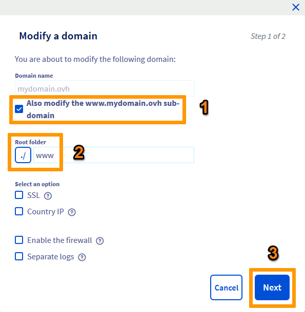

> [!primary]
> Esta tradução foi automaticamente gerada pelo nosso parceiro SYSTRAN. Em certos casos, poderão ocorrer formulações imprecisas, como por exemplo nomes de botões ou detalhes técnicos. Recomendamos que consulte a versão inglesa ou francesa do manual, caso tenha alguma dúvida. Se nos quiser ajudar a melhorar esta tradução, clique em "Contribuir" nesta página.
>

## Objetivo

Uma página **"Index of"** aparece pelo menos num dos casos seguintes:

- A configuração [Multisite](/pages/web_cloud/web_hosting/multisites_configure_multisite) do seu nome de domínio não está corretamente configurada para o seu diretório alvo
- A pasta alvo para a qual o seu nome de domínio aponta não contém ficheiros **"index.html"** ou **"index.php"**

{.thumbnail}

**Descubra como corrigir a apresentação de uma página "Index of".**

> [!warning]
>
> A responsabilidade sobre a configuração e a gestão dos serviços que a OVHcloud disponibiliza recai sobre o utilizador. Assim, deverá certificar-se de que estes funcionam corretamente.
>
> Este manual fornece as instruções necessárias para realizar as operações mais habituais. No entanto, se encontrar dificuldades, recomendamos que recorra a um [prestador de serviços especializado](https://partner.ovhcloud.com/pt/directory/) e/ou que contacte o editor do serviço. Não poderemos proporcionar-lhe assistência técnica. Para mais informações, aceda à secção [Quer saber mais](#go-further)?
>

## Requisitos

- Dispor de um [nome de domínio](https://www.ovhcloud.com/pt/domains/)
- Ter um [serviço de alojamento web](https://www.ovhcloud.com/pt/web-hosting/)
- Estar ligado à [Área de Cliente OVHcloud](https://www.ovh.com/auth/?action=gotomanager&from=https://www.ovh.pt/&ovhSubsidiary=pt).

## Instruções

### Compreender a origem da página "Index of"

O seu nome de domínio é declarado para aceder a um diretório alvo (um "`Pasta raiz`") no servidor [FTP](/pages/web_cloud/web_hosting/ftp_connection) do seu alojamento web partilhado. Isto no separador [Multisite](/pages/web_cloud/web_hosting/multisites_configure_multisite) do seu alojamento web presente no seu [Área de Cliente OVHcloud](https://www.ovh.com/auth/?action=gotomanager&from=https://www.ovh.pt/&ovhSubsidiary=pt).

A página **Index of** indica que o diretório-alvo em causa não contém ficheiros **index.php** ou **index.html**. Um ficheiro deste tipo constitui o "*ponto de entrada*" do seu website. O nome deste ficheiro está normalizado.

Para apresentar o seu website, deverá ligar o seu domínio ao `Pasta raiz` que contém o ficheiro **index.php** ou **index.html**.

> [!primary]
>
> Para associar temporariamente o seu domínio a um `Pasta raiz` que não contém ficheiro **index.php** ou **index.html**, pode proibir a apresentação da lista de pastas do seu site seguindo este [tutorial](/pages/web_cloud/web_hosting/htaccess_what_else_can_you_do). Pode também proteger o acesso às suas pastas com uma [palavra-passe](/pages/web_cloud/web_hosting/htaccess_protect_directory_by_password).

>
> Se precisar de ajuda, recomendamos que recorra a um [prestador de serviços especializado](https://partner.ovhcloud.com/pt/directory/). As nossas equipas de suporte não poderão fornecer-lhe assistência relativamente a qualquer alteração da programação interna do seu site.

### Resolver o caso mais comum de uma página "Index of"

Importou os ficheiros do seu site **mydomain.ovh** para a pasta `www` do seu alojamento por [FTP](/pages/web_cloud/web_hosting/ftp_connection). Se o domínio não estiver associado a esta pasta, consulte a coluna `Pasta raiz` do `Multisite`{.action}.

{.thumbnail}

Altere a `Pasta raiz` clicando no botão `...`{.action} à direita da tabela e depois em `Modificar o domínio`{.action}:

{.thumbnail}

Na nova janela:

* Selecione a opção `Modificar também o subdomínio www.mydomain.ovh`{.action} (1);
* Indique o diretório que contém o ficheiro **index.php** ou **index.html** do seu site como `Pasta raiz` (2);
* Clique em `Seguinte` (3).

{.thumbnail}

> [!primary]
>
> A utilização do diretório `www` como `Pasta raiz` não é, em caso algum, obrigatória. Pode instalar o seu site noutra pasta do seu [servidor FTP](/pages/web_cloud/web_hosting/ftp_connection).
>

Na janela seguinte, clique em `Validar`{.action}.

{.thumbnail}

Dentro de alguns minutos (refrescando o seu browser), obterá o seguinte resultado:

{.thumbnail}

Por fim, verifique se o seu site está a aparecer corretamente. Caso contrário, reinicie o seu dispositivo e esvazie a cache do seu browser, caso seja necessário.

Certifique-se igualmente de que está presente no seu diretório um ficheiro **index.php** ou **index.html**.

## Quer saber mais? 

[Resolver os erros mais frequentes associados aos módulos 1 clique](/pages/web_cloud/web_hosting/diagnostic_errors_module1clic)

[Resolver o erro “Site não instalado”](/pages/web_cloud/web_hosting/multisites_website_not_installed)

[Partilhar o alojamento entre vários sites](/pages/web_cloud/web_hosting/multisites_configure_multisite)

Para serviços especializados (referenciamento, desenvolvimento, etc), contacte os [parceiros OVHcloud](https://partner.ovhcloud.com/pt/directory/).

Se pretender usufruir de uma assistência na utilização e na configuração das suas soluções OVHcloud, consulte as nossas diferentes [ofertas de suporte](https://www.ovhcloud.com/pt/support-levels/).

Fale com nossa comunidade de utilizadores: <https://community.ovh.com/en/>. 