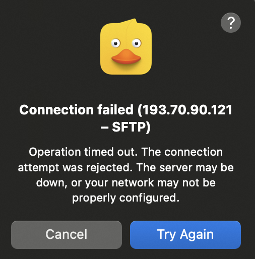
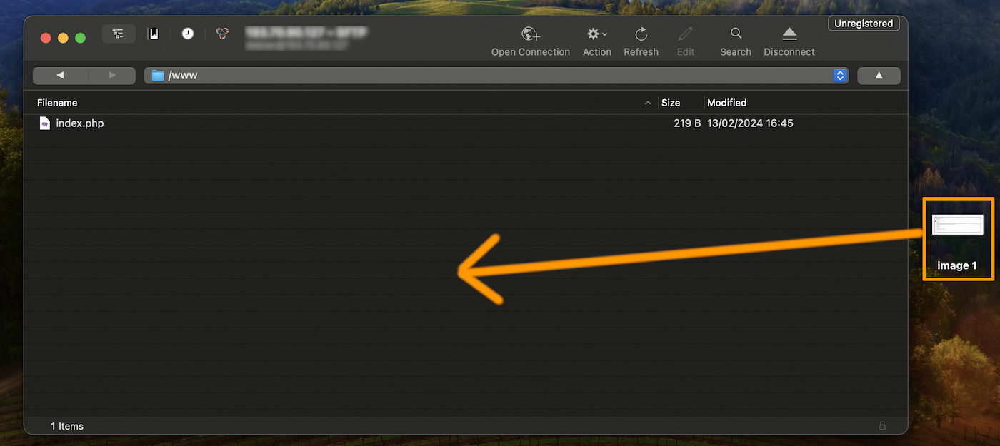

> [!primary]
> Diese Übersetzung wurde durch unseren Partner SYSTRAN automatisch erstellt. In manchen Fällen können ungenaue Formulierungen verwendet worden sein, z.B. bei der Beschriftung von Schaltflächen oder technischen Details. Bitte ziehen Sie im Zweifelsfall die englische oder französische Fassung der Anleitung zu Rate. Möchten Sie mithelfen, diese Übersetzung zu verbessern? Dann nutzen Sie dazu bitte den Button "Beitragen" auf dieser Seite.
>

## Ziel

Cyberduck ist eine Open-Source-Anwendung zur Dateiübertragung und steht unter macOS und Windows zur Verfügung. Damit können Sie sich mit dem FTP-Speicherplatz Ihres Webhostings verbinden (per FTP oder SFTP).

Um Cyberduck herunterzuladen, gehen Sie auf die [offizielle Website](https://cyberduck.io/) der App.

{.thumbnail}

> [!primary]
>
> - Cyberduck ist eine Anwendung, die unter macOS und Windows verfügbar ist. Da die Benutzeroberfläche und die Funktionen von Cyberduck auf beiden Betriebssystemen relativ ähnlich sind, wurde das Tutorial auf einem Windows-Rechner ausgeführt.
> - Dieser Leitfaden wurde mit einer kostenlosen Version der Applikation in der Version 8.7.2 erstellt, die von der [offiziellen Website](https://cyberduck.io/) heruntergeladen wurde.
>

> [!warning]
>
> OVHcloud stellt Ihnen Dienste zur Verfügung, für deren Konfiguration, Verwaltung und Verwaltung Sie die alleinige Verantwortung tragen. Es liegt somit in Ihrer Verantwortung, sicherzustellen, dass diese ordnungsgemäß funktionieren.
>
> Wir stellen Ihnen diese Anleitung zur Verfügung, um Sie bei gängigen Aufgaben bestmöglich zu begleiten. Dennoch empfehlen wir Ihnen, falls Sie Hilfe brauchen, einen [spezialisierten Dienstleister](https://partner.ovhcloud.com/de/directory/) und/oder den Herausgeber des Dienstes zu kontaktieren. Für externe Dienstleistungen bieten wir leider keine Unterstützung. Weitere Informationen finden Sie im Abschnitt [Weiterführende Informationen](#go-further) dieser Anleitung.
>

## Voraussetzungen

- Sie verfügen über ein [Webhosting](https://www.ovhcloud.com/de/web-hosting/){.external}.
- Sie haben die Cyberduck App heruntergeladen und auf Ihrem Computer installiert.

## In der Praxis

### Interface

Wenn Sie die Anwendung starten, wird das folgende Interface angezeigt.

- Der obere Teil, der in orange umrandet ist, entspricht der Symbolleiste. Sie können sich mit Ihrem Webhosting-Bereich verbinden, in der Ordnerstruktur Ihrer Dateien und Ordner navigieren, den Aktionsverlauf und viele andere Aktionen einsehen.
Darunter befindet sich der Inhalt, den Sie anzeigen möchten. Wenn Sie z.B. auf das Symbol `History`{.action} klicken, wird eine Liste Ihrer Aktionen angezeigt.

{.thumbnail}

### Die Anzeige von Cyberduck personalisieren

Sie können die Anzeige von Cyberduck anpassen, um es effektiver und persönlicher zu machen.

Klicken Sie im Hauptmenü ganz oben auf `View`{.action} und dann auf `Customize Toolbar...`{.action}.

{.thumbnail}

Ziehen Sie im angezeigten Fenster die gewünschten Elemente auf die Symbolleiste. Wenn Sie beispielsweise ein Symbol `Download`{.action} in die Symbolleiste einfügen möchten, ziehen Sie das Symbol `Download`{.action} auf die Symbolleiste. Um die Änderungen zu übernehmen, klicken Sie auf `Done`{.action}.

{.thumbnail}

### Cyberduck verwenden

#### SFTP-Verbindung

> [!warning]
>
> Aus Sicherheitsgründen wird die Verwendung von FTP nicht empfohlen. Die meisten Betriebssysteme lassen keine FTP-Verbindung mehr zu. Verwenden Sie stattdessen eine SFTP-Verbindung.
>

Um sich mit Ihrem Webhosting-Bereich zu verbinden, folgen Sie diesen Schritten:

**1.** Klicken Sie in der Symbolleiste auf `Open Connection`{.action}

**2.** Wählen Sie im Dropdown-Menü (orangefarbener Rahmen des Bildes) `SFTP (SSH File Transfer Protocol)`{.action} aus

**3.** Geben Sie die Verbindungsinformationen zu Ihrem FTP-Bereich ein:

- Server (Server)
- Username (Benutzername)
- Password (Passwort)
- Port (22)

{.thumbnail}

> [!success]
>
> - Sie können Ihr Passwort in Cyberduck speichern, indem Sie `Add to keychain`{.action} auswählen. Wenn Sie das Kontrollkästchen nicht aktivieren, müssen Sie das Passwort eingeben, um sich erneut mit Ihrem Webhosting-Bereich zu verbinden.
> - Wenn Sie nicht alle Ihre FTP-Informationen (Server, Login-Daten usw.) kennen, lesen Sie die Anleitung „[Mit dem FTP-Speicherplatz Ihres Webhostings verbinden](/pages/web_cloud/web_hosting/ftp_connection)“.
> 

Wenn Sie sich zum ersten Mal mit Ihrem Webhosting verbinden, erscheint ein Fenster mit dem Titel `Modified fingerprint`{.action}. Aktivieren Sie das Kontrollkästchen `Always`{.action} und bestätigen Sie. So können Sie den Verbindungshost (OVHcloud) endgültig zertifizieren.

> [!success]
>
> - Es wird empfohlen, Ihre Anmeldeinformationen mit einem Lesezeichen zu speichern. So können Sie sich bestimmte Verbindungsinformationen merken.
> - Lesen Sie diesen Teil der Anleitung: [Was ist ein Lesezeichen?](#signet)
> 

#### Anmeldefehler

Beim Versuch, sich in Ihrem Webhosting-Bereich einzuloggen, kann ein Fehler auftreten. Dies sind die 2 häufigsten Fehler, die auftreten können.

- `Connection failed (<server-SFTP>) - DNS lookup for <server> failed`

In den meisten Fällen hängt dieser Fehler mit den angegebenen Login-Daten zusammen, die wahrscheinlich falsch sind. Überprüfen Sie daher die eingegebenen Verbindungsinformationen.

{.thumbnail}

> [!success]
>
> - Wenn Sie nicht alle Ihre FTP-Informationen (Server, Login-Daten usw.) kennen, lesen Sie die Anleitung „[Mit dem FTP-Speicherplatz Ihres Webhostings verbinden](/pages/web_cloud/web_hosting/ftp_connection)“.
> 

- `Connection failed (<server-SFTP>) - Operation timed out`

Diese Nachricht enthält außerdem den Zusatz `Operation timed out`. Diese Meldung weist normalerweise darauf hin, dass der Host nicht erreichbar oder fehlerhaft ist. Sie müssen die eingegebenen Verbindungsinformationen überprüfen.

Dieser Fehler kann auch durch eine Firewall oder ein lokales Netzwerk verursacht werden, die bzw. das Port 21 oder 22 blockiert, die zum Herstellen einer Verbindung mit dem Server verwendet werden. In diesem Fall müssen Sie Ihre persönliche Konfiguration überprüfen.

{.thumbnail}

> [!primary]
>
> - Zur Erinnerung: Der Login-Host für Ihren Hosting-Bereich ist `ftp.cluster0XX.hosting.ovh.net` (ersetzen Sie `XXX` durch Ihre Cluster-Nummer).
> - Lesen Sie bei Bedarf die Anleitung „[Mit dem FTP-Speicherplatz Ihres Webhostings verbinden](/pages/web_cloud/web_hosting/ftp_connection)“.
>

### Was ist ein Lesezeichen?

Um den Zugriff auf Ihren Webhosting-Bereich zu erleichtern, empfehlen wir die Verwendung von Lesezeichen. Sie ermöglichen es Ihnen, Ihre Verbindungsinformationen im Voraus zu speichern, sodass Sie diese nicht bei jeder Verbindung eingeben müssen.

So fügen Sie das Element hinzu:

1. Loggen Sie sich in den FRP Bereich Ihres Webhostings ein.
2. Klicken Sie oben in der Symbolleiste auf die Registerkarte `Bookmarks`{.action} (orangefarbener Rahmen in der Abbildung unten).
3. Klicken Sie unten links im Fenster auf das Symbol `+`{.action}, um ein neues Lesezeichen hinzuzufügen.

{.thumbnail}

Es wird ein Fenster mit Ihren Anmeldeinformationen und eine neue Zeile in der Lesezeichenliste angezeigt. Beim nächsten Start von Cyberduck können Sie auf das Lesezeichen doppelklicken, um sich schneller einzuloggen.

### Dateien übertragen

Mit der Dateiübertragung können Sie Ihre Website auf Ihrem Webhosting-Bereich ablegen. Standardmäßig sollten Sie Ihre Dateien im Verzeichnis (Ordner) `www` ablegen. Sie können Ihre Dateien auf verschiedene Arten übertragen.

#### per Drag & Drop

Um Ihre Dateien zu übertragen, wählen Sie diese aus und ziehen Sie sie per Drag & Drop aus dem Fenster des lokalen Ordners (Ihre Dateien auf Ihrem Computer) in das Fenster von Cyberduck (FTP-Speicherplatz Ihres Webhostings). Sobald diese Aktion abgeschlossen ist, werden Ihre Dateien automatisch in die Warteschlange gestellt und auf dem Server abgelegt. Es wird ein Fenster angezeigt.

{.thumbnail}

#### Über das Hauptmenü

Klicken Sie im Menü von Cyberduck auf `File`{.action} und dann auf `Upload...`{.action}. Wählen Sie die Dateien aus, die Sie auf den Server hochladen möchten, und klicken Sie auf `Upload`{.action}.

{.thumbnail}

### Laufende Übertragungen anzeigen

Sie können die History der durchgeführten Transfers zum FTP-Speicherplatz Ihres Webhostings einsehen. So finden Sie:

- Dateien, die auf das Ablegen auf dem Remoteserver warten (die sich noch in der Warteschlange befinden oder gesendet werden);
- Dateien, deren Übertragung fehlgeschlagen ist;
- Dateien, für die die Übertragung auf das Remote-Webhosting erfolgreich war.

Dieses Fenster wird auf zwei Arten angezeigt:

- automatisch, wenn ein Transfer initiiert wird;
- indem Sie auf `Window`{.action} (im Hauptmenü) und dann auf `Transfers`{.action} klicken.

{.thumbnail}

### Mögliche Aktionen für eine Datei oder einen Ordner

Doppelklicken Sie auf eine Datei oder einen Ordner, um die folgenden Aktionen auszuführen:

- Datei- oder Ordnerinformationen lesen und Berechtigungen ändern (CHMOD).
- Bearbeiten Sie die Datei mit der Anwendung Ihrer Wahl.
- Datei oder Ordner umbenennen.
- Datei oder Ordner löschen.
- Ausgewählte Elemente herunterladen.
- Erstellen Sie einen neuen Ordner oder eine neue Datei.

Die obige Liste ist nicht vollständig, es sind weitere Aktionen möglich. Falls nötig, besuchen Sie die [offizielle Website](https://cyberduck.io/) von Cyberduck.

### Nützliche Informationen

#### Datei- und Ordnerrechte

Sie können die Rechte (CHMOD) Ihrer Dateien und Ordner auf dem Webhosting ändern.

Sie sind in drei Familien unterteilt:

- Owner (Inhaber)
- Group (Gruppe)
- Others (andere)

Doppelklicken Sie auf eine Datei oder einen Ordner, und wählen Sie `Info`{.action} aus. Das folgende Fenster wird angezeigt:

{.thumbnail}

Klicken Sie auf den Tab `Permissions`{.action} und nehmen Sie die gewünschten Änderungen vor:

- UNIX Permissions: Dieser Wert definiert die Rechte der 3 Familien (Eigentümer, Gruppe und andere).
- Aktivieren Sie die gewünschten Kontrollkästchen: Der Wert wird automatisch für UNIX-Berechtigungen aktualisiert.

#### Website neu starten

Sie können Ihre Website mit einem benutzerdefinierten Befehl wieder öffnen.

In den meisten Fällen erfolgt diese Änderung, nachdem OVHcloud den FTP-Speicherplatz Ihres Webhostings nach einem Hackerangriff aus Sicherheitsgründen geschlossen hat.

Klicken Sie im Cyberduck-Menü auf `Go`{.action} und dann auf `Send Command...`{.action}.

{.thumbnail}

Fügen Sie im neuen Fenster den Befehl `CHMOD 705 /` ein und klicken Sie auf `Send`{.action}, um den Befehl auszuführen. Zur Bestätigung sollte in der unteren Box die Meldung `200 Permissions changed on /` erscheinen.

Um zu überprüfen, ob die Wiedereröffnung korrekt ist, loggen Sie sich über einen Webbrowser in Ihrer Website ein.

{.thumbnail}

> [!warning]
>
> - Dieser Befehl funktioniert bei SFTP nicht. Verwenden Sie hierzu eine FTP-Verbindung.
> - Zur Erinnerung: Testen Sie die Anzeige nach maximal 3 Stunden. Unsere Roboter verbringen alle 3 Stunden damit, Zustandsänderungen zu überprüfen. Je nachdem, wann die Änderung durchgeführt wird, kann es also mehr oder weniger schnell gehen, um Ihre Website wieder anzuzeigen.
> - Wenn die 3-Stunden-Frist abgelaufen ist und Ihre Website immer noch nicht online ist, wenden Sie sich bitte an den OVHcloud Support.
>

## Weitere Informationen 

[Tutorial - FileZilla mit Ihrem OVHcloud Hosting verwenden](/pages/web_cloud/web_hosting/ftp_filezilla_user_guide)

Kontaktieren Sie für spezialisierte Dienstleistungen (SEO, Web-Entwicklung etc.) die [OVHcloud Partner](https://partner.ovhcloud.com/de/directory/).

Für den Austausch mit unserer User Community gehen Sie auf <https://community.ovh.com/en/>.