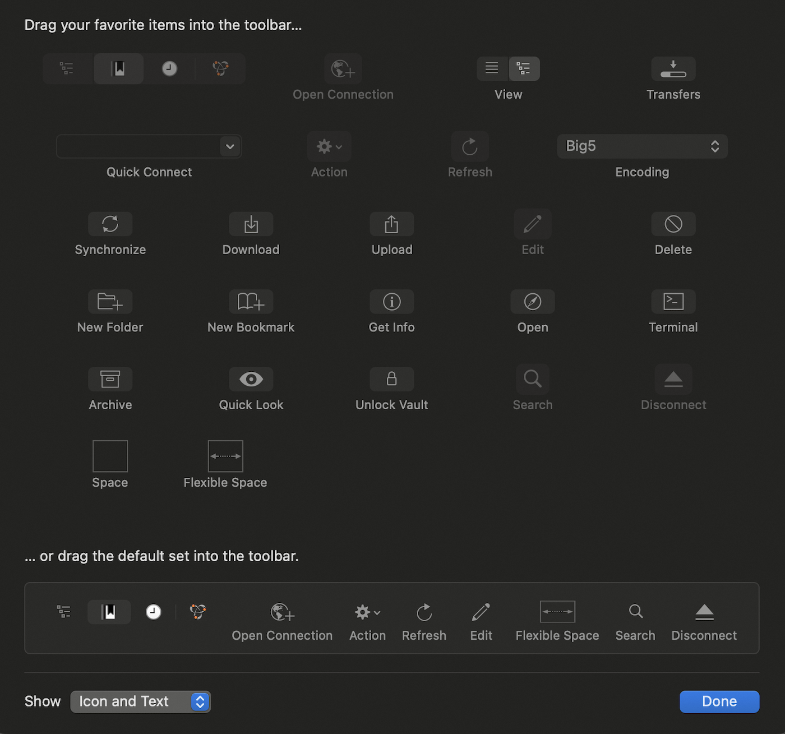
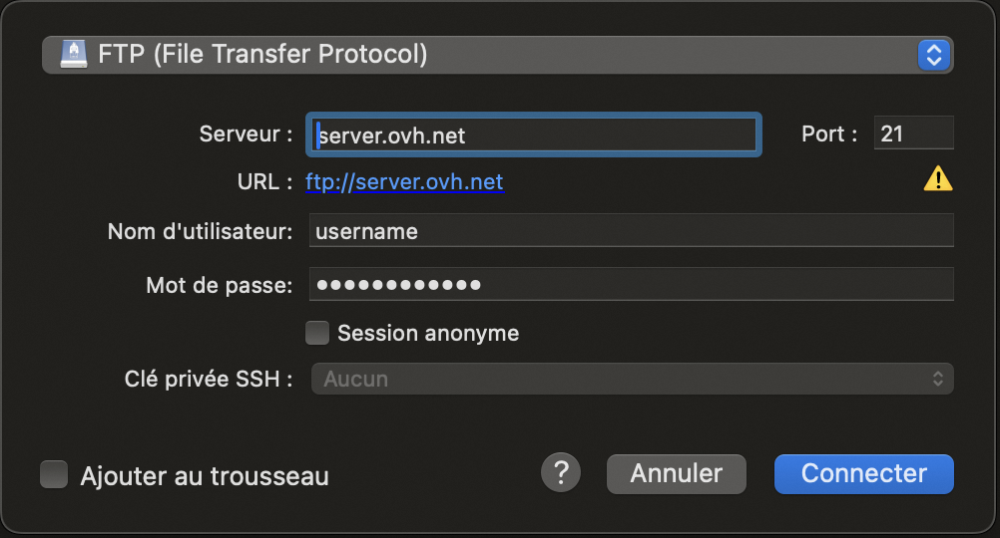
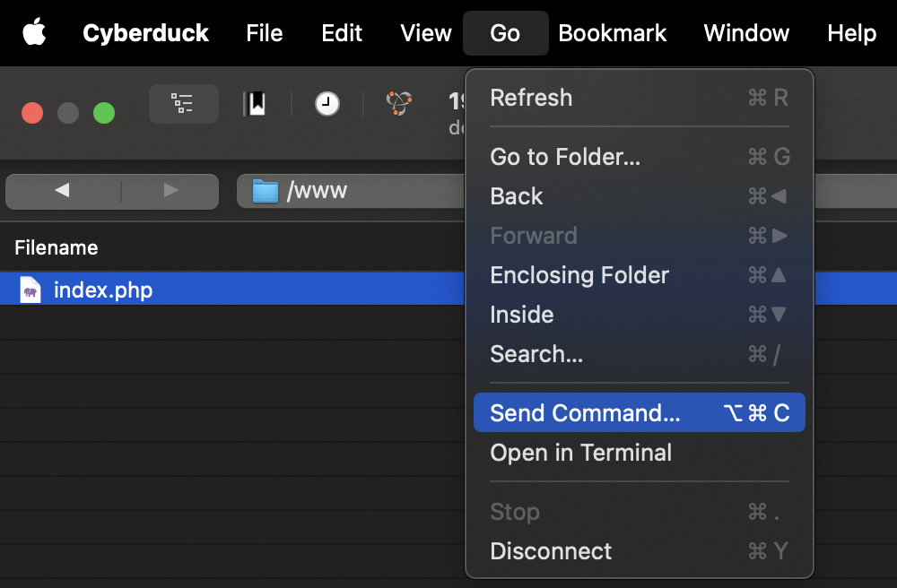
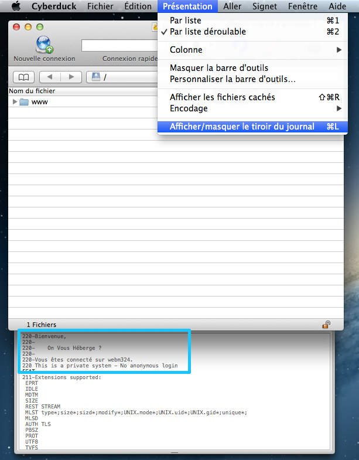

## Introduction
Cyberduck is an application available on Mac.

Its main purpose is to allow you to publish your website via your FTP server.

To get the application, go to the official Cyberduck website:

- Official Cyberduck website: [cyberduck.io](https://cyberduck.io/)

{.thumbnail}
Cyberduck is an application for Mac users. If you have a machine that uses Windows, use [FileZilla](/pages/web_cloud/web_hosting/ftp_filezilla_user_guide) instead.

## Interface
From the first time you start up the application, you will see this window.

- The upper section allows you to connect quickly and access different actions once you are connected to your FTP server (renaming, editing, etc.)

- The middle section allows you to see any Bookmarks you have added (your pre-registered FTP connections), and once you are connected, the content of your FTP server.

- The lower section allows you to get information on any actions in progress (connecting to the FTP server) as well as various icons to add a new Bookmark, for example.

{.thumbnail}

Customise the Cyberduck display
You can customise the Cyberduck display to make it more efficient and adapted to your needs.

To do this, click View then Customise the toolbar.

In the window that appears, drag the elements you want to show in your display to the toolbar. To validate your changes, click Done.

{.thumbnail}

## FTP connection
Follow the below steps to connect to your FTP server:

1. Click Open connection in the top left.

2. In the new window, enter the information to connect to your FTP server:

- Server (FTP)
- Username
- Password
- Port (21)

3. Tick Add to Keychain if you want Cyberduck to remember your password.

4. Click Connect to connect to your FTP server.

{.thumbnail}

- Cyberduck will remember your password if you tick Add to Keychain. This is not obligatory, but if you do not tick this box, you will need to re-enter your password every time you connect.

- If you do not know your FTP login details, see [this guide](/pages/web_cloud/web_hosting/ftp_connection).

A message should appear notifying you that the server supports encrypted connections (SSL)

- As our server is not compatible with FTP-SSL, you must tick Do not display and select Continue.

- If you want to use a secure connection, you must use an [SFTP connection](#utiliser_cyberduck_connexion_sftp). However, this connection is only available if SSH access is included in your web hosting plan.

{.thumbnail}

- If you do not know if SSH is included in your web hosting plan, have a look at the [details of our web hosting plans](https://www.ovhcloud.com/en-sg/web-hosting/).

- If you are still unsure, click Continue. The server will not connect if SSH is not included in your plan.

- We recommend that you save your login information in a Bookmark. This will allow you to retain a copy of this information.

- For more information on Bookmarks, see this section of the guide: [What is a Bookmark?](#utiliser_cyberduck_quest-ce_quun_signet).

## SFTP connection
If your web hosting plan is compatible with SSH access, you already have the option to log in via SFTP. You must have SSH access for the SFTP connection to work.

- If you do not know if SSH is included in your web hosting plan, have a look at the [details of our web hosting plans](https://www.ovhcloud.com/en-sg/web-hosting/).

- If you are still unsure, connect via FTP rather than SFTP. The server will not connect if SSH is not included in your plan.

Follow the below steps to connect to your FTP server:

1. Click Open connection in the top left.

2. In the drop-down menu, select SFTP (File transfer protocol via SSH) (see orange box in the image)

- Server (FTP)
- Username
- Password
- Port (22)

3. Tick Add to Keychain if you want Cyberduck to remember your password.

4. Click Connect to connect to your FTP server.

{.thumbnail}

- Cyberduck will remember your password if you tick Add to Keychain. This is not obligatory, but if you do not tick this box, you will need to re-enter your password every time you connect.

- If you do not know your FTP login details, see [this guide](/pages/web_cloud/web_hosting/ftp_connection).

When you connect to your FTP server for the first time, a System does not recognise this host notification will appear.

- Click the Always box and click on  Allow. This will verify the connection host (OVH) for all future connections.

{.thumbnail}

- We recommend that you save your login information in a Bookmark. This will allow you to retain a copy of this information.

- For more information on Bookmarks, see this section of the guide: [What is a Bookmark?](#utiliser_cyberduck_quest-ce_quun_signet).

## Connection errors
You may encounter errors when trying to connect to your server via Cyberduck. Here are the two most common errors:
Open a failed session
You will also see this message: 530 Login authentification failed. In most cases, this error is linked to login details you have entered; they are most probably incorrect.

- You will therefore need to verify the login information you entered.

- If necessary, you will also need to update the Bookmark you created (by selecting it and clicking on the pencil icon)/.

{.thumbnail}

- If you do not know your FTP login details, see [this guide](/pages/web_cloud/web_hosting/ftp_connection).

Connection failure
You will also see this message: Timed out waiting for initial connect reply. In most cases, this means that the server is cannot be reached. It is probably incorrect or blocked.

- You will therefore need to verify the login information you entered.

- If necessary, you will also need to update the Bookmark you created (by selecting it and clicking on the pencil icon).

This may also be caused by a firewall or local network blocking port 21 or 22, which are used to connect to the FTP server. In this case, you must verify your personal configuration.

{.thumbnail}

- As a reminder, your connection to your virtual host for your website on our servers is ftp.your-domain.tld (remplace with your domain name) or ftp.clusterXXX.ovh.net (replace XXX by your cluster number).

- For more information, you can see [this guide](/pages/web_cloud/web_hosting/hosting_how_to_get_my_website_online).

## What is a Bookmark?
To make it easier for you to connect to your FTP server, we recommend that you use Bookmarks. This allows you to save your login details.

To do this:

- Login to your server (FTP or SFTP)
- Navigate to Bookmarks (blue square and green square in the image)
- Click the [+] logo in the bottom left of the window

{.thumbnail}
A new window with your login details will appear. The next time you log in to Cyberduck, you may double-click on the Bookmark to connect more quickly.

## File transfer
The file transfer function allows you to upload your website to your server. By default, you need to upload files in the www directory (folder).

There are several ways in which you can transfer your files.
Drag and drop
To transfer your files using FTP, you can simply drag and drop them from the window of the local folder (files on your machine) to the Cyberduck window (files on your server).

- Once this is done, your files will automatically be queued to be uploaded to the server. You will see the queue in a new window.

{.thumbnail}
Via the Transfer interface
You may use the Transfer interface. This will open a window in which you can see all your files. You will need to select the files you wish to transfer and click Transfer.

- Once this is done, your files will automatically be queued to be uploaded to the server. You will see the queue in a new window.

{.thumbnail}
See transfers in progress
You can see your the history of your transfers to your web server. Here you will find:

- files waiting to be uploaded to the remote server still in the queue (or being uploaded)
- files that failed to transfer
- files that transferred successfully

You can see this window in two ways:

- it will automatically open when the transfer begins
- by clicking Window the Transfers

{.thumbnail}

## Possible actions on a file/folder
By selecting a file or folder on your web server (in the Cyberduck browser), you will be able to perform various Actions.

Notably, you will be able to:

- Read information and change permissions on a file or folder
- Edit the file with the application of your choice
- Rename the file or folder
- Delete the file or folder
- Download the selected element(s)
- Create a new file or folder

The above is not an exhaustive list; you can also perform other actions. Go to the Cyberduck website for more information.

{.thumbnail}

## Files and folder permissions
You have the option to change permissions (CHMOD) on  files and folders on your web server.

There are 3 different permission categories:

- User
- Group
- Others

To access this interface, select the file(s) or folder(s) for which you wish to change permissions, and then under Actions, click "Get info".

In the new window, click Permissions, then make your changes.

- Unix permissions: the value will automatically update the permissions for each of these three categories of users.
- Tick the boxes of your choice: the value will automatically update for Unix permissions.

{.thumbnail}

## Re-open the website
You have the option to re-open your website by running a custom command.

In most cases, you will run this command after OVHcloud has shut down your website as a security precaution following a hack.

To use this command:

- Click Go
- Click Send Command

{.thumbnail}
In the new window, enter the following command:

- CHMOD 705 /
- Click on Send

The 200 Permissions changed on / message should appear in the box beneath the command. This confirms that permissions have been changed.

- To verify that the website has been re-opened, simply check it in a web browser.

{.thumbnail}
This command cannot be used in SFTP. To perform it, use an [FTP connection](#utiliser_cyberduck_connexion_ftp).

- As a reminder, please check the to see if your website is back online after a maximum of three hours. Our robots check for any modifications every three hours, so your website can take any time up to three hours to go back online.

- If three hours have passed and your website is still not online, please contact our support team.

## Find your connection server
In some cases, our support team may ask you which of your servers Cyberduck is connected to.

This would happen, for example, if your FTP client is slow or is being problematic.

To access the server, firstly activate the journal log:

- Click View
- Click Show/Hide Toggle Log Drawer

A box should appear beneath the Cyberduck window. Then:

- Log in to your FTP server
- Go back up to the Toggle Log
- Remove the webmXXX

{.thumbnail}

