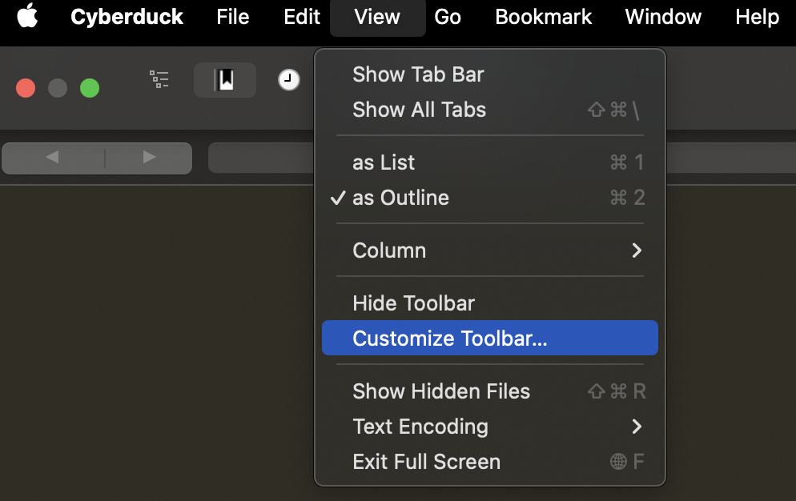
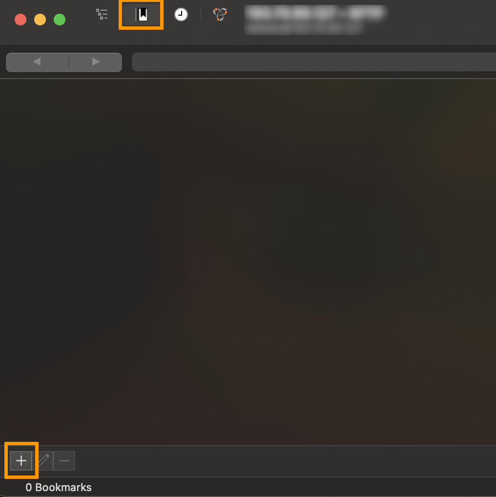
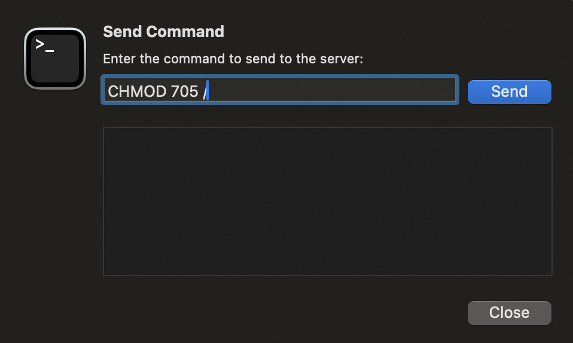

## Objectif

Disponible sur macOS et Windows, Cyberduck est une application open-source de transfert de fichiers. Elle vous permet de vous connecter à l'espace de stockage FTP de votre hébergement web (en protocole FTP ou SFTP).

Pour télécharger Cyberduck, rendez-vous sur le [site officiel](https://cyberduck.io/) de l'application.

{.thumbnail}

> [!primary]
>
> - Cyberduck est une application disponible sur macOS et Windows. L'interface et les fonctionnalités de Cyberduck étant relativement similaires sur les deux systèmes d'exploitation, le tutoriel a été réalisé sur une machine Windows.
> - Ce guide a été réalisé avec une version gratuite de l'applicatif en version 8.7.2 téléchargée depuis le [site officiel](https://cyberduck.io/).
>

> [!warning]
>
> OVHcloud met à votre disposition des services dont la configuration, la gestion et la responsabilité vous incombent. Il vous revient de ce fait d'en assurer le bon fonctionnement.
>
> Nous mettons à votre disposition ce guide afin de vous accompagner au mieux sur des tâches courantes. Néanmoins, nous vous recommandons de faire appel à un [prestataire spécialisé](https://partner.ovhcloud.com/fr-ca/directory/) et/ou de contacter l'éditeur du service si vous rencontrez des difficultés. En effet, nous ne serons pas en mesure de vous fournir une assistance. Consultez la section [Aller plus loin](#go-further) de ce guide pour plus d'informations.
>

## Prérequis

- Disposer d'une offre d'[hébergement web](https://www.ovhcloud.com/fr-ca/web-hosting/){.external}.
- Avoir téléchargé et installé l'application Cyberduck sur votre ordinateur.

## En pratique

### Interface

Lorsque vous démarrez l'application, l'interface ci-dessous s'affiche.

- La partie supérieure, entourée en orange, correspond à la barre d'outils. Elle vous permet d'établir une connexion à votre espace d'hébergement, de naviguer dans l'arborescence de vos dossiers et fichiers, de consulter l'historique de vos actions, ainsi que de nombreuses autres actions.
- En-dessous se trouve le contenu que vous souhaitez afficher. Par exemple, si vous cliquez sur l'icône `History`{.action}, la liste des vos actions y apparaitra.

{.thumbnail}

### Personnaliser l'affichage de Cyberduck

Vous pouvez personnaliser l'affichage de Cyberduck afin de le rendre plus efficace et personnel.

Dans le menu principal, tout en haut de l'interface, cliquez sur `View`{.action} puis sur `Customize Toolbar...`{.action}.

{.thumbnail}

Dans la fenêtre qui apparaît, faites glisser les éléments souhaités vers la barre d'outils. Par exemple, si vous voulez ajouter une icône `Download`{.action} dans votre barre d'outils, glissez et déposez l'icône `Download`{.action} vers la barre d'outils. Pour valider vos modifications, cliquez sur `Done`{.action}.

{.thumbnail}

### Utiliser Cyberduck

#### Connexion SFTP

> [!warning]
>
> Pour des raisons de sécurité, se connecter en FTP n'est pas recommandé. La plupart des systèmes d'exploitation interdisent désormais la possibilité de se connecter en FTP. Préférez donc une connexion SFTP.
>

> 

Afin de pouvoir vous connecter à votre espace d'hébergement web, suivez les étapes ci-dessous :

**1.**  Dans la barre d'outils, cliquez sur `Open Connection`{.action}

**2.**  Dans le menu déroulant (cadre orange de l'image), sélectionnez `SFTP (SSH File Transfert Protocol)`{.action}

**3.**  Renseignez les informations de connexion à votre espace FTP :

- Server (Serveur)
- Username (Nom d'utilisateur)
- Password (Mot de passe)
- Port (22)

{.thumbnail}

> [!success]
>
> - Vous avez la possibilité d'enregistrer votre mot de passe dans Cyberduck en cochant `Add to keychain`{.action}. Si vous ne cochez pas la case, vous devrez renseigner le mot de passe afin de vous reconnecter à votre espace d'hébergement web.
> - Si vous ne connaissez pas toutes vos informations FTP (serveur, identifiants etc.), reportez-vous au guide « [Se connecter à l’espace de stockage FTP de son hébergement web](/pages/web_cloud/web_hosting/ftp_connection) ».
> 

Lorsque vous effectuez une première connexion vers votre espace d'hébergement web, une fenêtre portant le titre `Modified fingerprint`{.action} s'affiche. Cochez la case `Always`{.action} puis validez. Ceci vous permettra de certifier définitivement l'hôte de connexion (OVHcloud).

> [!success]
>
> - Nous vous conseillons d'enregistrer vos informations de connexion via un signet. Cela vous permettra de garder en mémoire certaines informations de connexion.
> - Consultez cette partie du guide : [Qu'est-ce qu'un signet ?](#signet)
> 

#### Erreurs de connexion

Lors d'une tentative de connexion à votre espace d'hébergement web, il est possible qu'une erreur survienne. Voici les 2 erreurs les plus fréquentes que vous pouvez rencontrer.

- `Connection failed (<server-SFTP>) - DNS lookup for <server> failed`

Dans la majorité des cas, cette erreur est liée aux identifiants que vous avez renseignés et qui sont probablement erronés. Vous devez donc vérifier les informations de connexion que vous avez renseignées.

{.thumbnail}

> [!success]
>
> - Si vous ne connaissez pas toutes vos informations FTP (serveur, identifiants, etc.), reportez-vous au guide « [Se connecter à l’espace de stockage FTP de son hébergement web](/pages/web_cloud/web_hosting/ftp_connection) ».
> 

- `Connection failed (<server-SFTP>) - Operation timed out`

Ce message est également accompagné de la mention `Operation timed out`. Ce message signifie généralement que l'hôte n'est pas joignable ou erroné. Vous devez vérifier les informations de connexion que vous avez renseignées.

Cette erreur peut également provenir d'un pare-feu ou du réseau local bloquant le port 21 ou 22 qui sont utilisés pour se connecter au serveur. Dans ce cas, vous devez vérifier votre configuration personnelle.

{.thumbnail}

> [!primary]
>
> - Pour rappel, l'hôte de connexion pour votre espace d'hébergement est `ftp.cluster0XX.hosting.ovh.net` (remplacez les `XXX` par votre numéro de cluster).
> - Si besoin, reportez-vous au guide « [Se connecter à l’espace de stockage FTP de son hébergement web](/pages/web_cloud/web_hosting/ftp_connection) ».
>

### Qu'est-ce qu'un signet ?

Pour faciliter l'accès à votre espace d'hébergement web, nous vous recommandons d'utiliser les signets. Ils permettent de pré-enregistrer vos informations de connexion, vous évitant ainsi de rentrer celles-ci à chaque connexion.

Pour effectuer cet ajout :

1. Connectez-vous à l'espace FRP de votre hébergement web.
2. En haut de l'interface, dans la barre d'outils, cliquez sur l'onglet `Bookmarks`{.action} (cadre orange dans l'image ci-dessous).
3. En bas à gauche de la fenêtre, cliquez sur l'icône `+`{.action} pour ajouter un nouveau signet.

{.thumbnail}

Une fenêtre s'affiche contenant vos informations de connexion, ainsi qu'une nouvelle ligne dans la liste des signets. Au prochain démarrage de Cyberduck, vous pourrez double-cliquer sur le signet pour vous connecter plus rapidement.

### Transférer des fichiers

Le transfert de fichiers vous permet de déposer votre site internet sur votre espace d'hébergement web. Par défaut, vous devez déposer vos fichiers dans le répertoire (dossier) `www`. Vous pouvez transférer vos fichiers via plusieurs méthodes.

#### Via un glisser-déposer

Pour réaliser le transfert de vos fichiers, sélectionnez et réalisez un glisser-déposer depuis la fenêtre du dossier local (vos fichiers sur votre machine) vers la fenêtre de Cyberduck (espace de stockage FTP de votre hébergement web). Une fois cette action réalisée, vos fichiers vont automatiquement se mettre en file d'attente pour être déposés sur le serveur. Une fenêtre s'affichera alors.

{.thumbnail}

#### Via le menu principal

Dans le menu de Cyberduck, cliquez sur `File`{.action} puis sur `Upload...`{.action}. Sélectionnez les fichiers que vous souhaitez transférer sur le serveur puis cliquez sur `Upload`{.action}.

{.thumbnail}

### Visionner les transferts en cours

Vous pouvez visionner l'historique des transferts effectués vers  l'espace de stockage FTP de votre hébergement web. Vous pourrez ainsi retrouver :

- les fichiers en attente d'être déposés sur le serveur distant (encore présents dans la file d'attente ou en cours d'envoi) ;
- les fichiers pour lesquels le transfert a échoué ;
- les fichiers pour lesquels le transfert est réussi sur l'hébergement web distant.

Cette fenêtre s'affiche de deux manières différentes :

- automatiquement lorsqu'un transfert est initié ;
- en cliquant sur `Window`{.action} (dans le menu principal) puis `Transfers`{.action}.

{.thumbnail}

### Actions possibles sur un fichier / dossier

Double-cliquez sur un fichier ou un dossier pour effectuer les actions suivantes :

- Lire les informations d'un fichier ou d'un dossier et en modifier les droits (CHMOD).
- Éditer le fichier avec l'application de votre choix.
- Renommer le fichier ou le dossier.
- Supprimer le fichier ou le dossier.
- Télécharger le ou les éléments sélectionné(s).
- Créer un nouveau dossier ou fichier.

La liste ci-dessus n'est pas exhaustive, d'autres actions sont possibles. Consultez le [site officiel](https://cyberduck.io/) de Cyberduck si besoin.

### Informations utiles

#### Droits des fichiers et dossiers

Vous pouvez modifier les droits (CHMOD) de vos fichiers et de vos dossiers présents sur l'hébergement web.

Ces derniers se répartissent en 3 familles :

- Owner (Propriétaire)
- Group (Groupe)
- Others (Autres)

Double-cliquez sur un fichier ou un dossier puis sélectionnez `Info`{.action}. La fenêtre suivante s'affiche :

{.thumbnail}

Cliquez sur l'onglet `Permissions`{.action} puis effectuez les modifications souhaitées :

- UNIX Permissions : cette valeur définit les droits des 3 familles (Propriétaire, groupe et autres).
- Cochez les cases souhaitées : la valeur se mettra à jour automatiquement pour les permissions UNIX.

#### Réouverture du site web

Vous pouvez effectuer la réouverture de votre site web en utilisant une commande personnalisée.

Dans la plupart des cas, cette manipulation fait suite à une fermeture par sécurité de l'espace de stockage FTP de votre hébergement web par OVHcloud suite à un piratage.

Dans le menu de Cyberduck, cliquez sur `Go`{.action} puis sur `Send command...`{.action}.

{.thumbnail}

Dans la nouvelle fenêtre, insérez la commande `CHMOD 705 /` puis cliquez sur `Send`{.action} pour éxécuter la commande. En confirmation, le message `200 Permissions changed on /` devrait apparaître dans l'encadré du dessous.

Pour vérifier que la réouverture est bien effective, connectez-vous à votre site web depuis un navigateur web.

{.thumbnail}

> [!warning]
>
> - Cette commande n'est pas fonctionnelle en SFTP. Pour l'effectuer, utilisez une connexion FTP.
> - Pour rappel, veillez à tester l'affichage après 3 heures maximum. En effet, nos robots passent toutes les 3 heures pour vérifier les changements d'état. En fonction du moment où la manipulation sera réalisée, le rétablissement de l'affichage de votre site pourra donc être plus ou moins rapide.
> - Si le délai des 3 heures est écoulé et que votre site web n'est toujours pas en ligne, veuillez contacter le support OVHcloud.
>

## Aller plus loin 

[Tutoriel - Utiliser FileZilla avec votre hébergement OVHcloud](/pages/web_cloud/web_hosting/ftp_filezilla_user_guide)

Échangez avec notre communauté d'utilisateurs sur <https://community.ovh.com>.
