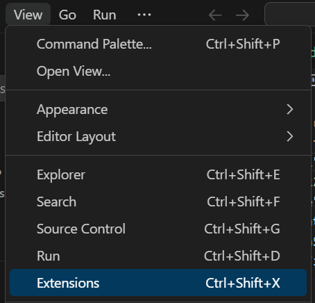
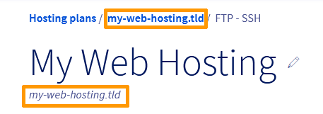
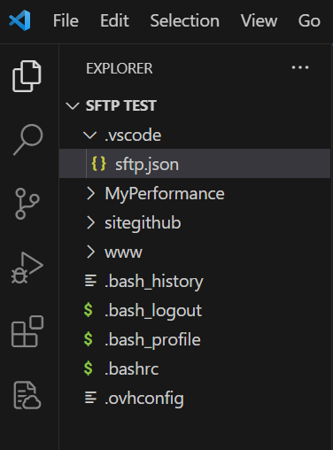
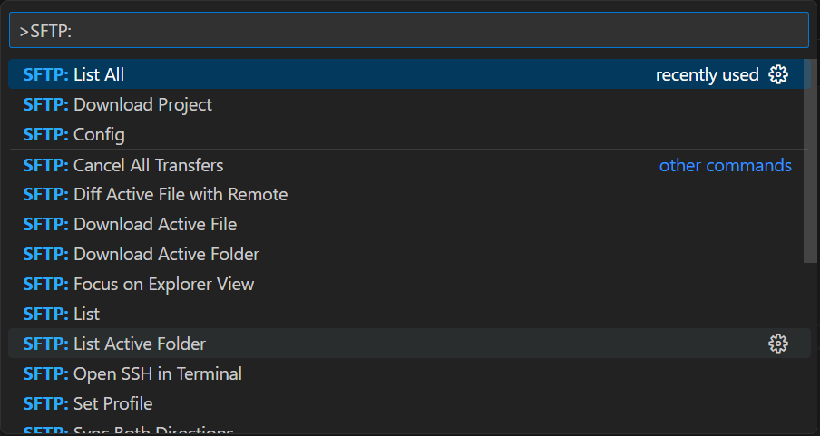

> [!primary]
> Tłumaczenie zostało wygenerowane automatycznie przez system naszego partnera SYSTRAN. W niektórych przypadkach mogą wystąpić nieprecyzyjne sformułowania, na przykład w tłumaczeniu nazw przycisków lub szczegółów technicznych. W przypadku jakichkolwiek wątpliwości zalecamy zapoznanie się z angielską/francuską wersją przewodnika. Jeśli chcesz przyczynić się do ulepszenia tłumaczenia, kliknij przycisk “Zgłóś propozycję modyfikacji” na tej stronie.
>

## Wprowadzenie

Jeśli posiadasz hosting od OVHcloud, zyskasz dostęp do przestrzeni dyskowej umożliwiającej zarządzanie stroną WWW. Dostęp do przestrzeni dyskowej jest możliwy poprzez protokół SFTP. Chociaż możliwe jest połączenie za pomocą terminala, możesz również użyć zintegrowanego środowiska programistycznego (IDE) Visual Studio Code do zarządzania folderami i plikami strony WWW.

> [!primary]
>
> Jeśli chcesz zdalnie zarządzać swoją witryną internetową bez użycia Visual Studio Code, możesz zainstalować klienta FTP FileZilla. Zapoznaj się z naszym przewodnikiem "[Korzystanie z FileZilla na Twoim hostingu OVHcloud](/pages/web_cloud/web_hosting/ftp_filezilla_user_guide)". Jeśli chcesz połączyć się ze stroną WWW przez SSH, zapoznaj się z naszą dokumentacją "[Korzystanie z dostępu SSH do hostingu WWW](/pages/web_cloud/web_hosting/ssh_on_webhosting)".
>

**Dowiedz się, jak zarządzać stroną WWW przy użyciu Visual Studio Code.**
  
## Wymagania początkowe

- Posiadanie hostingu [OVHcloud](https://www.ovhcloud.com/pl/web-hosting/)
- Zainstaluj [Microsoft Visual Studio Code](https://visualstudio.microsoft.com/#vscode-section) na komputerze

## W praktyce
 
> [!warning]
>
> OVHcloud udostępnia różnorodne usługi, jednak to Ty odpowiadasz za ich konfigurację i zarządzanie nimi. Ponosisz więc odpowiedzialność za ich prawidłowe funkcjonowanie.
> 
> Oddajemy w Twoje ręce tutorial, którego celem jest pomoc w jak najbardziej optymalnym wykonywaniu bieżących zadań. Niemniej jednak w przypadku trudności zalecamy skorzystanie z pomocy [wyspecjalizowanego dostawcy](https://partner.ovhcloud.com/pl/directory/) lub [Visual Studio Code](https://code.visualstudio.com/){.external} IDE. Niestety firma OVH nie jest w stanie udzielić Ci wsparcia w tym zakresie. Więcej informacji znajduje się w sekcji ["Sprawdź również"](#go-further) tego tutoriala.
>

### Zainstaluj rozszerzenie SFTP dla Visual Studio Code

> [!warning]
>
> W tym tutorialu wybraliśmy rozszerzenie "SFTP/FTP sync" dla *Natizyskunk*. Możesz wybrać inną. Należy jednak pamiętać, że rozszerzenie w Visual Studio Code to oprogramowanie, które jest często tworzone przez niezależnego programistę, który może zatrzymać jego rozwój w dowolnym momencie.
>

Po uruchomieniu Visual Studio Code przejdź do poziomego menu na górze interfejsu, kliknij `View`{.action}, a następnie `Extensions`{.action}.

{.thumbnail}

Aby wykonać tę samą akcję ze skrótem klawiaturowym, wybierz:

- `Ctrl + Shift + X` jeśli korzystasz z systemu Windows, 
- `Maj + Command + X` jeśli korzystasz z systemu macOS.

W lewym górnym rogu wpisz nazwę rozszerzenia "SFTP/FTP sync" *Natizyskunk* i kliknij na `Install`{.action}.

{.thumbnail}

Można również zainstalować [rozszerzenie "SFTP/FTP sync"](https://marketplace.visualstudio.com/items?itemName=Natizyskunk.sftp#sftp-sync-extension-for-vs-code) z marketplace Visual Studio.
  
### Inicjuj projekt lokalnie

Aby zsynchronizować pliki strony WWW z hostingiem za pomocą Visual Studio Code, podaj lokalizację projektu lokalnie. W tym celu utwórz folder w żądanym miejscu.

Wróć do programu Visual Studio Code w menu poziomym u góry interfejsu, kliknij przycisk `View`{.action}, a następnie wybierz polecenie `Command Palette`{.action}, aby wyświetlić edytor poleceń.

Aby wykonać tę samą akcję ze skrótem klawiaturowym, wybierz:

- `Ctrl + Shift + P` jeśli korzystasz z systemu Windows, 
- `Maj + Command + P` jeśli korzystasz z systemu macOS.

Wprowadź następującą komendę: `SFTP: Config`.

{.thumbnail}

Dzięki temu poleceniu program Visual Studio Code utworzy plik konfiguracyjny "sftp.json" w katalogu głównym utworzonego wcześniej folderu lokalnego. Ponieważ jednak Visual Studio Code nie zna jeszcze lokalizacji Twojego projektu lokalnie, powinien pojawić się następujący komunikat:

{.thumbnail}

Kliknij `Open Folder`{.action}, przejdź do wybranego katalogu lokalnego i kliknij `Wybierz folder`{.action}, aby potwierdzić.

{.thumbnail}

W Visual Studio Code wprowadź ponownie komendę `SFTP: Config`. Plik konfiguracyjny o nazwie "sftp.json" pojawi się w kodzie Visual Studio Code.

{.thumbnail}

Plik ten znajduje się w folderze .vscode, który jest umieszczony w katalogu głównym projektu lokalnego.

### Konfiguracja pliku sftp.json

Zanim rozpoczniesz pracę nad Twoim projektem, przekaż go do utworzonego wcześniej lokalnego folderu. Najpierw jednak upewnij się, że plik "sftp.json" jest poprawnie skonfigurowany. Przydatne informacje można znaleźć w [Panelu klienta OVHcloud](https://www.ovh.com/auth/?action=gotomanager&from=https://www.ovh.pl/&ovhSubsidiary=pl). W sekcji `Web Cloud`{.action} kliknij `Hosting`{.action}. Wybierz odpowiedni hosting, następnie kliknij zakładkę `FTP - SSH`{.action}.

W pliku "sftp.json" wprowadź wartości dla następujących wpisów:

#### name 

Odnajdziesz go w dwóch miejscach, które są wyróżnione na pomarańczowo.

{.thumbnail}

> [!primary]
>
> Możesz ustawić dowolną wartość `name`(nazwa). Jeśli jednak konfigurujesz więcej niż jeden plik "sftp.json", to ze względów organizacyjnych lepiej jest użyć jako odwołania wartości widocznych powyżej.
>

#### host

W zakładce `FTP-SSH`{.action} nazwa hosta (`host`) jest widoczna pod napisem `Serwer FTP i SFTP`{.action}.

{.thumbnail}

#### username

Odszukaj nazwę użytkownika (`username`) w kolumnie `Login`{.action} tabeli.

#### remotePath

Znajdź ścieżkę zdalną (`remotePath`) pod nazwą `Ścieżka do katalogu home`{.action}. Jeśli skonfigurowanych jest kilku użytkowników, podana ścieżka może być inna. W takim przypadku zmień nazwę użytkownika wskazaną po `home/` na wybraną przez siebie z listy `Login`{.action} Twojego hostingu.

**Przykład**: Jeśli Twoja nazwa użytkownika to "john-smith", otrzymasz `home/john-smith`

Dodaj ten wiersz do pliku "sftp.json": `"openSsh": true`

> [!primary]
>
> Aby nie było konieczności wprowadzania hasła po każdym poleceniu w kodzie Visual Studio, zapisz je w pliku "sftp.json", dodając wiersz:`"password": "<password>"`
>

Przykładowy plik "sftp.json":

```json

{
    "name": "<name>",
    "host": "<host>",
    "protocol": "sftp",
    "port": 22,
    "username": "myusername",
    "password": "mypassword",
    "remotePath": "/home/myusername",
    "uploadOnSave": false,
    "useTempFile": false,
    "openSsh": true
}

```

Więcej informacji na temat opcji w pliku "sftp.json" można znaleźć w [dokumentacji projektu](https://github.com/Natizyskunk/vscode-sftp/wiki/configuration).

### Pobierz projekt lokalnie

Po skonfigurowaniu pliku "sftp.json" pobierz zawartość Twojego projektu, aby pobrać wszystkie foldery i pliki Twojej strony WWW. W tym celu przejdź do Visual Studio Code i wprowadź następującą komendę: `SFTP: Download Project`.

Program Visual Studio Code wymaga wybrania folderu, który chcesz pobrać na hosting WWW. Wpisz poprzednio zdefiniowaną wartość `name` w pliku "sftp.json".

{.thumbnail}

Jeśli zostanie wyświetlony monit, wprowadź hasło powiązane z danym użytkownikiem w pliku "sftp.json", a następnie kliknij `enter`. Po pobraniu pliku wszystkie foldery i pliki projektu będą wyświetlane w Eksploratorze plików znajdującym się w kolumnie po lewej stronie interfejsu Visual Studio Code.

{.thumbnail}

> [!primary]
>
> Przypominamy, że właściwa konfiguracja pliku "sftp.json" jest kluczowa. Jeśli przed pobraniem projektu wystąpi błąd, zazwyczaj jest to spowodowane błędem w konfiguracji pliku "sftp.json". Jeśli masz pytania, zapoznaj się z sekcją [FAQ rozszerzenia](https://github.com/Natizyskunk/vscode-sftp/blob/HEAD/FAQ.md){.external}.
>

### Wprowadzanie zmian w plikach

Po pobraniu projektu lokalnie na komputer można łatwo edytować, dodawać lub usuwać pliki w Visual Studio Code.

Jeśli chcesz, aby zmiany lokalne były synchronizowane przy każdej kopii zapasowej pliku, dodaj ten wiersz do pliku "sftp.json":`"uploadOnSave": true`

Aby wyłączyć tę funkcję, pozostawiając ją w pliku "sftp.json", zmień wartość `true` na `false`.

Do tej pory wspomnieliśmy tylko polecenia: `SFTP: Config` i `SFTP: Download Project`. Istnieją inne polecenia, które możesz obejrzeć przez autouzupełnianie, wprowadzając `SFTP:` w edytorze poleceń.

{.thumbnail}

Listę poleceń [tutaj](https://github.com/Natizyskunk/vscode-sftp/wiki/Commands){.external}.

Możesz teraz uzyskiwać dostęp do zawartości hostingu i modyfikować ją za pomocą kodu Visual Studio Code.
Celem tego przewodnika jest przedstawienie w sposób efektywny sposobu zarządzania projektem w Visual Studio Code. Odpowiedni do pierwszego eksperymentu. Jeśli jednak zmodyfikujesz kilka plików i są one synchronizowane na Twoim hostingu, nie będziesz mógł sprawdzić historii zmian, aby w razie potrzeby wrócić do nich lub nadrobić błąd.

## Sprawdź również <a name="go-further"></a>

[Logowanie do przestrzeni dyskowej FTP hostingu WWW](/pages/web_cloud/web_hosting/ftp_connection)

[Korzystanie z FileZilla na Twoim hostingu OVHcloud](/pages/web_cloud/web_hosting/ftp_filezilla_user_guide)

[Korzystanie z dostępu do hostingu WWW przez SSH](/pages/web_cloud/web_hosting/ssh_on_webhosting). Pamiętaj, że aby korzystać z SSH, musisz mieć wykupiony [hosting Pro lub Performance](https://www.ovhcloud.com/pl/web-hosting/).

W przypadku wyspecjalizowanych usług (pozycjonowanie, rozwój, etc.) skontaktuj się z [partnerami OVHcloud](https://partner.ovhcloud.com/pl/directory/).

Jeśli chcesz otrzymywać wsparcie w zakresie konfiguracji i użytkowania Twoich rozwiązań OVHcloud, zapoznaj się z naszymi [ofertami pomocy](https://www.ovhcloud.com/pl/support-levels/).

Dołącz do społeczności naszych użytkowników na stronie <https://community.ovh.com/en/>. 