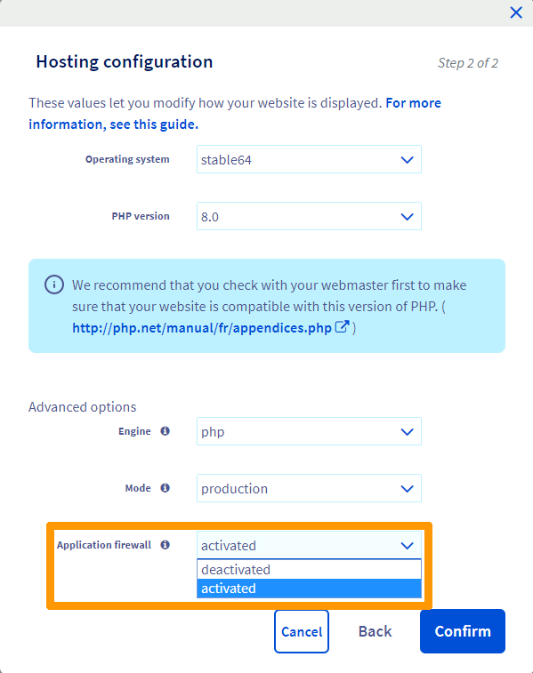

> [!primary]
> Questa traduzione è stata generata automaticamente dal nostro partner SYSTRAN. I contenuti potrebbero presentare imprecisioni, ad esempio la nomenclatura dei pulsanti o alcuni dettagli tecnici. In caso di dubbi consigliamo di fare riferimento alla versione inglese o francese della guida. Per aiutarci a migliorare questa traduzione, utilizza il pulsante "Contribuisci" di questa pagina.
>

## Obiettivo

*ModSecurity* è un modulo Apache complementare che filtra tutte le richieste in entrata sul tuo server Web. Aumenta la sicurezza contro le vulnerabilità note intercettando e filtrando le richieste prima che siano trattate con script.

L'insieme preconfigurato di regole di base, il "Core Rule Set" (CRS) della nostra *ModSecurity* protegge i tuoi siti Web dagli attacchi più diffusi, ad esempio:

- Trojans,
- Email injection,
- Bug sui file PDF,
- File injection sul tuo hosting,
- SQL o XSS injection,
- e tanto altro ancora

**Questa guida ti mostra come attivare il firewall applicativo dallo Spazio Cliente OVHcloud per ottenere una protezione ancora maggiore.**

## Prerequisiti

- Disporre di un piano di [hosting Web OVHcloud](https://www.ovhcloud.com/it/web-hosting/){.external} attivo
- Disporre di almeno un [dominio](https://www.ovhcloud.com/it/domains/){.external} associato all'hosting
- Avere accesso allo [Spazio Cliente OVHcloud](https://www.ovh.com/auth/?action=gotomanager&from=https://www.ovh.it/&ovhSubsidiary=it){.external}

## Procedura

Accedi allo [Spazio Cliente OVHcloud](https://www.ovh.com/auth/?action=gotomanager&from=https://www.ovh.it/&ovhSubsidiary=it){.external} e seleziona `Web Cloud`{.action}. Clicca su `Hosting`{.action} e poi su quello corrispondente.

### Attiva il firewall applicativo nella configurazione PHP

Assicurati di trovarti nella scheda `Informazioni generali`{.action}. La `versione PHP globale` attuale è disponibile nella zona **Configurazione**. Clicca sui tre puntini `...`{.action} e seleziona `Modifica la configurazione`{.action}. Nella nuova finestra, seleziona l'elemento `Modifica la configurazione attuale`{.action} e clicca su `Seguente`{.action}.

{.thumbnail}

Nella nuova finestra, assicurati che l'**Applicazione firewall** sia definita su `Attivato`{.action}. Per confermare la configurazione, clicca sul pulsante `Conferma`{.action}.

### Attiva il firewall applicativo per i domini individuali su un multisito

Clicca sulla scheda `Multisito`{.action} della tua offerta di hosting. Clicca sui tre puntini `...`{.action} a destra del dominio interessato e seleziona l'opzione `Modifica il dominio`{.action}.

{.thumbnail}

Nella finestra di configurazione, spunta la casella `Attiva il firewall`{.action}. È possibile includere anche il sottodominio `www` in questa configurazione selezionando la casella in alto.

Clicca su `Seguente`{.action} e poi su `Conferma`{.action} per modificare i parametri multisito.

{.thumbnail}

### Verifica lo stato dell'operazione di attivazione

{.thumbnail}

Gli aggiornamenti della configurazione multisito saranno elencati nella scheda `Operazioni in corso`{.action} (lo stato iniziale è "Pianificato"). Il firewall sarà attivo non appena il suo aggiornamento non sarà più incluso nella lista.

### Verifica dei domini per i quali il firewall è attivo

La scheda `Multisito`{.action} del tuo piano di hosting fornisce informazioni sui domini per i quali è attiva l'opzione firewall.

{.thumbnail}

La tabella visualizzata contiene tutti i domini aggiunti alla tua offerta di hosting Web. Nella colonna "Firewall" viene mostrato lo stato di attivazione di ciascun dominio.

## Per saperne di più

Per prestazioni specializzate (referenziamento, sviluppo, ecc...), contatta i [partner OVHcloud](https://partner.ovhcloud.com/it/directory/).

Per usufruire di un supporto per l'utilizzo e la configurazione delle soluzioni OVHcloud, è possibile consultare le nostre soluzioni [offerte di supporto](https://www.ovhcloud.com/it/support-levels/).

Contatta la nostra Community di utenti all'indirizzo <https://community.ovh.com/en/>.