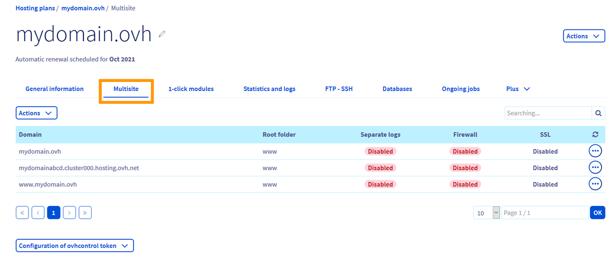
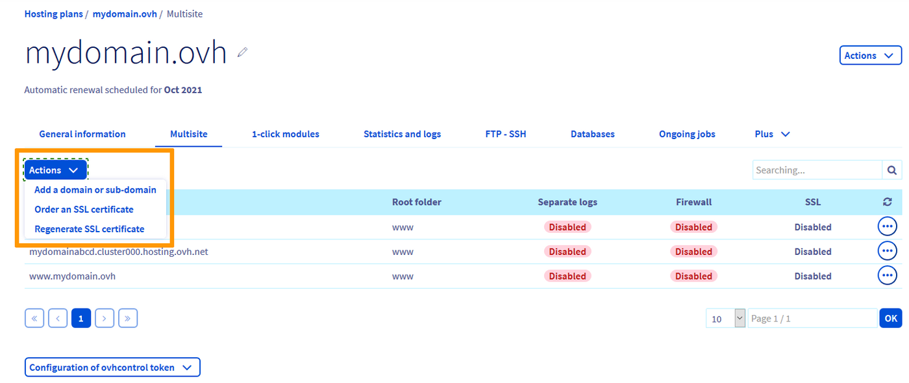
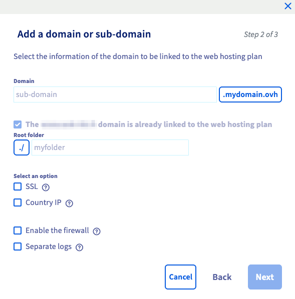
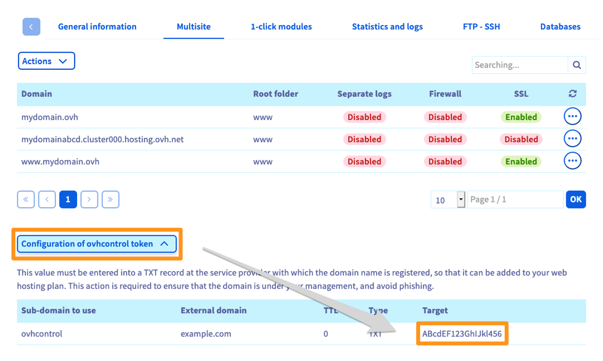
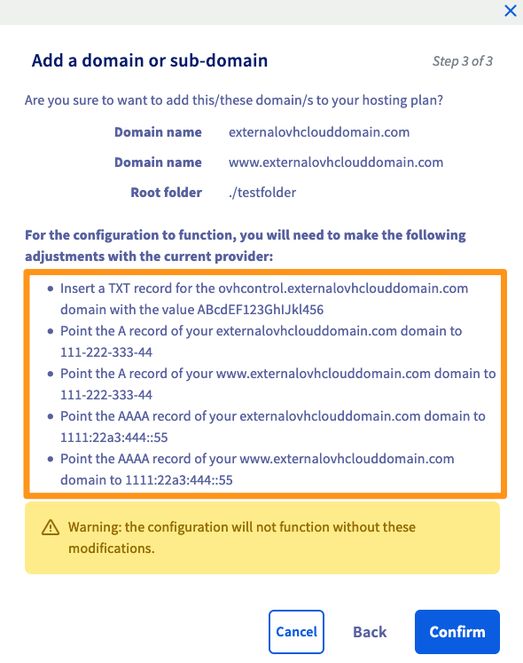

## Objective

You can host multiple websites on a single Web Hosting plan, even if the domain names are not registered with OVHcloud.

**Find out how to host several websites on your Web Hosting plan.**

## Requirements

- A compatible [OVHcloud Web Hosting plan](https://www.ovhcloud.com/en-gb/web-hosting/){.external}
- One or more [domain names](https://www.ovhcloud.com/en-gb/domains/){.external}
- The right to modify your domain name's configuration (the [DNS Zone](/pages/web_cloud/domains/dns_zone_edit))
- Access to the [OVHcloud Control Panel](https://www.ovh.com/auth/?action=gotomanager&from=https://www.ovh.co.uk/&ovhSubsidiary=GB){.external}

## Instructions

> [!primary]
>
> Most [OVHcloud Web Hosting](https://www.ovhcloud.com/en-gb/web-hosting/){.external} offers include the option of creating email accounts with custom addresses using your domain name. This email option can be enabled for **only one** domain name.
>
> This means that if you use *multisite* with several different domain names, you can only enable this option for one of your domain names.
> Please refer to our [guide](/pages/web_cloud/web_hosting/activate-email-hosting) for more details on how to enable this option.
>

### Step 1: Access multisite management

First, log in to the [OVHcloud Control Panel](https://www.ovh.com/auth/?action=gotomanager&from=https://www.ovh.co.uk/&ovhSubsidiary=GB){.external} and select `Web Cloud`{.action}. Click `Hosting plans`{.action}, select the plan concerned, then choose the `Multisite`{.action} tab.

The table displayed will list all of the domain names and subdomains added to your Web Hosting plan. Some of these will have been created automatically, when your hosting was set up.

> [!primary]
>
> If you are migrating your website and would like to avoid any service interruptions, follow [Step 3: Put your website online](#site-online).
>

{.thumbnail}

### Step 2: Add a domain or subdomain

To add a new domain or subdomain to your Web Hosting plan, click on `Actions`{.action} on the left of your screen then `Add a domain or sub-domain`{.action}, then select your domain in the window that appears.

{.thumbnail}

- **Adding an OVHcloud-registered domain**:

Only OVHcloud domain names for which you are a [technical contact and/or administrator in the OVHcloud Control Panel](/pages/account_and_service_management/account_information/managing_contacts) appear here. Choose one from the list, then click `Next`{.action}. Then continue to [Step 2.1: Adding an OVHcloud-registered domain](#add-ovhcloud-domain).

- **Adding an external domain**:

For a domain name that is external to your customer account (another NIC handle) or external to OVHcloud (third-party domain name provider), select `Add an external domain`{.action}, then click `Next`{.action}. Then continue to [Step 2.2: Adding an external domain](#add-external-domain).

{.thumbnail}

#### Step 2.1: Adding an OVHcloud-registered domain 

> [!warning]
> This step only applies if you have selected "Add an OVHcloud-registered domain". The domain name or its DNS zone must be **in your Control Panel**. For external domain names, go to [Step 2.2: add an external domain](#add-external-domain){.external}.

You will now need to customise the way you add your domain or subdomain. Some of the choices offered cannot be selected, depending on which [Web Hosting plan](https://www.ovhcloud.com/en-gb/web-hosting/){.external} you have.

> [!primary]
> To add a subdomain, you must first select the primary domain from the list (example: mydomain.ovh). In the next step, you can enter the subdomain (e.g. **blog**.mydomain.ovh).

{.thumbnail}

|Information|Description|
|---|---|
|Domains|The domain that you have selected will be automatically entered by default. You can add a subdomain (e.g. **blog**.mydomain.ovh) to it, and create the corresponding "www" subdomain at the same time (e.g. **www.blog**.mydomain.ovh). This domain will represent the website that you want to put online.|
|Root folder|Define the folder on your storage space to which the domain points. The website files need to be placed in this folder. For example, for blog.mydomain.ovh, the root directory could be "blog". If the directory does not exist, it will be created automatically.|
|SSL|Provides you with a secure connection (HTTPS://) on the selected domain. Find out more about this on [our SSL page](https://www.ovhcloud.com/en-gb/web-hosting/options/ssl/){.external}. By enabling SSL and the CDN (Content Delivery Network), you can also benefit from the **HTTP2** protocol (the latter is enabled by default in our Gravelines data centre).|
|Enable CDN|Enables the CDN (which replicates and caches your website’s static elements, e.g. images) on the selected domain. To find out more about this, go to [our CDN page](https://www.ovhcloud.com/en-gb/web-hosting/options/cdn/){.external}. By enabling SSL and the CDN, you can also benefit from the **HTTP2** protocol (the latter is activated by default in our Gravelines data centre).|
|Geolocated IP|Provides you with a geolocated IP address (from a country list) for the selected domain. To find out more about this, go to [our IP page](https://www.ovhcloud.com/en-gb/web-hosting/options/){.external}.|
|Enable firewall|Enables a firewall (request analysis) for the selected domain. To find out more about this, go to [our ModSecurity page](https://www.ovhcloud.com/en-gb/web-hosting/options/){.external}.|
|Separate logs|Activates a new space for logs on the selected domain. You will need to choose a domain name from the list. The selected domain will be used as an access name for this new space. Find out more about this on [our detailed statistics page](https://www.ovhcloud.com/en-gb/web-hosting/uc-website-traffic-analysis/){.external}.|

> [!warning]
>
> You cannot enable separate logs for external domain names, it is only possible for domain names registered with OVHcloud.
>

Once you have entered this information, click `Next`{.action}. Then check the summary that appears.

{.thumbnail}

Once you have selected an OVHcloud-registered domain, you can automatically or manually modify its DNS configuration.

- **For automatic DNS configuration**: tick the `Automatic configuration (recommended)`{.action} box.
- **For manual DNS configuration**: untick the `Automatic configuration (recommended)`{.action} box, then note down the information that appears. If you would like to configure your DNS zone manually, you can use our guide on [Editing an OVHcloud DNS zone](/pages/web_cloud/domains/dns_zone_edit){.external}.

Click `Confirm`{.action} to start adding the domain. This may take up to an hour. Changes made to a domain name's configuration can take between 1 and a maximum of 24 hours to propagate fully.

Now that you have added your domain, go to [Step 3: Put your website online](#site-online).

#### Step 2.2: Adding an external domain 

 This step only applies if you have selected "Add an external domain".
 
 Your domain name is not registered with OVHcloud **or** it is not associated with **your** OVHcloud account. 

 > Before you proceed, it is best to modify the DNS zone of the external domain name before adding the multisite record.
 >
 > The external domain name’s configuration (its DNS zone) must be modified using the interface of the service provider managing it. If you are using OVHcloud, please follow our guide on [Editing an OVHcloud DNS zone](/pages/web_cloud/domains/dns_zone_edit){.external}. Once you have configured your domain, you will need to allow between 1 and 24 hours for the changes to propagate fully.
>
> Below are the 2 elements you need to modify in your external domain name's DNS configuration:
>
> |Field|Where to find this information|Action to take|
> |---|---|---|
> |TXT|On the `Multisite`{.action} tab, click `Configuration of ovhcontrol token`{.action}|Allows OVHcloud to ensure that each external domain name is added legitimately. Ensure that you create the TXT record with the subdomain ovhcontrol (e.g. ovhcontrol.mydomain.ovh) in the DNS zone authoritative for the domain name to be added.   It is important to note that if you want to add `blog.mydomain.ovh` you have to create the record for the subdomain `ovhcontrol.mydomain.ovh` and not `ovhcontrol.blog.mydomain.ovh`   To find the right zone, find the [DNS servers](/pages/web_cloud/domains/dns_server_general_information#understanding-dns) your domain is linked to. You will need to validate only the primary domain, not all subdomains.|
>
> {.thumbnail}
>
> |Field|Where to find this information|Action to take|
> |---|---|---|
> |A and AAAA|`General information`{.action} tab, under **IPv4** and **IPv6**|Makes your domain display the website you will put online using your Web Hosting plan. Attach your domain or subdomain to the IP address of your Web Hosting plan.|
>
> {.thumbnail}
>

 You will now need to customise the way you add your domain. Please note that some of the options included in your [Web Hosting plan](https://www.ovhcloud.com/en-gb/web-hosting/){.external} cannot be enabled during this process. You will need to finalise this operation in order to use them, by modifying the multisite settings once the domain is attached.

|Information|Description|
|---|---|
|Domain|Enter the domain name you want to use. Add subdomains (e.g. **blog**.mydomain.ovh) if required, and create the corresponding "www" subdomain at the same time (e.g. **www.blog**.mydomain.ovh). This domain will correspond to the website that you want to put online. As a reminder, you must have the appropriate rights to modify the domain’s configuration (its DNS zone) to finalise this addition.|
|Root folder| Define the folder on your storage space to which the domain points. The website files need to be placed in this folder. For example, for blog.mydomain.ovh, the root directory could be "blog". If the directory does not exist, it will be created automatically.|
|Enable IPv6|Enables the IPv6 protocol on the selected domain. To find out more about this, go to [our IP page](https://www.ovhcloud.com/en-gb/web-hosting/options/){.external}.|

Once you have entered this information, click `Next`{.action}. Then check the summary that appears.

{.thumbnail}

Attempting to attach a non-OVHcloud domain name requires additional validation. This allows us to ensure that the attachment of the external domain is legitimate. You will receive a message prompting you to modify the domain name's DNS configuration.

{.thumbnail}

Check the information displayed, then click `Confirm`{.action}. Once you have done this, the domain name is added temporarily, until you have modified its DNS configuration.

> [!warning]
>
> You need to **quickly** make these changes for your domain to be correctly added. Otherwise, your domain addition will be cancelled.
>
> The **A** and **TXT** DNS records must be placed in your domain name’s active DNS zone for it to be added to your Web Hosting plan. Only **AAAA** DNS records are optional. 
>

### Step 3: Put your website online 

Once you have added your domain name, you just need to put your website online. As a reminder, you will need to make this change in the root folder, which you defined in the previous step.

To help you with this, you can use OVHcloud 1-click modules, which provide you with a ready-to-use website structure. The website will then be set up automatically in the root directory you configured earlier. You can find out more about this option by referring to our guide on [Setting up your website with 1-click modules](/pages/web_cloud/web_hosting/cms_install_1_click_modules){.external}. 

However, if you would like to set up your website manually, you can put it online by moving all of your website files into the correct root directory on your storage space. You can find out more about this option by referring to our guide on [Publishing a website on your Web Hosting plan](/pages/web_cloud/web_hosting/hosting_how_to_get_my_website_online){.external}.

> [!primary]
>
> If you would like to add several websites, you will need to repeat this step.
>
> We recommend taking care with the number of websites you host on your Web Hosting plan. The more websites you host, the higher the demand will be on your allocated resources. Our [Web Hosting page](https://www.ovhcloud.com/en-gb/web-hosting/){.external} shows the recommended number of websites you can host on your plan.
>

## Go further

[Setting up your website with 1-click modules](/pages/web_cloud/web_hosting/cms_install_1_click_modules){.external}

[Editing an OVHcloud DNS zone](/pages/web_cloud/domains/dns_zone_edit){.external}

[Publishing a website on your Web Hosting plan](/pages/web_cloud/web_hosting/hosting_how_to_get_my_website_online){.external}

If you would like assistance using and configuring your OVHcloud solutions, please refer to our [support offers](https://www.ovhcloud.com/en-gb/support-levels/).

Join our community of users on <https://community.ovh.com/en/>.
