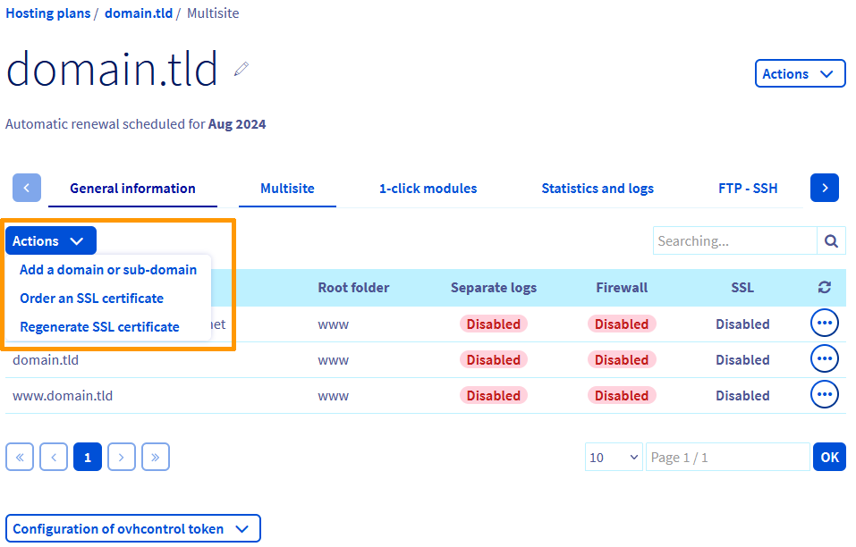
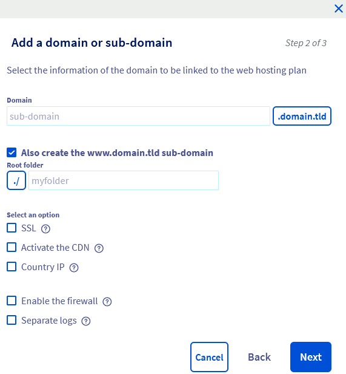
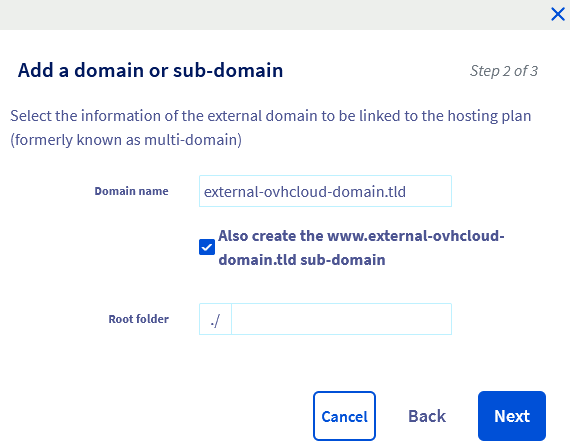

> [!primary]
> Esta tradução foi automaticamente gerada pelo nosso parceiro SYSTRAN. Em certos casos, poderão ocorrer formulações imprecisas, como por exemplo nomes de botões ou detalhes técnicos. Recomendamos que consulte a versão inglesa ou francesa do manual, caso tenha alguma dúvida. Se nos quiser ajudar a melhorar esta tradução, clique em "Contribuir" nesta página.
>

## Objetivo

Pode alojar vários websites no mesmo alojamento web, mesmo que os nomes de domínio não estejam registados na OVHcloud.

**Saiba como alojar diferentes websites no seu alojamento web.**

### Índice

- 1 : [Aceder à gestão multisite](#multisite-menu)
- 2 : [Adicionar um domínio ou subdomínio](#add-domain)
    - 2.1 : [Adicionar um domínio registado na OVHcloud](#add-ovhcloud-domain)
    - 2.2 : [Adicionar um domínio externo](#add-external-domain)
- 3 : [Colocar o seu website online](#site-online)

## Requisitos

- Ter um serviço [de alojamento web OVHcloud](https://www.ovhcloud.com/pt/web-hosting/){.external} compatível.
- Dispor de um ou vários [domínios](https://www.ovhcloud.com/pt/domains/){.external}.
- Poder alterar a configuração dos seus nomes de domínio (a [zona DNS](/pages/web_cloud/domains/dns_zone_edit)).
- Ter acesso à [Área de Cliente OVHcloud](https://www.ovh.com/auth/?action=gotomanager&from=https://www.ovh.pt/&ovhSubsidiary=pt){.external}.

## Instruções

> [!primary]
>
> A maioria das ofertas de [alojamento web OVHcloud](https://www.ovhcloud.com/pt/web-hosting/){.external} dispõem de uma opção incluída de criação de endereço(s) de e-mail personalizado(s) com o seu nome de domínio.
> Esta opção de e-mail pode ser ativada para **apenas um** nome de domínio. Isto significa que se utilizar o *multisite* com vários domínios, só poderá ativar esta opção para um dos seus nomes de domínio.
> Não hesite em consultar o nosso [guia](/pages/web_cloud/web_hosting/activate-email-hosting) para mais pormenores sobre a ativação desta opção.
>

### 1 - Aceder à gestão multisite 

Em primeiro lugar, aceda à Área de [Cliente OVHcloud](https://www.ovh.com/auth/?action=gotomanager&from=https://www.ovh.pt/&ovhSubsidiary=pt){.external} e selecione a `Web Cloud`{.action}. Depois, clique em `Alojamentos`{.action}, selecione o serviço correspondente e clique no separador `Multisite`{.action}.

Aparecerá uma tabela com todos os domínios e subdomínios adicionados à sua solução de alojamento web. Alguns foram criados automaticamente durante a instalação do alojamento.

> [!primary]
>
> Se migrar o seu website e pretender evitar qualquer interrupção do serviço, siga o [passo 3: colocar o seu website online](#site-online).
>

{.thumbnail}

### 2 - Adicionar um domínio ou subdomínio 

Para adicionar um novo domínio ou subdomínio ao seu alojamento web, clique no botão `Ações`{.action} situado à esquerda do ecrã e, a seguir, em `Adicionar um domínio ou subdomínio`{.action} e faça a sua escolha na nova janela.

{.thumbnail}

- **Adicionar um domínio registado na OVHcloud**:

Apenas aparecem aqui os nomes de domínio OVHcloud para os quais tem [contacto técnico e/ou administrador na sua Área de Cliente](/pages/account_and_service_management/account_information/managing_contacts). Escolha um na lista e clique em `Seguinte`{.action}. De seguida, consulte o [passo 2.1: adicionar um domínio registado na OVHcloud](#add-ovhcloud-domain).

- **Adicionar um domínio externo**:

No caso de um nome de domínio externo à sua conta de cliente (outro identificador de cliente) ou externo à OVHcloud (fornecedor de nome de domínio terceiro), selecione `Adicionar um nome de domínio externo`{.action} e clique em `Seguinte`{.action}. De seguida, consulte o passo [“2.2 - Adicionar um domínio externo”](#add-external-domain).

{.thumbnail}

#### Etapa 2.1: adicionar um domínio registado na OVHcloud 

> [!warning]
> Esta etapa só se aplica se tiver selecionado "Adicionar um domínio registado na OVHcloud". O domínio ou a zona DNS devem estar localizados **na Área de Cliente**. Para os nomes de domínio externos, passe ao [passo 2.2: adicionar um domínio externo](#add-external-domain){.external}

Agora deve personalizar a adição do domínio ou subdomínio. Dependendo do seu serviço de [alojamento web](https://www.ovhcloud.com/pt/web-hosting/){.external}, alguns elementos propostos não poderão ser selecionados.

> [!primary]
> Para adicionar um subdomínio, deve primeiro selecionar o domínio principal na lista (exemplo: mydomain.ovh). O passo seguinte permitir-lhe-á indicar o subdomínio (exemplo: **blog**.mydomain.ovh).

{.thumbnail}

|Informação|Descrição|
|---|---|
|Domínios|Por predefinição, o nome de domínio que selecionou é automaticamente indicado. Pode adicionar um subdomínio (por exemplo, **blog**.mydomain.ovh) e criar simultaneamente o subdomínio "www" correspondente (por exemplo, **www.blog**.mydomain.ovh). No final, este domínio será o endereço web do site que pretende publicar.|
|Pasta raiz|Defina a pasta no seu espaço de armazenamento, para o qual o domínio aponta. É neste espaço que os ficheiros do site deverão ser publicados. Por exemplo, para blog.mydomain.ovh, a pasta raiz poderia ser um "blog". Se a pasta não existir, esta será criada automaticamente.|
|SSL|Permite-lhe beneficiar de uma ligação segura (HTTPS://) no nome de domínio selecionado. Saiba mais na nossa [página sobre SSL](https://www.ovhcloud.com/pt/web-hosting/options/ssl/){.external}. Ao ativar o SSL e o CDN (Content Delivery Network), poderá também beneficiar do protocolo **HTTP2** (este é ativado por predefinição no nosso datacenter de Gravelines).|
|Ativar o CDN|Permite ativar o CDN (implementação de cache dos elementos estáticos do seu site, como as imagens) no nome de domínio selecionado. Saiba mais na [nossa página sobre CDN](https://www.ovhcloud.com/pt/web-hosting/options/cdn/){.external}. Ao ativar o SSL e o CDN, poderá também beneficiar do protocolo **HTTP2** (este é ativado por predefinição no nosso datacenter de Gravelines).|
|IP do país|Permite beneficiar de um endereço de IP geolocalizado (a partir de uma lista de países) para o nome de domínio selecionado. Obtenha mais informações na [nossa página sobre IP](https://www.ovhcloud.com/pt/web-hosting/options/){.external}.|
|Ativar a firewall|Permite ativar uma firewall (análise de pedidos) no nome de domínio selecionado. Saiba mais na [nossa página sobre Mod Security](https://www.ovhcloud.com/pt/web-hosting/options/){.external}.|
|Logs separados|Permite ativar um novo espaço de logs no domínio selecionado. Terá de escolher um nome de domínio a partir de uma lista que determinará o nome de acesso a esse novo espaço. Saiba mais na [nossa página sobre estatísticas detalhadas](https://www.ovhcloud.com/pt/web-hosting/uc-website-traffic-analysis/){.external}.|

> [!warning]
>
> Não poderá ativar os logs separados para um nome de domínio externo. Esta opção só está disponível para os domínios registados na OVHcloud.
>

Concluída esta etapa, clique no botão `Seguinte`{.action}. De seguida, verifique o resumo que aparece.

{.thumbnail}

Ao selecionar um domínio registado na OVHcloud, tem a possibilidade de modificar automaticamente ou manualmente a sua configuração DNS:

- **para uma configuração DNS automática**: selecione a opção `Configuração automática (recomendada)`{.action};
- **para uma configuração DNS manual**: desselecione a opção `Configuração automática (recomendada)`{.action} e anote as informações apresentadas. Quando efetuar esta configuração, consulte a nossa documentação ["Editar uma zona DNS da OVHcloud"](/pages/web_cloud/domains/dns_zone_edit){.external}.

Em seguida, clique em `Validar`{.action} para adicionar o domínio. Esta operação pode demorar até uma hora. No entanto, a propagação das alterações da configuração DNS do seu domínio pode demorar entre 1 a 24 horas.

Agora que o domínio foi adicionado, consulte o [passo 3: colocar o seu website online](#site-online).

#### Etapa 2.2: adicionar um domínio externo 

 Este passo aplica-se apenas se selecionou a opção "Adicionar um domínio externo".
 
 O seu domínio não está registado na OVHcloud **ou** não está registado na **sua** conta OVHcloud. 

 > Antes de continuar, é preferível alterar a zona DNS do nome de domínio externo antes da adição da entrada multisite.
 >
 > A alteração da configuração do domínio externo (a sua zona DNS) deve ser realizada a partir da interface do prestador que a gere. Se se tratar da OVHcloud, consulte o nosso manual ["Editar uma zona DNS da OVHcloud"](/pages/web_cloud/domains/dns_zone_edit){.external}. Depois de efetuar a alteração, é necessário aguardar entre 1 a 24 horas até que esta seja implementada.
>
> Encontre aqui os 2 elementos a modificar relativos à configuração DNS do seu nome de domínio externo:
>
> |Campo|Onde posso encontrar a informação?|Ação a realizar|
> |---|---|---|
> |TXT|Selecione a secção `Multisite`{.action} e, em seguida, clique em `Configuração do token ovhcontrol`{.action}|Permite à OVHcloud assegurar-se de que a adição de cada nome de domínio externo é legítima. Certifique-se de que cria o campo TXT com o subdomínio ovhcontrol (por exemplo, ovhcontrol.mydomain.ovh) na zona DNS que faz autoridade para o nome de domínio a adicionar.  É importante notar que se deseja adicionar `blog.mydomain.ovh`, deve criar o registo para o subdomínio `ovhcontrol.mydomain.ovh` e não `ovhcontrol.blog.mydomain.ovh`.   Para consultar esta última, encontre os [servidores DNS](/pages/web_cloud/domains/dns_server_general_information) aos quais o seu domínio está associado. Deverá validar apenas o domínio principal, não todos os subdomínios.|
>
> {.thumbnail}
>
> |Campo|Onde posso encontrar a informação?|Ação a realizar|
> |---|---|---|
> |A e AAAA|Na secção `Informações gerais`{.action} e junto de **IPv4** e **IPv6**|Permite que o seu domínio apresente o site web publicado no seu alojamento web. Associe o seu nome de domínio ou subdomínio ao endereço IP do seu alojamento.|
>
> {.thumbnail}
>

 Aqui, deverá personalizar a adição do domínio. Tenha em atenção que algumas opções incluídas na sua oferta de [alojamento web](https://www.ovhcloud.com/pt/web-hosting/){.external} não podem ser ativadas durante este processo. Deverá finalizar esta operação antes de as poder utilizar, alterando as definições dos parâmetros do multisite quando este for adicionado.

|Informação|Descrição|
|---|---|
|Domínio|Indique o domínio que pretende utilizar. Se necessário, adicione um subdomínio (por exemplo, **blog**.mydomain.ovh) e, ao mesmo tempo, crie o subdomínio "www" correspondente (por exemplo, **www.blog**.mydomain.ovh). No final, este domínio será o endereço web do site que pretende publicar. Para finalizar a adição, certifique-se de que consegue alterar a configuração do domínio (a sua zona DNS).|
|Pasta raiz| Defina a pasta no seu espaço de armazenamento, para o qual o domínio aponta. É neste espaço que os ficheiros do site deverão ser publicados. Por exemplo, para blog.mydomain.ovh, a pasta raiz poderia ser um "blog". Se a pasta não existir, esta será criada automaticamente.|
|Ativar o IPv6|Permite ativar o protocolo IPv6 no domínio indicado. Obtenha mais informações na [nossa página sobre IP](https://www.ovhcloud.com/pt/web-hosting/options/){.external}.|

Concluída esta etapa, clique no botão `Seguinte`{.action}. De seguida, verifique o resumo que aparece.

{.thumbnail}

A adição de um domínio externo à OVHcloud requer uma validação suplementar obrigatória. Isto permite-nos assegurar que a adição do domínio externo é legítima. Assim, receberá uma mensagem solicitando a alteração da configuração DNS do domínio.

{.thumbnail}

Tenha em atenção os elementos apresentados e clique no botão `Validar`{.action}. A seguir, o domínio é adicionado temporariamente, até que a configuração DNS seja alterada.

> [!warning]
>
> Para que o seu domínio seja adicionado corretamente, deverá **efetuar rapidamente** estas alterações. Caso contrário, a adição do seu domínio será anulada.
>
> As entradas DNS de tipo **A** e **TXT** devem obrigatoriamente ser colocadas na zona DNS ativa do seu nome de domínio para que este seja adicionado ao seu alojamento web. Apenas as entradas DNS de tipo **AAAA** são opcionais. 
>

### Etapa 3: colocar o seu website online 

Depois de adicionar o nome de domínio, só lhe resta publicar o site que lhe está associado. Lembre-se de que deve realizar esta operação na pasta raiz que definiu na etapa anterior.

Para o ajudar, pode beneficiar de uma estrutura de site pronta a utilizar, graças aos módulos 1 clique da OVHcloud. O site será automaticamente instalado na pasta raiz que configurou anteriormente. Para saber mais, consulte a nossa documentação intitulada: [“Módulos 1 clique: como instalar um CMS para criar um site”](/pages/web_cloud/web_hosting/cms_install_1_click_modules){.external}. 

Se, pelo contrário, pretender instalar manualmente o seu site web, deverá recuperar os seus ficheiros e publicá-los na pasta raiz no seu espaço de armazenamento. Pode obter mais informações consultando a nossa documentação intitulada [“Publishing a website on your Web Hosting space”](/pages/web_cloud/web_hosting/hosting_how_to_get_my_website_online){.external} (versão inglesa - Publicar um site web num alojamento web).

> [!primary]
>
> Se pretender adicionar vários websites, deverá repetir esta etapa.
>
> Lembre-se de que quanto maior for o número de sites no seu alojamento, maior será a solicitação de recursos atribuídos. [A página das nossas ofertas de alojamento web](https://www.ovhcloud.com/pt/web-hosting/){.external} indica o número de websites recomendados que pode alojar no seu espaço.
>

## Quer saber mais?

["Módulos 1 clique: como instalar um CMS para criar um site"](/pages/web_cloud/web_hosting/cms_install_1_click_modules){.external}

["Editar uma zona DNS da OVHcloud"](/pages/web_cloud/domains/dns_zone_edit){.external}

["Publicar um site num alojamento web"](/pages/web_cloud/web_hosting/hosting_how_to_get_my_website_online){.external}

Se pretender usufruir de uma assistência na utilização e na configuração das suas soluções OVHcloud, consulte as nossas diferentes [ofertas de suporte](https://www.ovhcloud.com/pt/support-levels/).

Fale com a nossa comunidade de utilizadores em <https://community.ovh.com/en/>.