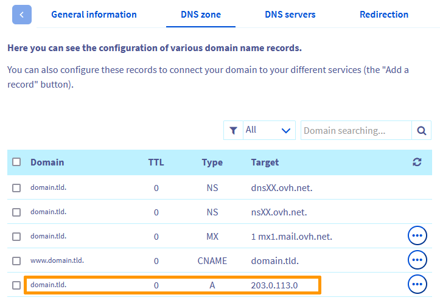
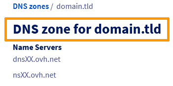

> [!primary]
> Tłumaczenie zostało wygenerowane automatycznie przez system naszego partnera SYSTRAN. W niektórych przypadkach mogą wystąpić nieprecyzyjne sformułowania, na przykład w tłumaczeniu nazw przycisków lub szczegółów technicznych. W przypadku jakichkolwiek wątpliwości zalecamy zapoznanie się z angielską/francuską wersją przewodnika. Jeśli chcesz przyczynić się do ulepszenia tłumaczenia, kliknij przycisk "Zgłóś propozycję modyfikacji" na tej stronie.
>

## Wprowadzenie 

W przeglądarce internetowej może pojawić się komunikat o błędzie **Niezainstalowana strona**, zwłaszcza przy pierwszej instalacji Twojej strony WWW.

{.thumbnail}

**Dowiedz się, jak zidentyfikować i usunąć stronę błędu "Strona nie została zainstalowana"**

> [!warning]
>
> OVHcloud udostępnia różnorodne usługi, jednak to Ty odpowiadasz za ich konfigurację i zarządzanie nimi. Ponosisz więc odpowiedzialność za ich prawidłowe funkcjonowanie.
>
> Oddajemy w Twoje ręce niniejszy przewodnik, którego celem jest pomoc w jak najbardziej optymalnym wykonywaniu bieżących zadań. Niemniej jednak, w przypadku trudności zalecamy skontaktowanie się z [wyspecjalizowanym dostawcą](https://partner.ovhcloud.com/pl/directory/) lub skontaktowanie się z wydawcą usługi. Niestety firma OVH nie jest w stanie udzielić Ci wsparcia w tym zakresie. Więcej informacji znajduje się w sekcji "[Sprawdź również](#go-further)" tego przewodnika.

## Wymagania początkowe

- Posiadanie [hostingu](https://www.ovhcloud.com/pl/web-hosting/)
- Dostęp do [panelu klienta OVHcloud](https://www.ovh.com/auth/?action=gotomanager&from=https://www.ovh.pl/&ovhSubsidiary=pl)
- Zarządzanie [strefą DNS](/pages/web_cloud/domains/dns_zone_edit), do której przypisana jest Twoja domena.

## W praktyce

Strona **Strona nie została zainstalowana** wyświetla się z dwóch powodów:

- 1: [Twoja domena lub subdomena nie jest poprawnie zadeklarowana na Twoim hostingu](#check-multisites).

- 2: [Twoja domena nie wskazuje na adres IP Twojego hostingu.](#check-dns-domain)

Poniższe kroki pozwolą Ci naprawić błąd `Strona nie została zainstalowana` w obu przypadkach.

### Etap 1 - Sprawdź deklarację Twojej domeny lub subdomeny na hostingu 

[Panel klienta OVHcloud](https://www.ovh.com/auth/?action=gotomanager&from=https://www.ovh.pl/&ovhSubsidiary=pl) przejdź do sekcji `Web Cloud`{.action} znajdującej się u góry strony, a następnie kliknij zakładkę `Hosting`{.action} w kolumnie z lewej strony.

Wybierz odpowiedni hosting z listy, następnie kliknij zakładkę `MultiSite`{.action}.

|Scenariusz|Operacja do wykonania|
|---|---| 
|Domena lub subdomena powiązana z Twoją stroną WWW pojawia się w tabeli "MultiSite".|Jeśli właśnie dodałeś domenę/subdomenę w sekcji `MultiSite`{.action} Twojego hostingu, odczekaj około **dwadzieścia minut** i odśwież cache przeglądarki internetowej. Jeśli nadal pojawia się komunikat "Strona nie została zainstalowana", przejdź do [etapu 2](#check-dns-domain).|
|Domena lub subdomena powiązana z Twoją stroną WWW nie pojawia się w tabeli "MultiSite".|Dodaj domenę/subdomenę w sekcji `MultiSite`{.action}, postępując zgodnie z dedykowaną sekcją przewodnika "[Udostępnianie hostingu między kilkoma stronami - dodawanie domeny lub subdomeny](/pages/web_cloud/web_hosting/multisites_configure_multisite)".|
|Domena lub subdomena została usunięta z tablicy "MultiSite" bez konieczności podejmowania działań przez użytkownika.|Domena lub jej strefa DNS mogą być zarządzane z innego konta. Dodaj domenę/subdomenę w sekcji `Multisite`{.action} zgodnie z dedykowaną rubryką przewodnika "[Podziel hosting na kilka stron - dodaj domenę zewnętrzną](/pages/web_cloud/web_hosting/multisites_configure_multisite)".|

### Etap 2 - Sprawdź wskazanie adresu IP w aktywnej strefie DNS Twojej domeny 

Etap ten polega na upewnieniu się, że Twoja domena lub subdomena wskazuje z aktywnej strefy DNS na adres IP Twojego hostingu.

> [!primary]
>
> Więcej informacji na temat DNS znajdziesz na następujących stronach:
> 
> - [Edycja strefy DNS OVHcloud](/pages/web_cloud/domains/dns_zone_edit)
> - [Utwórz strefę DNS OVHcloud](/pages/web_cloud/domains/dns_zone_create)
> - [Modyfikacja serwerów DNS domeny OVHcloud](/pages/web_cloud/domains/dns_server_general_information)
>

#### 2\.1 Identyfikacja adresu IP hostingu OVHcloud

Aby odnaleźć adres IP hostingu, zaloguj się do [Panelu klienta OVHcloud](https://www.ovh.com/auth/?action=gotomanager&from=https://www.ovh.pl/&ovhSubsidiary=pl), a następnie przejdź do sekcji `Web Cloud`{.action} znajdującej się u góry strony. W kolumnie po lewej stronie kliknij zakładkę `Hosting`{.action}, po czym wybierz z listy odpowiedni hosting.

Adres `IPv4` znajdziesz w ramce `Informacje ogólne`{.action}.

{.thumbnail}

Adres IP powiązany z Twoim hostingiem znajdziesz również w naszym przewodniku "[Lista adresów IP powiązanych z hostingiem WWW OVHcloud](/pages/web_cloud/web_hosting/clusters_and_shared_hosting_IP)".

#### 2\.2 Sprawdź adres IP w aktywnej strefie DNS Twojej domeny

Sprawdź, czy adres IP Twojego hostingu wyświetla się w aktywnej strefie DNS Twojej domeny.

> [!primary]
>
> Zanim przejdziesz dalej, jeśli wystąpi zmiana w **strefie DNS** aktywnej nazwy domeny, może upłynąć czas propagacji **4 do 24 godzin**, aby zaktualizować informacje o sieci DNS.
>
> Jeśli zmodyfikujesz bezpośrednio **serwery DNS** powiązane z Twoją domeną, może to potrwać do **48 godzin** maksymalnie.
>

W tym celu zaloguj się do [Panelu klienta OVHcloud](https://www.ovh.com/auth/?action=gotomanager&from=https://www.ovh.pl/&ovhSubsidiary=pl), a następnie przejdź do sekcji `Web Cloud`{.action} znajdującej się u góry strony. Przejdź do sekcji `Domeny`{.action}, wybierz swoją domenę, następnie przejdź do zakładki `Strefa DNS`{.action}.

Pojawi się tabela z różnymi rekordami DNS.

|Możliwe scenariusze|Operacja do wykonania|
|---|---| 
|W aktywnej strefie DNS Twoja domena/subdomena wskazuje na adres IP hostingu WWW z rekordem typu A (dla IPv4) lub AAAA (dla IPv6). {.thumbnail}|Oznacza to, że konfiguracja Twojej domeny jest prawidłowa.   Czekaj na propagację DNS, jeśli zmiana jest nowsza.   Nie zapomnij również zrestartować swoich urządzeń (PC, smartphone, box, itp.) i wyczyścić pamięć podręczną przeglądarki internetowej. Stara konfiguracja Twojej domeny może zostać umieszczona w pamięci cache: co może spowolnić wyświetlanie aktualizacji.|
|Bieżąca strefa DNS nie zawiera rekordów typu A ani AAAA łączących domenę/subdomenę z adresem IP hostingu WWW. Lub istniejący rekord wskazuje inny adres IP.|Dodaj nowy rekord typu A lub AAAA lub popraw istniejący rekord, postępując zgodnie z [tym przewodnikiem](/pages/web_cloud/domains/dns_zone_edit).|
|Twoja domena nie wyświetla się w części `Domeny`{.action} Panelu klienta OVHcloud.  Lub w zakładce `Strefa DNS`{.action} Twojej domeny wyświetla się następująco: {.thumbnail}|Oznacza to, że Twoja domena nie jest zarządzana w Panelu klienta OVHcloud.  Ustal jej "operator" za pomocą narzędzia [WHOIS](https://www.ovhcloud.com/pl/domains/whois/) oraz przypisanych do niej serwerów DNS.   Znajdź i zmodyfikuj odpowiednią strefę DNS, postępując zgodnie z instrukcjami w sekcji przewodnika "[Podziel hosting na kilka stron WWW - dodaj domenę zewnętrzną](/pages/web_cloud/web_hosting/multisites_configure_multisite)".|
|To ostrzeżenie jest wyświetlane w zakładce `Strefa DNS`{.action} :  {.thumbnail}|Należy więc odpowiednio zmodyfikować serwery DNS domeny, postępując zgodnie z instrukcjami zawartymi w przewodniku "[Modyfikacja serwerów DNS domeny OVHcloud](/pages/web_cloud/domains/dns_server_general_information).|"

## Sprawdź również 

[Lista adresów IP klastrów i hostingów WWW](/pages/web_cloud/web_hosting/clusters_and_shared_hosting_IP)

[Instalacja kilku stron WWW na hostingu](/pages/web_cloud/web_hosting/multisites_configure_multisite)

[Modyfikacja serwerów DNS domeny OVHcloud](/pages/web_cloud/domains/dns_server_general_information)

[Edycja strefy DNS OVHcloud](/pages/web_cloud/domains/dns_zone_edit)

[Utwórz strefę DNS OVHcloud](/pages/web_cloud/domains/dns_zone_create)

W przypadku wyspecjalizowanych usług (pozycjonowanie, rozwój, etc.) skontaktuj się z [partnerami OVHcloud](https://partner.ovhcloud.com/pl/directory/).

Jeśli chcesz otrzymywać wsparcie w zakresie konfiguracji i użytkowania Twoich rozwiązań OVHcloud, zapoznaj się z naszymi [ofertami pomocy](https://www.ovhcloud.com/pl/support-levels/).

Dołącz do społeczności naszych użytkowników na stronie <https://community.ovh.com/en/>.