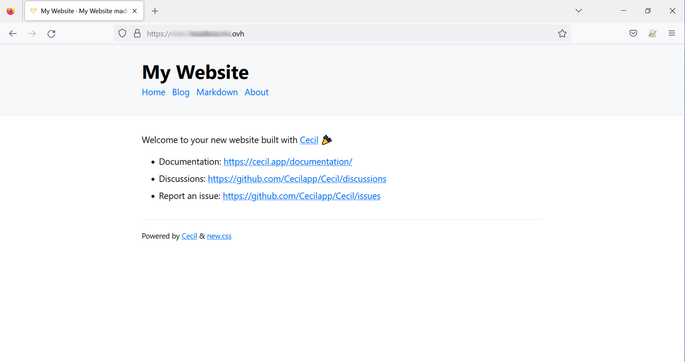
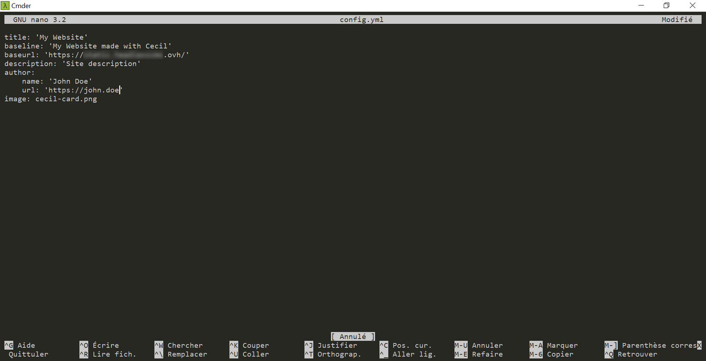
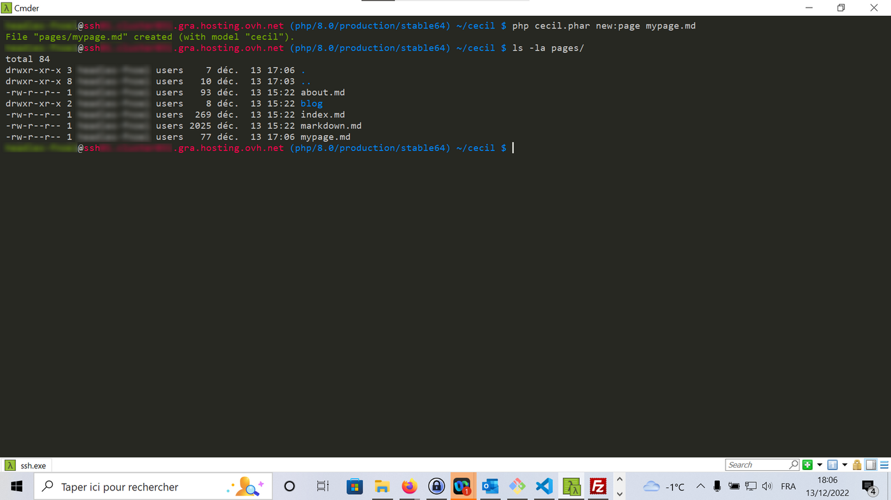
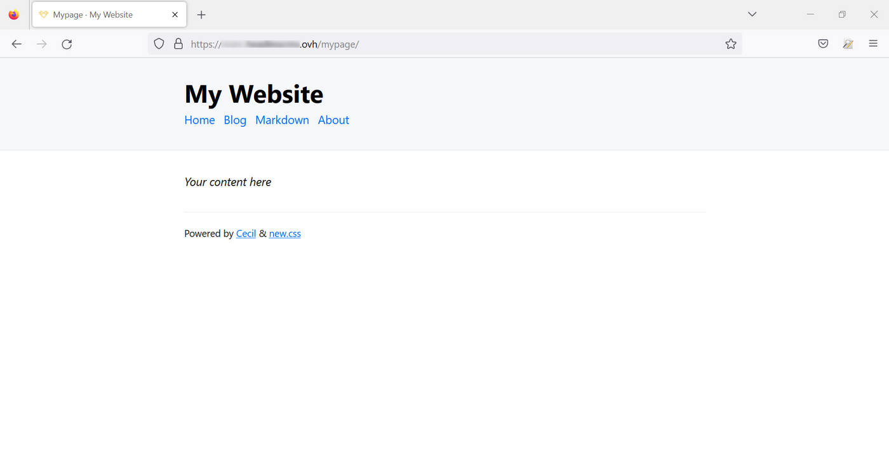
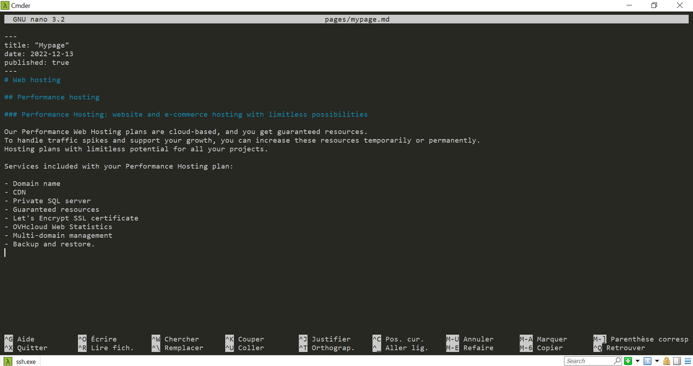
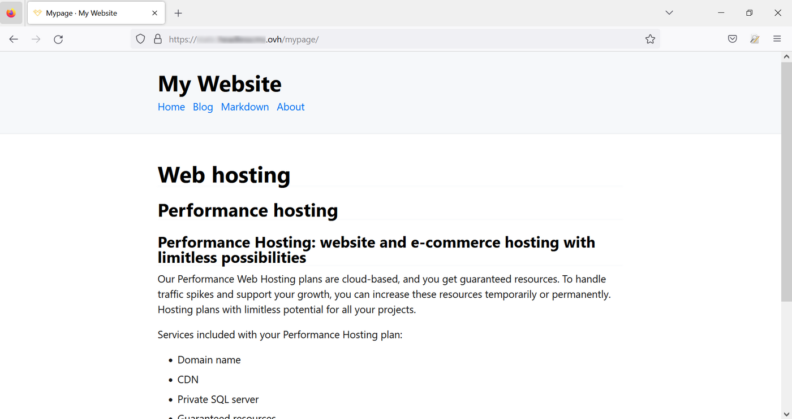
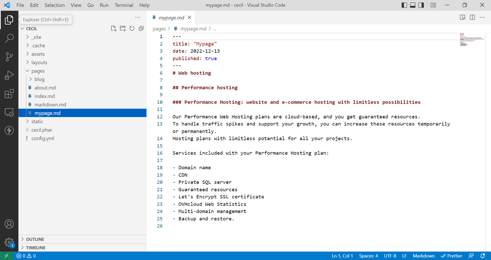

## Objectif

Ce tutoriel vous explique comment installer et configurer [Cecil](https://cecil.app/){.external}. Il s'agit d'une application écrite en PHP permettant de générer et d'administrer des pages web statiques.

Un site web composé essentiellement de pages web statiques garantit un meilleur temps de chargement pour vos visiteurs et une plus grande sécurité. Sans contenu dynamique, vos pages sont plus robustes face aux attaques informatiques. La génération d’un site statique permet de disposer d’une liberté plus grande pour créer le site web de votre choix. Vous gagnerez également du temps puisque vous n’aurez pas à partir de zéro.

**Découvrez comment Cecil vous permet de créer votre site statique à l'aide d'un moteur de template moderne (Jamstack).**

## Prérequis

- Disposer d'une [offre d'hébergement web OVHcloud](https://www.ovhcloud.com/fr/web-hosting/) incluant un accès SSH. Cet accès permet d'installer en ligne de commande une ou plusieurs solutions alternatives à celles proposées par défaut dans nos offres d'hébergements web.
- Être familiarisé à la saisie en ligne de commande.
- Être en capacité de transférer des fichiers en FTP avec un client comme [FileZilla](/pages/web_cloud/web_hosting/ftp_filezilla_user_guide).
- Paramétrer votre zone DNS pour faire pointer votre nom de domaine (ou sous-domaine) vers votre hébergement web mutualisé. Cela s'avère notamment utile si vous souhaitez héberger plusieurs sites en [multisites](/pages/web_cloud/web_hosting/multisites_configure_multisite) sur votre hébergement web mutualisé.
- Installer préalablement [Composer](https://getcomposer.org/){.external} avec le fichier `composer.phar` à la racine de votre hébergement web mutualisé ou dans le dossier cible de votre nom de domaine.

## En pratique

Les [hébergements web mutualisés](https://www.ovhcloud.com/fr/web-hosting/) permettent de déclarer des domaines ou sous-domaines en multisites. Un domaine ou un sous-domaine est nécessaire pour déployer votre site web réalisé avec **Cecil**.

Pour vous aider à déclarer un domaine ou un sous-domaine en multisite sur votre hébergement, consultez notre page « [Partager son hébergement entre plusieurs sites](/pages/web_cloud/web_hosting/multisites_configure_multisite) ».

### Créer le répertoire dans lequel seront vos fichiers

Une fois connecté en SSH à votre hébergement web, créez un répertoire à la racine avec la commande suivante :

```sh
mkdir mystaticwebsite
```

Remplacez `mystaticwebsite` par le nom de dossier de votre choix (sans accents et sans espaces).

Allez ensuite dans ce répertoire:

```sh
cd mystaticwebsite
```

Remplacez `mystaticwebsite` par votre nom de dossier.

### Téléchargement

Dans le répertoire que vous venez de créer, téléchargez Cecil:

```sh
curl -OL https://github.com/Cecilapp/Cecil/releases/latest/download/cecil.phar
```

### Installation

Lancez l'installation de Cecil avec la commande suivante:

```sh
php cecil.phar new:site
```

Renseignez les éléments demandés:

- le titre de votre site _(title)_
- la _baseline_
- l'URL de votre site web (par exemple, `https://mywebsite.ovh`)
- une description de votre site web

{.thumbnail}

Une fois ces éléments renseignés, vous devez maintenant déployer le site en tapant la commande suivante:

```sh
php cecil.phar build
```

En affichant le contenu du répertoire, vous constaterez la présence d'un répertoire `_site`. Ce répertoire contiendra l'ensemble des fichiers HTML et des assets:

{.thumbnail}

Vous pouvez maintenant voir le résultat en vous rendant sur votre nom de domaine:

{.thumbnail}

#### Configuration du pointage du domaine ou sous-domaine

Pour visualiser le résultat de votre site sur votre navigateur, modifiez le pointage de votre nom de domaine ou de sous-domaine dans le répertoire `_site` créé précédemment lors de l'installation de **Cecil**.

Si votre nom de domaine ou sous-domaine est hébergé chez OVHcloud, consultez nos guides relatifs à la [configuration DNS](/pages/web_cloud/domains/dns_zone_edit) et à la mise en place d'un [multisites sur votre hébergement web](/pages/web_cloud/web_hosting/multisites_configure_multisite).

### Configurer son site

Les informations générales de votre site peuvent être configurées dans le fichier `config.yml`:

```sh
nano config.yml
```

Remplacez les informations par défaut par les vôtres et sauvegardez le fichier.

{.thumbnail}

### Créer une nouvelle page

La création des pages qui contiendront les données de votre site se fait via des fichiers au format _Markdown_. Ces pages sont personnalisables. **Cecil**  intègre le moteur de _template_ [Twig](https://twig.symfony.com/){.external} qui est utilisé par défaut avec le _framework_ [Symfony](https://symfony.com/){.external}.

Les dossiers et fichiers sont organisés comme suit:

- `assets` : contient les éléments graphiques, audio et vidéo, les scripts JavaScript et les styles (CSS, Sass) 
- `layouts` : répertoire dans lequel seront le ou les _templates_
- `pages` : endroit où seront vos fichiers _Markdown_
- `_site` : répertoire qui contient les fichiers générés et qui est pointé par votre nom de domaine
- `static` : tous les fichiers statiques de type PDF

#### Créer un fichier _Markdown_ en ligne de commande

À la racine du site, tapez la commande suivante:

```sh
php cecil.phar new:page mypage.md
```

Un fichier `mypage.md` est alors créé à la racine du répertoire `/pages`.

Remplacez `mypage` par le nom de votre propre page.

{.thumbnail}

#### Générer les fichiers statiques

Toujours à la racine, tapez la commande suivante :

```sh
php cecil.phar build
```

Votre fichier se trouve dans le répertoire `_site/mypage/`:

{.thumbnail}

Vous pouvez le visualiser sur votre serveur en tapant l'URL de votre site, suivi de `/mypage/`:

{.thumbnail}

### Personnaliser les fichiers de votre site

#### Modification sur le serveur

L'édition des fichiers _Markdown_ peut se faire directement sur le serveur d'hébergement web. Sur votre offre d'[hébergement Performance](https://www.ovhcloud.com/fr/web-hosting/performance-offer/), votre accès SSH pour permet d'utiliser indifféremment [GNU nano](https://nano-editor.org/){.external}, [vi](https://ex-vi.sourceforge.net/){.external} ou [vim](https://www.vim.org/){.external}.
Les captures d'écran du présent tutoriel ont été réalisées sous **GNU nano**.

Éditez le fichier `mypage.md` situé dans le répertoire `pages` en tapant la commande suivante si vous êtes à la racine de votre site:

```sh
 nano pages/mypage.md
```

Remplacez `mypage` par le nom de votre propre page.

{.thumbnail}

Ajoutez quelques lignes en respectant la syntaxe _Markdown_:

{.thumbnail}

Supprimez les fichiers dans le cache à l'aide de la commande suivante:

```sh
php cecil.phar clear
```

Reconstruisez vos pages après avoir sauvegardé votre fichier:

```sh
php cecil.phar build
```

Puis retournez sur votre page pour voir le résultat:

{.thumbnail}

#### Modification sur votre poste de travail

Si vous préférez utiliser votre éditeur de code habituel, connectez-vous avec un client FTP sur votre serveur pour récupérer les fichiers sur votre ordinateur:

{.thumbnail}

Vous pouvez maintenant éditer les fichiers dans votre I.D.E.:

{.thumbnail}

Il vous suffit de renvoyer vos fichiers modifiés ou vos nouveaux fichiers sur votre serveur et de *rebuilder* pour avoir vos pages en ligne.

### Ajouter la page générée au menu de votre site

Pour ajouter cette nouvelle page dans le menu du site web, modifiez manuellement l'en-tête du fichier `.md` en rajoutant la ligne suivante:

```sh
menu: main
```

### Conclusion

**Cecil** est un outil permettant de construire efficacement un site statique à partir de fichiers *Markdown*, langage de balisage plus simple à mettre en œuvre que le HTML. L'organisation des fichiers Markdown conditionne la hiérarchie de vos pages web.<br/>
L'utilisation d'un moteur de template, très utilisé dans la communauté des développeurs web, vous permettra de trouver facilement de nombreuses sources sur Internet pour concevoir une interface d'apparence professionnelle.

## Aller plus loin

[Ajouter du contenu dynamique dans une page web statique générée avec Cecil](/pages/web_cloud/web_hosting/static_website_installation_cecil_api_call)

Le [site officiel de l'application Cecil](https://cecil.app/){.external}

Un [guide sur le format Markdown](https://www.markdownguide.org/){.external}

Notre [guide sur l'utilisation de FileZilla](/pages/web_cloud/web_hosting/ftp_filezilla_user_guide)

Pour des prestations spécialisées (référencement, développement, etc), contactez les [partenaires OVHcloud](https://partner.ovhcloud.com/fr/directory/).

Échangez avec notre communauté d'utilisateurs sur <https://community.ovh.com>.